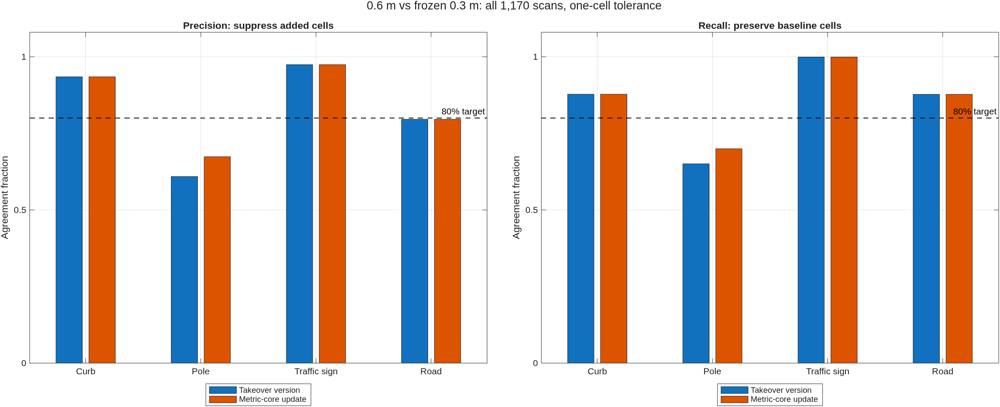

# Continuing the 0.6 m perception migration

Date: 2026-09-25. **Status: improved, but the requested 80% agreement is not met.**
The online lattice remains 100 x 100 whole 0.6 m pillars. There is no 0.3 m
auxiliary detector, fine semantic point refinement, or learned classifier in
the production path. Offline mapping remains on its existing 0.3 m path.

## Reference and acceptance

The reference is the frozen **0.3 m coarse** output of revision
`796c737344e6c29c3e7aa8869aab2630dc0ebbb1`, stored in
`output/coarse_lattice_20260924/baseline_sequence.mat`, on all 1170 Mississippi
scans. It is not the offline fine point mask or independently labelled truth.
Comparison is restricted to the common [-29.9, 30.1) m square. Changes in
features outside that square are excluded from these agreement numbers.

The user requested at least 80% agreement and confirmed that detection should
continue using only whole 0.6 m pillars. `evaluateCoarseAgreement` reports exact
cell precision, recall and F1, and the previous study's one-cell tolerant
versions. The tolerance is **Chebyshev distance of one grid step**: 0.6 m per
axis, up to 0.849 m diagonally. It is not a 0.6 m Euclidean bound, and tolerant
correspondence need not be one-to-one. Empty background cells never enter the
score. The operational gate requires both precision and recall >= 0.80 for
each channel, including road as an additional diagnostic. Even this lenient
tolerant gate fails for poles. This study does not claim that the user has
accepted spatial tolerance as the final definition of 80% agreement.

## Implementation continued from the working tree

The starting working tree already contained an uncommitted metric-isolation
and split-shaft recovery implementation in the structural branch. Its full
sequence was first captured as `takeover`; it improved the pole tolerant F1
from the previously committed density-core version's 0.534 to 0.629.

This continuation validates and retains that implementation, then changes the
coarse pole decision as follows:

- `computePillarDensityCore` also returns the number of actual returns in the
  0.15 m core, including neighbouring pillars. Neighbours remain evidence even
  when their own cores are not selected for evaluation.
- A core requires at least 12 such returns. A high fraction based on only a
  few returns no longer suffices. The fraction of the owning pillar required
  in the core changes from 0.55 to 0.35; its metric isolation inside a 0.60 m
  radius changes from 0.30 to 0.35. The 1.5 m core-height gate remains.
- The coarse point/line shape thresholds are disabled as hard gates. Their
  fixed cell neighbourhood grows with grid spacing and rejects isolated shafts
  near other structures. The scores still contribute to semantic probability.
  Metric isolation and core support provide the decision instead. The original
  whole-pillar count, height, height variance, tilt and 0.25 m radial-scatter
  limits remain.
- The offline pole settings retain their old point/line gates and zero-valued
  core gates. All output moments continue to use the complete accepted pillar;
  core membership is a statistic, not a published semantic point mask.

## Full-sequence results

The final run is `metricCoreFull`; raw sequence captures remain in `output/`.
All precision and recall values below use the one-cell tolerance.

| Channel | Takeover precision | Final precision | Takeover recall | Final recall | Takeover F1 | Final F1 | Both >= 80% |
|---|---:|---:|---:|---:|---:|---:|---|
| Curb | 0.935 | 0.935 | 0.878 | 0.878 | 0.905 | 0.905 | Yes |
| Pole | 0.609 | 0.674 | 0.651 | 0.700 | 0.629 | 0.687 | **No** |
| Traffic sign | 0.974 | 0.974 | 0.999 | 0.999 | 0.987 | 0.987 | Yes |
| Road | 0.796 | 0.796 | 0.877 | 0.877 | 0.835 | 0.835 | **No** |

Pole exact-cell precision/recall/F1 improve from 0.557/0.560/0.559 to
0.623/0.608/0.615. Final pole cells total 8909 against 9129 projected baseline
cells. The near-equal counts do **not** establish location agreement. The
mean per-frame nearest-cell distance is still 3.24 m from candidate to
reference and 3.12 m in the reverse direction, excluding empty-set cases.
Mean pole mixture weight is 0.174, versus the baseline's 0.146 and takeover's
0.179. These remain material differences.

The tuning subset is frames 1:20:1170 (59 frames); the interleaved check is
11:20:1170 (58 frames). Final tolerant pole F1 is 0.712 and 0.701 respectively.
The remaining 1053 frames, excluded from these threshold experiments, score
0.684, with precision 0.671 and recall 0.698. These are same-drive checks, not
independent-route generalization evidence. Historical experiments had already
examined the drive. Final median perception time is 30.1 ms; takeover was
30.0 ms in this session. The stored historical 0.3 m median is 54.0 ms, measured
in an earlier session; this is not a new paired speed benchmark.



## Other approaches actually evaluated

`sweepDensitySupport` freezes the takeover hard gates explicitly and tests
seven core-radius/fraction/isolation combinations. The best sampled tolerant
F1 is 0.670, below the adopted metric-core count rule's 0.706 on the same 117
frames. Increasing the core radius can recover more reference cells but also
adds many spatially unrelated cells. `candidate_comparison.csv` retains the
tuning/interleaved scores for all tested variants.

Two further diagnostic helper variants were tested through temporary MATLAB
path overrides, then removed from the path:

- A 3 x 3 XY histogram smoothing before selecting the density peak: sampled
  tolerant F1 0.710, precision 0.671, recall 0.754. The precision loss does not
  satisfy the acceptance target, so smoothing was not adopted.
- Square rather than circular density neighbourhoods (maximum absolute XY
  distance), core half-width 0.15 m and outer half-width 0.45 m, at isolation
  thresholds 0.40, 0.50 and 0.58: tolerant F1 0.637, 0.645 and 0.562. A high
  threshold reaches 0.850 precision but only 0.420 recall. Not adopted.

Copies of those diagnostic helpers remain under
`output/coarse_lattice_20260924/{smoothPeak,boxCore}/`; their file hashes are
listed in the independent artifact manifest. Neither directory is on the
production path.

To check whether combinations of existing whole-pillar features could close
the gap, `captureWholePillarDescriptors` collected 1,097,054 candidate rows
using only the 0.6 m runtime. `probeWholePillarClassifier.py` fits a diagnostic
histogram gradient-boosted classifier to frozen coarse-reference labels using
31 descriptors: whole-pillar moments and bounds, position of the mean and peak
within the pillar, radiometry maxima, shape scores and metric-core statistics.
There are no absolute XY coordinates or frame IDs among its predictors.
Training uses frames congruent to 1 modulo 4, threshold selection uses 3 modulo
4, and all 585 even frames are held out. With seed 42, 250 iterations, 31 leaves,
minimum leaf support 25, L2 regularization 5 and positive class weight 10,
validation selects threshold 0.725. Train precision/recall are 0.907/0.989;
validation is 0.728/0.738; held-out test is 0.750/0.740. The candidate table
contains only cells with >= 6 returns and >= 1 m height, covering 8996 of the
9129 reference-positive cells, so these diagnostic metrics do not replace the
full-reference acceptance calculation. The classifier is **not deployed**.
These failures do not prove that 80% is impossible using other whole-pillar
representations; they show that neither the tested threshold changes nor this
combination model meets it.

## Validation and remaining work

- 143/143 selected MATLAB tests passed, none incomplete: density-core and
  whole-pillar contracts, pole boundaries/footprints, structural semantics,
  pillar efficiency, coarse Gaussian products, native/MATLAB equivalence,
  compact raster equivalence, and feature selection. Results are recorded in
  `tests_initial.csv` (81) and `tests_products.csv` (62).
- Five new density-core tests cover cross-boundary support counts, clipped
  row/column rasters, unevaluated neighbours remaining evidence, empty inputs
  and invalid evaluation-mask lengths.
- All 1170 final pole masks retain the compact-footprint contract: no
  connected pole component exceeds two cells. MATLAB Code Analyzer reports
  no findings in the six production/test files and five research MATLAB
  drivers checked; `git diff --check` is clean.
- An initial test invocation omitted the repository root from the MATLAB path
  and failed setup; after adding the root and setting the data-root environment
  variable, the recorded test runs above completed successfully.
- No full localization/observer replay was performed in this continuation.
  The unrelated observer edits and pre-existing downstream comparison edits
  remain outside this commit. A complete repository-wide test suite was not
  rerun; selected tests were chosen for the perception changes.

**The migration remains open.** Poles require a more informative whole-pillar
representation or different geometric decision rule; another adjustment to the
tested scalar gates is not supported as a sufficient fix. Road precision is
also below the conservative 80% precision-and-recall gate. Exact-cell agreement
is below 80% for curb, pole and road. Do not close this task on overall averages,
matching-position RMSE, equal feature counts, or the classifier's training fit.

Reproduce the selected production evaluation from the repository root:

```matlab
addpath(pwd); setupVehicleLocalization;
setenv('VEHICLE_LOCALIZATION_DATA_ROOT',fullfile(pwd,'data'));
addpath('research/coarse_lattice_20260924');
addpath('research/coarse_lattice_continuation_20260925');
captureCoarseSequence('metricCoreFull',1:1170);
compareCoarseSequences('metricCoreFull');
evaluateCoarseAgreement('output/coarse_lattice_20260924/metricCoreFull_vs_baseline.csv');
```
