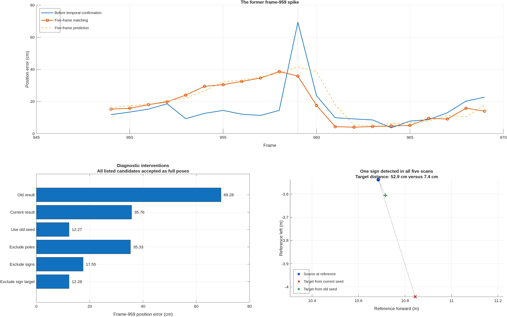

# Frame 959 after five-frame temporal confirmation

Investigated September 22, 2026, with deployed source revision
`22e203c7912de6ca07a5f31fd8f3bf9b966cfc89`. Raw frames 955:959 were processed
again by coarse perception and the five-frame temporal window. The current
recursive frame-959 result was reproduced within 5.83e-11 in pose coordinates.
The original pre-confirmation result was also reproduced with the current
matcher and its saved unfiltered source. No production algorithm, threshold,
calibration or map was changed. No full-sequence replay was rerun.

## What improved

The two previously identified distant suspect pole distributions, original
Gaussian IDs 100 and 142, appear only in scans 958 and 959 respectively.
Neither has confirming pole observations within the 0.75 m association gate
in the other four scans. Neither survives into the confirmed matching cloud.
These IDs describe the original diagnostic Gaussian array, not raw point IDs.

With the original prediction held fixed, the old 69.2822 cm position error
falls to **12.2743 cm** using the new five-frame source. This isolates source
processing from a changed recursive prediction. It does not claim that the
current deployed trajectory already achieves 12.27 cm at this frame.

The actual current recursive result is **35.7554 cm**, reduced from its
**41.5131 cm** incoming prediction. Previously the prediction was 15.3166 cm
and matching made it worse, at 69.2822 cm. The current yaw error is 0.0304
degrees. These are single-frame position errors, not sequence RMSE or fused
GNSS-plus-LiDAR observer errors.

## Why 35.76 cm remains

The saved current trajectory already drifts before frame 959: position errors
at frames 953, 956 and 958 are 23.93, 32.43 and 38.63 cm. Frame 959 is no longer
the isolated jump caused by the two former pole flashes. By frame 961 the
saved trajectory returns to 4.27 cm. The controls here diagnose frame 959;
they do not establish every cause of the earlier accumulated drift.

One traffic-sign source is detected in all five scans and receives stability
one. From the current prediction it selects map component 1300; from the old
prediction it selects component 1298. Their distances from the source at the
reference pose are 52.89 cm and 7.40 cm respectively. This is evidence of an
association ambiguity, not proof that the sign detection itself is false.
The selected map component's prior is 0.00020965, versus 0.00023422 for the
alternative. Existing map stability weighting therefore does not prevent the
less reference-consistent association.

The sign is the only matched source in its class and receives one third of
the pre-robust residual weight; its final robust weight is 0.3078. Curbs alone
provide rank-two geometry here. These facts explain how a consistently
detected but ambiguously associated sign can influence a weakly constrained
pose direction. Repeated detection supports existence, not correspondence
correctness.

| Intervention at the current prediction | Position error (cm) | Status |
|---|---:|---|
| Current five-frame source | 35.7554 | Full pose accepted |
| Remove pole class | 35.3263 | Full pose accepted |
| Remove sign class | 17.5538 | Full pose accepted |
| Remove only selected sign map component 1300 | 12.2758 | Full pose accepted |
| Remove pole colocated with the sign | 38.5599 | Full pose accepted |
| Use reference motion inside the window | 28.9455 | Full pose accepted |
| Curbs only | 21.6461 | Directional, rank two |
| Require at least three detections | 18.8098 | Rejected: not converged |
| Require at least four detections | 31.9830 | Full pose accepted |
| Require five detections | 40.8342 | Directional, rank two |

The sign-target exclusion retains the source, initial pose and all other map
components, and reaches the same lower-error solution as the old-seed control.
It is a diagnostic intervention, not a deployed map deletion rule. Class
removal also changes class normalization, so its numeric effect cannot be
interpreted as a simple additive class error contribution. The rejected and
directional rows are candidate errors, not accepted full-pose measurements.

Six pole distributions survive confirmation, three obtain correspondences.
Two matched poles have support only in frames 955 and 956, so they persist
through three missed scans while those detections remain in the five-frame
window. Another pole coincides with the sign and has three-scan support;
the prior fine-perception audit found sign rather than pole evidence there.
Thus temporal confirmation does not remove every persistent semantic error.
Removing all poles barely changes this frame's current error, which argues
against treating remaining poles as the principal explanation of this residual.

## Implication and evidence

The requested five-frame mechanism suppresses the original single-scan pole
failure. The next relevant matching problem is seed-sensitive sign association
under weak geometry and accumulated prediction error. These controls support
investigating competing correspondence hypotheses or association consistency;
they do not establish a sequence-wide fix or justify removing all signs.



`review_frame959.m` executes 13 diagnostic variants and exports component
support, correspondences, target identities and trajectory context. Raw inputs
remain coarse-only; reference seeds and reference motion are explicitly
diagnostic variants. All main production-result controls use recorded odometry
and saved predictions. MATLAB Code Analyzer found no issues in the two new
helpers. Direct reproduction and intervention assertions provide the relevant
validation; no unrelated unit suite was rerun for this diagnostic-only work.

The existing same-drive map includes query observations; sequence-fitted origin
calibration, recorded reference tilt and offline time synchronization remain
evaluation limitations. All generated MAT state stays local under
`output/frame959_five_frame_review_20260922`. The saved full trajectory supplies
context; only raw frames 955:959 and the stated registration controls were
rerun for this review.

```matlab
setupVehicleLocalization;
addpath('research/frame959_five_frame_review_20260922');
review_frame959;
plot_review;
```
