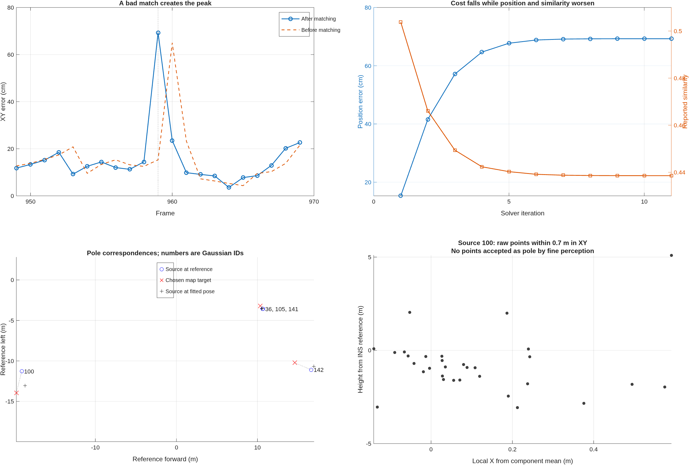

# Frame 959: erroneous pole associations drive the remaining matching peak

Executed September 22, 2026, against the deployed calibrated map and saved
coarse-only replay from `output/lidar_origin_20260922/coarse_pipeline`.
Production code, calibration, perception thresholds and maps are unchanged by
this investigation. The source revision is
`cbb2016b6c122eaafafde06319a7bc7c26e95fc0`.

## Finding

Frame 959 starts with **15.32 cm** position error and **0.655 degrees** yaw
error. Registration increases these to **69.28 cm** and **3.533 degrees**.
The accepted error is about **31.15 cm backward and 61.88 cm rightward** in
reference vehicle axes. The saved result is reproduced to `9.31e-10` in pose
coordinates before any diagnostic substitution.

The main causal chain is: unreliable coarse pole distributions receive
geometrically inconsistent map associations; their residual influence rotates
and translates a weakly constrained solution; existing acceptance checks admit
that biased solution. Removing the two distant pole source distributions
reduces the error to **16.01 cm** without changing the map, initial pose, curb,
sign, motion, or solver parameters. The spike was also present with the former
identity calibration (62.40 cm at frame 959); the origin correction did not
solve this different failure mode and slightly worsened this particular frame.



## Controlled interventions

All entries use the saved frame-959 prediction unless stated otherwise.
Reference poses and fine features below are offline diagnostics only.

| Control | Position error (cm) | Accepted full pose? |
|---|---:|---|
| Reproduce deployed three-scan coarse matching | 69.28 | Yes |
| Remove pole channel, retain curb and signs | 16.27 | Yes |
| Remove source Gaussian 100 only | 22.82 | Yes |
| Remove distant source Gaussians 100 and 142 | 16.01 | Yes |
| Change association distance gate from 2.5 m to 1 m | 15.34 | Yes |
| Change association distance gate to 0.5 m | 14.60 | Yes |
| Replace source-window motion with reference motion | 66.73 | Yes |
| Uniform map mixture priors | 68.07 | Yes |
| Reference pose as the initial seed | 22.82 | Yes |
| Current scan only, saved seed | 49.61 | Yes |
| Fine current-scan features, saved seed | 15.47 | **No: rank 2** |
| Fine current-scan features, reference seed | 1.17 | **No: rank 2** |

The last two values are directional candidate errors, not valid full-pose
localization accuracy. A reference seed already supplies the missing direction.
They must not be reported as a 1.17 cm map-matching result. The fine input
contains 15 curb distributions and one sign distribution, with no pole.
`controls.csv` and `pole_ablation.csv` retain all controls and their status.

The accurate-motion control stays close to the original large error, while
removing suspect pole evidence largely removes the spike. Thus relative window
motion is not the main cause here. Uniform map priors similarly fail to cure
it: the existing stability weight is not the main cause either. Seed sensitivity
and the opposite-direction single-scan solution show multiple biased basins,
but a better seed alone does not fully solve the association problem.

## Which correspondences are responsible?

The current three-scan source contains frames 957:959 over 0.2012 s. It has
126 curb, 14 pole and three sign distributions. Accepted pairs use 126 curb,
five pole and three sign source distributions. These are **not independent
physical landmarks**: three pole pairs reuse one map component, and all three
sign pairs reuse one sign component.

Source numbers below are temporary **Gaussian indices**, not raw point indices.
Coordinates are metres in the calibrated, gravity-aligned frame-959 reference.

| Source Gaussian | Original scan | Source mean XY | Target mean XY | Distance at reference |
|---|---:|---|---|---:|
| 100 | 958 | (-19.079, -11.281) | (-19.746, -13.940) | 2.741 m |
| 142 | 959 | (16.628, -11.094) | (14.589, -10.228) | 2.215 m |
| 36 / 105 / 141 | 957 / 958 / 959 | approximately (10.66, -3.58) | (10.347, -3.221) | 0.46--0.48 m |

Source 100's distance at the actual initial prediction is **2.418 m**, inside
the **2.5 m** geometric gate. Its initial squared standardized residual is
**94.81**. The association code still chooses the best eligible same-class
map component: there is no standardized-residual rejection or explicit unmatched
choice after that geometric gate. This is a strong geometric inconsistency,
not a small Gaussian alignment residual. These residual units are based on
uncalibrated scatter models, not calibrated measurement sigmas.

`inspect_poles` reruns perception on the actual source scans. Source 100 is
built from 12 selected coarse hits and has semantic evidence 0.856 and occupancy
0.865. Fine perception accepts no pole points anywhere in scan 958. Source 142
has 29 coarse hits; scan 959 likewise has no fine pole points. For the three
nearby sources, fine perception instead accepts 24, 28 and 35 sign points in
their respective 0.7 m XY neighborhoods, with no fine pole points there.
The same local geometry therefore contributes overlapping coarse pole and sign
channels, while fine classification does not support those pole labels.

These observations establish coarse/fine semantic inconsistency and suspect
associations; fine labels are not independent human ground truth. This analysis
does not claim a definitive physical object identity for every raw return.
The source-100 raw-neighborhood plot contains all 31 returns within 0.7 m XY,
not only the 12 selected hits.

## Why a few bad pairs can dominate

`registerSemanticProbabilityCloud.m` normalizes the weights of the *matched*
source distributions within each semantic class. In this frame, curb, pole and
sign each receive one third of the pre-robust total weight, despite 126, five
and three accepted pairs respectively. Low pole coverage affects the reported
similarity, but does not equivalently suppress that class's fitting weight.

Cauchy robustification reduces large-residual weights without making them zero.
More fundamentally, road-edge normals and one sign location offer weak
constraints on some coupled position/yaw directions. A distant wrong pole can
therefore supply influential, apparently independent geometry in that direction.

The exact first-step decomposition is recorded in `first_step_contributions.csv`.
Source 100 alone contributes **+1.682 degrees** to the linearized yaw step.
All pole pairs contribute +1.492 degrees, curb contributes -0.0009 degrees,
and signs contribute -0.0417 degrees. Their sum is the actual first step,
+1.450 degrees. This control accounts for the coupled information matrix;
it is more informative than comparing scalar pair weights alone.

During the eleven recorded iterations, the robust fitting cost falls from
3.5798 to 3.2950, while position error rises from 15.32 to 69.28 cm. The displayed
similarity simultaneously falls from 0.5038 to 0.4386. The solver is minimizing
its defined objective, but that objective includes incompatible associations.
It does not enforce improvement of the separately defined similarity score.

## Why the acceptance and stability checks miss it

The final normalized similarity 0.4386 exceeds the configured 0.15 threshold.
The scaled information eigenvalues are approximately `[1.068, 9.375, 25.963]`,
so the solver reports rank three under its 0.01 observability-ratio criterion.
The unreliable pole pairs contribute to this apparent observability. Curb-only
and fine-feature controls instead report rank two.

The class-consistency gate measures each class's remaining local correction
at the final fitted pose, not the total displacement from the input prediction
or error against truth. Its three information-weighted values are 0.090, 0.276
and 0.122, all below the 0.50 threshold. Convergence and local curvature hence
pass without certifying that the chosen correspondences are correct.

Map temporal repeatability answers whether a map component was observed
consistently; it does not verify the current source association. The selected
map pole for source 100 has repeatability 0.934, but only three observation
frames contribute more than 0.5 effective point: 929, 951 and 955. The nearby
pole/sign components have repeatability near one. High repeatability does not
make the 2.74 m source-to-target disagreement geometrically plausible.
`map_targets.csv` and `map_frame_support.csv` preserve this provenance.

Production matching uses XY. A single-scan diagnostic with conditional height,
reference Z and removal of one map component lacking height produces a rank-two
directional result, not an accepted full pose. It suggests useful compatibility
information, but is not an online fix: the current window has no vertical-motion
input and the experiment supplied reference Z explicitly.

## Engineering implications and scope

The evidence supports improving association rejection and weak-direction
validation before globally retuning perception. Concrete candidates are an
explicit unmatched option for implausible pole associations; support-aware
class influence based on compatible independent landmarks; and checking a
candidate's improvement and influence before exporting a full-pose measurement.
Coarse pole/sign overlap also deserves a pillar-statistics consistency check.
These are proposed follow-ups, not changes implemented by this investigation.

The 1 m gate control is diagnostic evidence, not a selected production tuning:
it must be tested across the sequence before claiming an improvement without
recall loss. No new full-sequence RMSE is claimed. The same-drive map includes
query observations and uses INSPVA as reference, so all position errors retain
the previous experiment's validation limitations.

## Reproduction and verification

From the repository root with the existing generated input assets:

```matlab
setupVehicleLocalization();
addpath('research/frame959_matching_diagnosis_20260922');
diagnose_frame();
trace_solver();
inspect_poles();
m = load('output/mississippi_mapping_calibrated/probability_cloud_map.mat', ...
    'probabilityCloudMap');
inspect_map(m.probabilityCloudMap);
plot_diagnosis();
validate_diagnosis();
```

`trace_solver` creates a temporary instrumented copy of the current matcher
under `output/frame959_matching_diagnosis_20260922`, verifies identical results,
and removes its path on completion. This avoids modifying or leaving tracing
hooks in production. `validation.json` records reproduction, causal-control,
artifact and code-analysis checks. No unrelated unit suite or full localization
replay was necessary for this diagnostic-only task. All generated large MAT
artifacts stay under `output`; compact evidence is in this directory.
