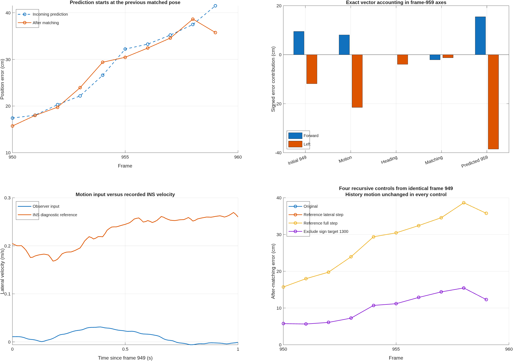

# Why frame 959 starts with 41.51 cm prediction error

Investigated September 22, 2026, against source revision
`f60ccb612f26de621c260a27e02bcdf5474c4de4`. Production code, parameters, the
five-frame horizon and the map are unchanged. This is a diagnostic of the
recursive matching-only replay, not the GNSS-plus-LiDAR fusion observer.

## Mechanism

`replayMississippiLocalization` predicts from the previous accepted matching
pose plus the wheel/gyro/lateral motion increment. An accepted result replaces
the state directly. This replay has no ongoing GNSS-position correction after
its declared initialization. Consequently a biased match becomes the starting
point of the next prediction.

At frame 958 the accepted position already has **38.6346 cm** error. Its next
approximately 0.101 s motion increment produces **41.5131 cm** incoming error
at frame 959. Calling the entire 41.51 cm a motion-predictor error would hide
the contribution of earlier biased map matching.

## Exact accounting over the preceding second

From the accepted frame-949 pose through the incoming frame-959 prediction,
1.000505 s elapses. Position error can be decomposed exactly into previous
error, mismatch of body-frame motion increments, error from using the previous
estimated heading, and the intervening matching corrections. The table uses
one fixed basis: the reference forward/left axes at frame 959. Positive right
is negative left. Error magnitudes must not be added as if they were signed
components.

| Contribution | Forward (cm) | Right (cm) |
|---|---:|---:|
| Accepted frame-949 error | 9.4874 | 11.8415 |
| Motion-increment mismatch, 950:959 | 8.0679 | 21.5021 |
| Previous estimated heading, 950:959 | -0.0082 | 3.9297 |
| Actual matching corrections, 950:958 | -2.0737 | 1.2484 |
| Incoming frame-959 error | **15.4735** | **38.5216** |

The final two components have Euclidean norm 41.5131 cm. The per-step identity
closes within 1.14e-9 m. This is an exact accounting of the observed trajectory;
it does not assign causal responsibility independently of feedback.

Motion reconstruction is not accidentally setting lateral velocity to zero.
The actual wheel and lateral observer inputs were reconstructed with the saved
design and reproduce the stored integrated path within 6.44e-10 m. Over this
second their mean forward/lateral velocities are **11.9774 / 0.0108 m/s**.
Recorded INSPVA velocity, resolved in its heading axes, is **11.8978 / 0.2289
m/s**. The approximately 0.2181 m/s lateral difference is consistent with the
roughly 21.5 cm one-second lateral motion-increment discrepancy.

The lateral observer's dynamic channel has participation one throughout this
interval. Its mean hidden dynamic lateral estimate is -0.0149 m/s. In the
master velocity equation, the mean kinematic term is +0.30074 m/s2 and dynamic
correction injection is -0.31202 m/s2, leaving mean velocity rate -0.01128
m/s2. Thus the estimator is running, with its nominal dynamic model maintaining
a near-zero lateral estimate. `observer_balance.json` records this evidence.
This does not prove that all disagreement is physical tire sideslip or that
INS velocity is exact: body-axis alignment, INS-to-model reference-point
differences, nominal dynamics and sensor corrections remain unresolved causes.
No fixed velocity offset or heading calibration is inferred from one second.

## Why correcting prediction alone does not cure this segment

Raw frames 945:959 were processed again; 945:949 supplies full warmup. Four
10-frame recursive controls start from the same accepted frame-949 pose.
All retain identical odometry-based source-window geometry. Reference motion
substitutions affect only prediction, isolating it from historical-cloud
alignment. Map exclusion is a diagnostic, not a deployed map edit.

| Recursive control, frames 950:959 | Frame-959 incoming error (cm) | Frame-959 matched error (cm) |
|---|---:|---:|
| Original motion and map | 41.5131 | 35.7554 |
| Reference lateral displacement per step | 38.8796 | 35.7558 |
| Reference complete SE(2) step | 38.6202 | 35.7558 |
| Original motion, exclude sign map component 1300 | **17.0102** | **12.2758** |

All forty results are accepted full poses. The original recursive trajectory
is reproduced within 1e-7 in pose coordinates. The reference increments are
offline controls, not viable runtime measurements or accuracy claims.

Every original result from frames **950 through 959** matches the five-scan
confirmed traffic sign to the same map component **1300**. Its source-to-target
distance at the reference pose grows from 33.48 cm to 52.89 cm, while its final
robust residual weight remains 0.3078--0.3266. It is the only matched sign and
receives one third of the pre-robust class-balanced weight. Previous inspection
established that alternative component 1298 is substantially more consistent
at frame 959. The association stays locally self-consistent at the biased pose,
so robust weighting and acceptance checks continue to admit it.

Even improved prediction returns to nearly the same biased matching solutions.
Excluding only component 1300 with the original motion substantially reduces
both subsequent prediction and matched errors. This establishes an important
feedback mechanism: mismatched motion adds error, but repeated biased map
associations prevent correction and write that bias back into the next seed.
The tiny net matching correction in the accounting table does not imply a tiny
causal role for matching: it measures its actual movement, not how much error
it should have removed. The controls test that distinction directly.



## Scope and verification

- `decompose_drift.m`: exact signed accounting, reconstruction of the original
  motion stream, direct recorded INS velocity comparison and observer balance.
- `replay_drift_controls.m`: 15 fresh coarse scans, five warmup scans, four
  recursive variants over ten query frames, and per-frame sign associations.
- `plot_drift.m`: standalone diagnostic export; visually checked.
- Code Analyzer: zero findings for all three helpers. Direct assertions verify
  vector closure and the saved trajectory rather than rerunning unrelated tests.
- No full 1170-frame replay or production modification is claimed. Results are
  limited to this selected segment and the existing same-drive map, fitted
  origin, reference tilt, initialization and offline synchronization assumptions.
- The evidence does not establish every cause of the initial frame-949 error,
  the physical identity of every sign component, or a sequence-wide solution.

```matlab
setupVehicleLocalization;
addpath('research/frame959_prediction_drift_20260922');
decompose_drift;
replay_drift_controls;
plot_drift;
```
