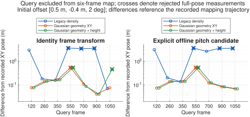

# Semantic Gaussian geometry registration with retained height

Date: 2026-09-05. This implementation follows the
[height and density bias investigation](height_registration_bias_diagnosis.md).
Its localization state, optimization vector, and accepted observer measurement
are always **[X, Y, psi]**. Height is feature information and an externally
referenced compatibility cue; neither Z nor roll/pitch is an online unknown.

## Implemented decision

The default `registerSemanticProbabilityCloud` path now uses `geometricD2D`:
same-class Gaussian associations, covariance-normalized geometric residuals,
robust reweighting, explicit nullspace detection, and class consistency checks.
It consumes the coarse probability cloud directly. It does not recover raw
point correspondences or run any fine perception online.

The former normalized L2 Gaussian-mixture overlap remains available as
`method="densityOverlap"`. Its map export and integrated-support mass formula
are unchanged. Historical diagnostic scripts explicitly select that method,
so a change of production default cannot silently rewrite old experiments.
`scoreSemanticProbabilityCloudAlignment` remains a legacy overlap diagnostic;
its score and the new result's `similarity` have different meanings.

The theoretical starting point is a Gaussian residual whose covariance is the
sum of target covariance and transformed source covariance. GICP uses this
construction; the VGICP paper summarizes it in Section III-A, equations 1–5.
Our implementation uses semantic pillar/map components, projects line residuals
onto the normal, and estimates SE(2). It is a project-specific adaptation,
not an implementation of the complete VGICP method.
[Koide et al., Voxelized GICP for Fast and Accurate 3D Point Cloud Registration](https://staff.aist.go.jp/k.koide/assets/pdf/icra2021_02.pdf).

## Geometric objective

For source component i and associated target j of the same semantic class,

\[
d_{ij}=R(\psi)\mu_{i,xy}+[X,Y]^T-\mu_{j,xy},\qquad
V_{ij}=C_{j,xy}+R C_{i,xy}R^T+\sigma_n^2 I.
\]

For poles, the squared standardized residual is
\(q_{ij}=d_{ij}^T V_{ij}^{-1}d_{ij}\). For elongated curb/marking map components,
let n be the minor-eigenvalue eigenvector of their XY covariance:

\[
q_{ij}=\frac{(n^T d_{ij})^2}{n^T V_{ij}n}.
\]

The ground-line tangent is used only to bound local association. It contributes
no direct pose force or information eigenvalue. Consequently, moving a Gaussian
mean along an otherwise identical road line cannot manufacture longitudinal
observability. Ground components with XY eigenvalue ratio below 3 are omitted
because their covariance does not identify a reliable line normal. This loses
some usable ground geometry but avoids treating an arbitrary blob orientation
as a line constraint. Poles retain full horizontal constraints.

For ground association, compare standardized normal residual plus a bounded
tangent proximity term. The normal gate is 2.5 m and the tangent gate is
three target major standard deviations plus 2.5 m. Pole association uses a
2.5 m radial gate and adds a covariance-shape penalty to the Mahalanobis score:
\(\max(0,\log[\det V/(4\sqrt{\det C_j\det (R C_i R^T)})])\).
This discourages a broad map component from capturing a compact landmark
solely because its residual precision is small.

Weights use source semantic evidence times occupancy and available target
quality, normalized within each shared class. Classes receive equal nominal
weight. As of 2026-09-07, each normalized weight is then multiplied by the
matched map component's `repeatability`, without further renormalization.
This discounts geometrically unstable map components and uniformly unstable
classes. Schema-2 repeatability is the posterior probability of stable
geometry across observed blocks, not a calibrated per-frame detection rate.
Legacy clouds without this field retain unit repeatability and their existing
support-amplitude quality. See the [implementation and validation](d2d_repeatability_weighting.md).
Positive `mixtureWeight` magnitudes are not used: support volume,
EM sampling mass, and source hit count are not interchangeable geometric
confidence. A zero mixture weight still disables a component. This removes
the diagnosed integrated-volume attraction without changing the map's query
or density semantics. It does not make arbitrary spatial resampling or changed
component geometry exactly invariant; only positive mass changes at fixed
geometry are invariant.

The robust cost is \(\sum w\,c^2\log(1+q/c^2)\), with c = 2.5. The solver
alternates association/whitening and Gauss–Newton updates with backtracking.
Each trial step keeps its correspondences and whitening fixed; they are
recomputed for the next iteration. Thus it is an iteratively reweighted
geometric estimator, not the exact optimizer of the old mixture likelihood
or of a single pose-dependent covariance log-likelihood. The parameter scale
is \([\Delta X,\Delta Y,10\Delta\psi]\), in equivalent meters.

## Observability and acceptance

The weighted Gaussian residual Jacobians produce a 3-by-3 normal matrix.
Eigenvalues must exceed both 1e-8 and 1% of the largest eigenvalue to contribute
an update. Unsupported directions retain the supplied prediction. Parallel
roads without an overlapping landmark therefore have rank two, not a complete
SE(2) measurement. `observableProjector` uses the scaled coordinates above.

The existing full-pose observer interface requires rank three. The result
exposes `observableRank`, `correspondences`, `matchedFraction`,
`classDiagnostics`, and, for qualified degenerate geometry,
`partialPoseAvailable`. These diagnostics are not fused by `localizeLidarFrame`;
it emits a measurement only if `accepted` is true. An event still contains a
three-element `pose`, with acquisition and arrival timestamps.

Acceptance also requires at least three correspondences, 10% source coverage,
repeatability-weighted mean class compatibility >= 0.15, convergence, and an
interior solution in the configured [3 m, 3 m, 12 deg] correction bounds. Each class independently
computes a correction in its own observable subspace; a correction exceeding
0.5 equivalent meters rejects the combined result as `inconsistentClasses`.
These thresholds and the normal matrix are engineering diagnostics, not
calibrated confidence or a guarantee against repetitive-scene ambiguity.

## Height without a larger localization state

The complete Gaussian mean and covariance remain available:
\(\mu=[\mu_x,\mu_y,\mu_z]^T\), including Cxz and Cyz. For target j,

\[
\beta_j=C_{j,xy}^{-1}C_{j,xy,z},\qquad
s_j^2=C_{j,zz}-C_{j,z,xy}\beta_j.
\]

At the transformed source mean, the target conditional-height residual is

\[
r_z=\mu_{j,z}+\beta_j^T d_{ij}
      -(\mu_{i,z}+z_{\mathrm{reference}}),\qquad
v_z=s_j^2+[-\beta_j;1]^T\widetilde C_i[-\beta_j;1].
\]

Here \(\widetilde C_i\) includes known yaw rotation and configured height/tilt
uncertainty. Accept a correspondence only when \(|r_z|\leq3\sqrt{v_z}\).
The planar metric uses the original XY marginal regardless of height mode.
There is no Z residual row in the pose normal equations. Changing a compatible
vertical offset therefore cannot directly pull [X,Y,psi]; height may change
which associations are available. A small covariance slope does not erase
height: marginal/conditional spread and absolute height still affect this gate.

`heightMode="xy"` remains the default. `"xyz"` opts into this compatibility
test and requires height in both clouds and a finite `heightTranslation`.
`"auto"` falls back to XY if either is missing. The scalar vertical reference
comes from outside localization, not from optimization. Unknown-height maps
do not receive invented Z. The legacy density method retains its former XYZ
overlap behavior when explicitly selected.

## Shared offline frame calibration

`lidarFrameCalibrationConfig` describes
\(p_b=R_c p_{stored}+t_c\), before the recorded attitude. Identity is default.
Set the same `frameCalibration` in perception and map-building configuration.
Online accumulation composes the known tilt with Rc and rotates tc before
forming Gaussian moments; pillar classification stays in the original grid.
Offline collection applies Rc/tc to already verified feature points before
the full recorded body-to-map pose. Translation does not change covariance.

Both clouds and saved map windows carry the transform and an identifier.
Registration compares the numeric transforms, not merely their names. Known
differences, including a nonidentity source against an unannotated legacy
map, raise `VehicleLocalization:CalibrationMismatch`. Missing provenance with
an identity peer is allowed and labeled `unverifiedLegacy`. The new maps in
this study are separate local outputs; existing full-route maps and raw data
were not overwritten.

`fitLidarPitchCalibration` is a reusable offline candidate estimator. It fixes
nearest-XY same-class point pairs within 0.3 m between the first frame and
later translated frames. At least three overlapping pairs of frames and
similar headings are required. A bounded one-dimensional fit minimizes the
squared per-frame median Z discrepancy under the full recorded rotations.
The estimator reports its frame set, pair counts, residuals, and pitch-only
scope; it neither solves translation/full extrinsics nor changes an online
state. It is conditional on static features and valid recorded poses.

On curb observations from frames 260:266, the fitted increment is
Ry(-3.476566590 deg). RMS of six frame-pair median Z residuals decreases from
0.333187 to 0.005140 m on the fitting interval. This is an in-sample fit, not an
independent calibration certificate. It does not identify whether the mismatch
originated in LiDAR mounting, INS mounting, or the stored body-frame convention.
The fitted transform is an explicit study profile, never a global constant.

## Recorded validation

Input: `data/raw/MissisipiPointClouds.mat` and the matching 1:1170 pose CSV.
Queries are 260, 550, 900 plus additional scenes 120, 350, 700, 1050. Each map
uses only the next six frames; the query is excluded. The four additional
scenes were evaluated after initial prototype development and were not used
to select its geometric thresholds. For the calibration experiment only
260:266 is fitted; the other six query windows lie outside that interval.
All data are from the same recorded route, so these are trajectory-consistency
measurements, not independently established localization accuracy.

Three starts are [0.5 m, -0.4 m, 2 deg], its negative, and the recorded pose.
Identity and calibrated variants each test legacy XY overlap, Gaussian XY,
and Gaussian height compatibility: **126 registrations**. Temporal sampling
uses the map configuration's deterministic mt19937ar seed 1.

| Identity transform, first start | Legacy XY difference (m) | Gaussian XY difference (m) | Gaussian XY decision |
| --- | ---: | ---: | --- |
| 260 | 0.1824 | 0.1417 | accepted |
| 550 | 3.6171, boundary | 0.5381 | rank two; rejected |
| 900 | 3.5214, boundary | 0.0410 | accepted |
| 120 | 2.9610, accepted | 0.0764 | accepted |
| 350 | 0.1577 | 0.1659 | accepted |
| 700 | 3.4430, boundary | 0.1078 | accepted |
| 1050 | 0.0705 | 0.0753 | accepted |

Across the 21 identity-transform runs, legacy XY accepts 12, including one
2.961 m discrepancy; Gaussian XY accepts 18, with maximum accepted XY
difference 0.1659 m and maximum absolute yaw difference 0.3798 deg. All three
550 starts are rejected as degenerate. Their retained longitudinal prediction
is not claimed as a successful localization estimate. Accepted-only medians
are 0.1577 and 0.0764 m, but their acceptance sets differ.

Uncalibrated height compatibility rejects two additional 1050 starts because
the remaining associations have rank two. This is why it remains opt-in.
With the explicit pitch candidate and rebuilt maps, Gaussian height accepts
18/21, with maximum accepted differences 0.1409 m and 0.3943 deg. It restores
1050 acceptance but is not better on every frame (900 is about 0.0838 m versus
0.0410 m for identity Gaussian XY at the first start). Calibration alone leaves
large false density-overlap solutions, confirming the need to change the
geometric objective as well.



Warmed `timeit` measurements exclude perception/loading. Median over the seven
frames is 16.788 ms for legacy XY, 13.723 ms for Gaussian XY, and 18.508 ms for
Gaussian height under identity calibration. Precomputing conditional map
slopes and vectorizing height variance avoids the initial per-pair 3D solves.
These desktop timings are not hard real-time deadline guarantees.

Coarse perception was compared with an immutable export of
`5d523e322380af48c7d7aca60b1cdbeafeef014c`, using the same native MEX binary.
All seven identity component structures are exactly equal. The calibrated
and uncalibrated fine masks and candidate pillar structures are also exactly
equal for all seven frames. Single warmed `timeit` estimates per frame/path
(current first, baseline second) have medians 68.047 and 66.287 ms. This is a
similar latency scale, not evidence of a coarse-perception speedup; the timing
comparison is not randomized and does not estimate a confidence interval.

The full suite passed 106 tests; after the final projection-provenance test,
the combined latest results are **107 passing tests**, including 14 new tests for geometric
recovery, sampling-mass invariance, parallel-road nullspace, class conflict,
height compatibility, calibration transforms/provenance and excitation. The
existing perception fidelity, map regression, native/MATLAB and observer tests
also passed. Two final calls through `localizeLidarFrame` verified an accepted
three-element event for frame 260 and no event for degenerate frame 550. Code Analyzer with factory settings reported no findings in 30
changed/new MATLAB files. The user's unrelated observer file moves were
present during testing and are excluded from this change.

## Reproduction and use

```matlab
setupVehicleLocalization();
reports = runGeometricRegistrationStudy("output/geometric_registration");

% Default online estimator: exactly [X,Y,psi], geometry XY, identity calibration.
cfg = struct('perception',perceptionConfig(), ...
             'registration',distributionRegistrationConfig());
[pose,tilt,zReference] = poseRowToPlanarPose(poseRow);
cfg.perception.coarseProbabilityCloud.projectionRotation = tilt;
[event,diagnostic] = localizeLidarFrame(frame,mapCloud,pose,timestamp,cfg);

% Optional calibrated height compatibility. Rebuild before converting the map.
mapCfg = featureMapBuildConfig();
mapCfg.frameCalibration = calibration;
mapCfg.frameIndices = mappingFrames;
mapCfg.mapOutputPath = "calibratedFeatureMap.mat";
[map,~] = buildFeatureMap(dataRoot,mapCfg);
mapCloud = temporalMapToProbabilityCloud(map,batchIndex);
cfg.perception.frameCalibration = calibration;
cfg.registration.heightMode = "xyz";
cfg.registration.heightTranslation = zReference;
[event,diagnostic] = localizeLidarFrame(frame,mapCloud,pose,timestamp,cfg);
```

The figure and CSV/JSON exports in
`research/results/geometric_registration_20260905/` record actual runs. Cached
input clouds, fitted maps, test objects and local PNG stay under ignored
`output/geometric_registration/`. `benchmarkGeometricPerception` requires a
separate immutable baseline export and the same compiled kernel;
`finalizeGeometricRegistrationStudy` exports completed runs and check results.

Remaining limits are local association ambiguity, coarse/fine geometry
differences, unknown authoritative frame calibration, and no independent-route
accuracy evaluation. This change deliberately preserves predictions when
longitudinal geometry is absent; obtaining that direction requires overlapping
landmarks, other sensor information, or an observer interface for partial
measurements. It cannot be recovered from the density of a featureless line.
