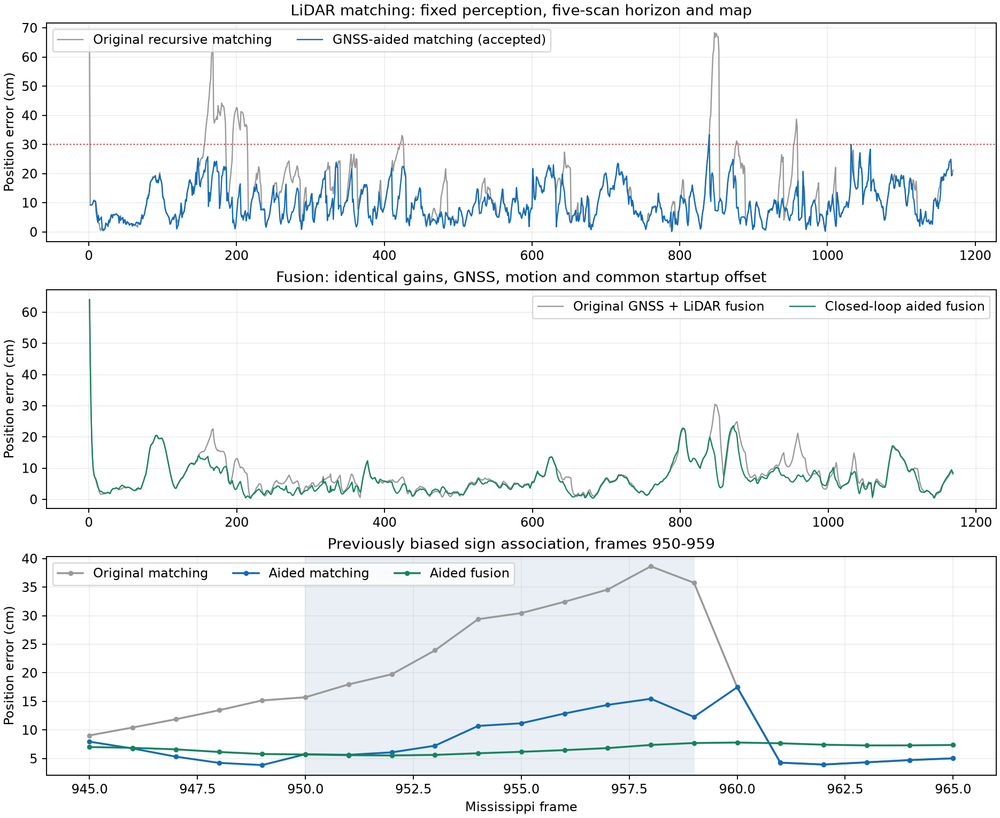

# GNSS-aided selection of LiDAR matching hypotheses

Implemented and evaluated on September 22, 2026. The comparison starts from
revision `9dad58c48cf28fbfc3488f0b69320cf3bebd2f36`. Raw Mississippi scans,
whole-pillar coarse perception, the five-scan confirmation horizon, source
odometry, map mixture weights and observer gains are held fixed.

## Problem and implementation

The previous experiment first generated recursive LiDAR measurements and then
fused those fixed measurements with GNSS. GNSS could correct the observer but
could not change a wrong LiDAR association. At frames 950-959 a persistent
sign repeatedly selected map Gaussian 1300 instead of the substantially more
reference-consistent component 1298. These are component identities; the
physical identity of both mapped surfaces is not established by this audit.

The current synchronous observer can call `data.lidarMatcher(k, seed, aid)`
before each update. Its seed uses the previous fused state and current motion;
aid contains the current BESTPOS position and covariance expressed at the
observer/map point using the existing independent-drive calibration. No
current LiDAR update is fed into its own seed. The temporal source continues
to use independent wheel/gyro/lateral odometry, not corrected matching poses.

`registerSemanticProbabilityCloud` accepts optional position aid. It evaluates
at most two LiDAR-only optimizations: one from the predicted pose, and another
from the GNSS XY position with the same predicted yaw. GNSS is not a heading
measurement. Each candidate must pass the existing geometry, overlap,
convergence and observability checks. The finite candidate score is

`-2 log(geometricSimilarity) + (candidateXY - GNSS)' C^-1 (candidateXY - GNSS)`.

This is an engineering compatibility score, not a calibrated log likelihood.
`C` includes reported GNSS uncertainty, the existing output-point correction
uncertainty, and a 0.10 m floor in quadrature. Aid with maximum position sigma
above 2 m is ignored. A second solve is skipped below 5 cm seed separation.
Converged hypotheses separated by less than 2 cm in the solver's scaled pose
coordinates are treated as the same mode. A chosen result with position
innovation above 9.21 is withheld, not replaced by a synthetic LiDAR event.
These constants were fixed before the full-drive comparison; no reference
position, map component ID or frame number enters the production decision.

For distinct modes, relative support is proportional to `exp(-score/2)`.
Their weighted second moment about the selected mode, `B`, reduces the
conditional geometry information through

`I_out = sqrt(I) * inv(identity + sqrt(I) * B * sqrt(I)) * sqrt(I)`.

The same operation is applied separately to supported directional information,
preserving its null directions. GNSS contributes no Hessian or continuous
pose force. This prevents directly adding its information twice, but does
**not** make the selected LiDAR measurement statistically independent of GNSS.
Events and saved experiment data explicitly mark that conditioning. Both the
geometric matrix and ambiguity adjustment remain uncalibrated.

`runMncavFullObserverExperiment` now rematches each scenario by default.
Declared GNSS withdrawals disable aiding; declared LiDAR withdrawals produce
no LiDAR correction. Saved `data.lidar` contains the actual selected results
from the both-sensors run. `RematchWithGnss=false` is an explicit experimental
control for frozen precomputed measurements, not a duplicate solver.

## Results

All 1170 raw scans were reprocessed into identical coarse horizons. Frozen-seed
matching covers all 1170; the existing native motion/GNSS synchronization
supports 1169 full-observer frames. No extrapolated final fusion frame is added.

| Measurement on the common 1167 accepted frames | Original | Aided closed loop |
|---|---:|---:|
| LiDAR position RMSE | 17.16 cm | 11.51 cm |
| LiDAR position P95 | 35.80 cm | 21.15 cm |
| Maximum LiDAR error | 68.28 cm | 33.35 cm |
| LiDAR errors above 30 cm | 74 | 1 |

The full 1169-frame fusion RMSE, including identical initialization error, is
**9.66 cm -> 8.22 cm**. The paired GNSS-only observer is **9.19 cm**. Feedback
of the fused seed alone gives **8.60 cm** fusion RMSE; GNSS candidate selection
adds a further improvement. With original seeds frozen, aiding alone reduces
accepted matching RMSE from 17.19 cm to 12.05 cm, separating candidate selection
from feedback effects. `metrics.csv` retains all populations and counts;
`paired_metrics.csv` reports identical accepted-frame comparisons.

At frame 959, matching error changes from **35.76 cm to 12.27 cm**, and fusion
error from **21.17 cm to 7.71 cm**. Original matching chose component 1300 in
all ten frames 950-959. Aided matching chooses 1298 in all ten. Fused seeds
alone still choose 1300 in frames 950-952 before recovering. No map component
was removed or blacklisted.

The aided observer withholds LiDAR at frame 1 (normal temporal startup) and
frame 169 (all admissible optima conflict with position aid). Frame 169's
unpublished candidate has 39.03 cm error. The largest remaining accepted
LiDAR error is **33.35 cm at frame 840**. Pose errors are not a manually labeled
sequence-wide mismatch rate, so these results do not prove all associations
are correct.

Every full trajectory retains the declared 64.03 cm frame-1 startup offset.
After the explicitly reported first 2 s, fusion RMSE is **9.40 -> 7.88 cm**,
and its maximum is **30.49 -> 23.58 cm**. Those are separate populations, not
the full-run metric. The full-run startup maximum must not be hidden.



## Validation and boundaries

- 139 MATLAB tests pass, including repeated structures, missing/uncertain aid,
  all-candidate conflict, information monotonicity, true and truncated null
  directions, acquisition-time checking, feedback and future-input isolation.
- Frozen baseline results reproduce on nine selected frames within 9.32e-10
  in pose coordinates. Across all 1167 accepted aided frames, exported
  information does not exceed the selected LiDAR-only conditional Hessian
  beyond 1.10e-11 numerical tolerance.
- The full entry point was exercised on both sensors, each sensor alone,
  40-60 s GNSS/LiDAR/both withdrawals, and alternating availability. Missing
  both sensors still causes substantial drift; this change does not claim
  observability during simultaneous outages.
- A second production replay regenerated all raw-scan horizons through the
  shared preparation function. Its both-sensor pose trajectory exactly equals
  the research replay, and saved measurements equal the actual selected
  candidates. All 15 changed MATLAB files have zero factory Code Analyzer
  findings. An intermediate cache clock-field assertion error was fixed
  before this successful fresh replay; it did not produce accuracy results.
- Coarse/window preparation took 67.86 s for 1170 scans, excluding disk reads;
  aided registration took 9.79 s for 1169 closed-loop frames on this run.
  These are measured batch timings, not a scheduling/deadline guarantee.
- Same-drive mapping includes query observations. Evaluation and BESTPOS share
  a receiver; BESTPOS is INS aided. Initial position/yaw uses the declared
  reference offset; reference tilt and offline clock/bracket alignment remain
  inherited assumptions. This is not an independent-drive or online-latency
  certification.
- Two starts cannot enumerate every mode. Biased overconfident GNSS can select
  or reject a valid LiDAR solution incorrectly. Relative support is heuristic;
  temporal, map and GNSS correlations are not fully modeled. No claim of
  globally optimal association or calibrated pose covariance is made.

## Reproduction

```matlab
setupVehicleLocalization;
addpath('research/gnss_aided_matching_20260922');
prepare_sources;
run_comparison;
analyze_aiding;
runMncavFullObserverExperiment('output/gnss_aided_matching_20260922/production_fresh', ...
    MatchingFolder='output/temporal_perception_20260922/five_frame_matching');
validate_results;
```

`python research/gnss_aided_matching_20260922/plot_results.py` exports the figure.
Large MAT outputs and source clouds remain under `output/`; compact tables,
validation and these reproducible methods are versioned. The default production
entry regenerates source horizons; an explicitly supplied `CoarseSourceFile`
can reuse a verified preparation for controlled comparisons.

The distinction between geometry and ambiguous association follows the
motivation in [Doherty et al., *Probabilistic Data Association via Mixture Models
for Robust Semantic SLAM*](https://arxiv.org/abs/1909.11213). This implementation
uses two LiDAR pose candidates, not that paper's full inference algorithm.
[Autoware's NDT documentation](https://autowarefoundation.github.io/autoware_core/latest/localization/autoware_ndt_scan_matcher/#regularization)
also describes position aiding and its GNSS failure modes; our implementation
uses candidate selection rather than adding its regularization term.
