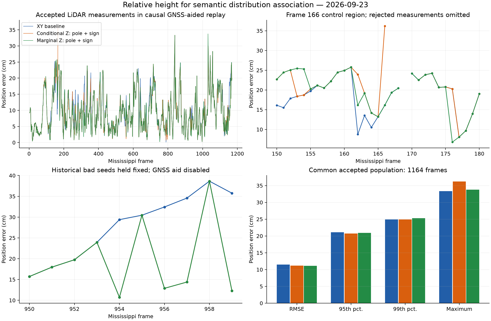

# Relative height evidence for semantic map association

Date: 2026-09-23. This is an implemented and measured exploration of using
retained XYZ pillar statistics to reduce ambiguous XY correspondences. The
production default remains XY-only while the relative-height option is evaluated.
No frame-specific or component-ID-specific rule is added to the matcher.

## Representation and implementation

The existing map has 1,320 Gaussian components, of which 1,309 have retained XYZ
statistics. The coarse source builder already produces `meanXYZ`,
`covarianceXYZ` and `heightAvailable`. The old source-window output and map-cache
projection discarded this information before registration.

The new source window keeps its original five-scan XY mixture and adds a
`heightEvidence` sidecar: the **current acquisition's** XYZ moments associated
with a track confirmed in at least two acquisitions. Detection count divided by
five still scales source influence. Historical Z values are not transported
using planar odometry: that would silently assume zero vertical ego motion.
A track missed in the current scan remains eligible in XY but has no current
height evidence. This is still whole-pillar coarse perception; there is no
pointwise fine perception, ring information, vertical subdivision or raw-point
access in the matcher.

`prepareRelativeHeightAssociation` estimates a nuisance Z offset from at least
four distinct curb map components, with at least 3 m of spatial span and at most
0.75 m normal-distance disagreement. It evaluates each anchor's map height
conditional on the current source XY location, uses a median/MAD consensus and
keeps the residual scatter as common uncertainty without dividing it by the
anchor count. Anchors depend on the initial planar hypothesis. No reference or
GNSS altitude is supplied. If support is insufficient, association falls back
exactly to XY.

The candidate score adds a bounded height compatibility penalty to the existing
XY correspondence cost and stored map-mixture prior:

\[
q_z = \frac{(\mu_{z,\mathrm{map}}-\mu_{z,\mathrm{source}}-\hat b_z)^2}
 {\sigma^2_{z,\mathrm{map}}+\sigma^2_{z,\mathrm{source}}+
  \sigma_b^2+\sigma_0^2+r^2\sigma_\mathrm{tilt}^2},
\qquad C_z=w\frac{9q_z}{9+q_z}.
\]

The marginal variant uses the formula directly. The conditional control instead
uses the map's conditional Z mean and Schur-complement variance and projects the
source covariance along the same tilted residual direction. These are
compatibility scores, not calibrated sensor likelihoods. Default experimental
settings are `w=1`, `sigma0=0.20 m` and `sigmaTilt=0.5 deg`. The semantic selection
can restrict this evidence to pole/sign or sign only. All six controls use the
same settings; there is no frame-based tuning.

Height changes **which correspondence is selected**, not the SE(2) residual,
force, Hessian or output dimension. The pose still measures X, Y and yaw. For
unchanged correspondences, the original planar pose and information are exactly
unchanged. The exported information remains conditional geometric information,
not a calibrated measure of association uncertainty. Existing stability map
weights are used once, without a new stability multiplier.

`selectLocalProbabilityCloud` now crops retained height statistics alongside XY.
It preserves original mixture weights and calibration while omitting whole-map
mass-normalization claims, which would become invalid in a local crop.

## Experiment protocol

All 1,170 coarse frames were regenerated from the recorded sequence. Every
pooled XY component structure is exactly equal to the previous cache, including
means, covariances, temporal stability and weights. The XY replay reproduces the
active GNSS-aided observer baseline exactly (maximum pose difference zero).

The observer produces 1,169 fusion outputs; the unsupported final timestamp is
not extrapolated. Matching uses causal observer predictions and the existing
GNSS aid. The reported LiDAR measurement errors are the raw matching outputs
inside that replay, **not a GNSS-independent standalone trajectory**. Reference
XY and yaw are used for evaluation, not passed as matching seeds. Known tilt and
initial observer alignment retain the baseline's reference-assisted assumptions.
The map and source are from the same drive. These comparisons do not establish
independent-map generalization or absolute localization accuracy.

Variants:

- `xy`: current XY-only algorithm.
- `relative_z_all`: conditional height cost for all feature classes.
- `relative_z_objects`: conditional height cost for pole and traffic sign.
- `relative_z_signs`: conditional height cost for traffic sign only.
- `marginal_z_objects`: marginal height cost for pole and traffic sign.
- `marginal_z_signs`: marginal height cost for traffic sign only.

Results and conclusions below are populated from the saved replays. No manual
object labels exist for the whole sequence; changed Gaussian target counts must
not be called a measured mismatch rate. Distance to a component center is only
an evaluation proxy, particularly for long curb components.

## Measured results

All six variants share 1,164 accepted matching frames. Errors below are in cm; fusion RMSE uses all 1,169 outputs.

| Variant | Matching RMSE, common | Matching P99, common | Matching max, common | Fusion RMSE | Accepted frames |
|---|---:|---:|---:|---:|---:|
| `xy` | 11.4693 | 24.8856 | 33.3491 (frame 840) | 8.2156 | 1167 |
| `relative_z_all` | 11.1571 | 24.8670 | 36.1984 (frame 166) | 8.1756 | 1164 |
| `relative_z_objects` | 11.1626 | 24.9029 | 36.2271 (frame 166) | 8.1805 | 1164 |
| `relative_z_signs` | 11.2690 | 25.1986 | 33.3491 (frame 840) | 8.2099 | 1167 |
| `marginal_z_objects` | 11.1353 | 25.2855 | 33.7629 (frame 1031) | 8.1662 | 1167 |
| `marginal_z_signs` | 11.2536 | 25.7242 | 33.7629 (frame 1031) | 8.1939 | 1167 |

The main XY/marginal-pole-and-sign pair has exactly the same **1,167 accepted
frames**. On that population, matching RMSE decreases from **11.5060 to
11.1740 cm** (2.89%). The maximum increases from **33.3491 cm at frame 840**
to **33.7629 cm at frame 1031**, and the number above 30 cm increases from one
to two. This is not a uniform improvement. In particular, frame 1031 gets worse
from **15.2164 to 33.7629 cm**: the sign target changes from component 1307 to
1308. The center-distance proxy rises from 26.26 to 31.11 cm; it does not provide
an independent physical-object label.

Fusion RMSE decreases only from **8.2156 to 8.1662 cm**. After the first two
seconds it decreases from **7.8754 to 7.8230 cm**. All variants retain the same
**64.0312 cm initial error at frame 1**; excluding startup must be stated
explicitly. The marginal variant's post-startup maximum is 23.5204 cm, versus
23.5787 cm for XY. These sub-millimeter changes in sequence fusion RMSE are
small and have not been shown statistically significant or transferable to
another sequence.

### Why the conditional-height control failed at frame 166

With an identical baseline-selected seed and no GNSS mode ranking, conditional
pole/sign height changes the frame-166 error from **16.1484 to 36.2271 cm**.
Two pole associations switch from 924/942 to 925/944. The current source
height means, after the inferred offset, actually agree with the original map
means to about **6.18 cm and 1.55 cm**. The failure therefore cannot be explained
simply as a mismatch of the original height means.

The conditional map model extrapolates height from horizontal displacement. For
component 942, the local coefficients are about `[-2.69, -10.11]` m/m: a
20.8 cm XY displacement changes the conditional map height by about 1.33 m.
Thin, nearly vertical distributions make this a poor way to evaluate the
current observed pole height. Current-acquisition XY and the pooled XY mean
also differ, making such extrapolation particularly sensitive.
`frame166_height_geometry.csv` records this separate baseline-pose diagnostic.

Using the **marginal height distribution**, with its full Z spatial variance,
keeps the original pole correspondences and returns **16.1484 cm** under the
same seed. This supports marginal height evidence for vertical objects over
interpreting them as height surfaces. Partial visibility and noisy temporal
association remain possible problems; this control does not eliminate them.
Restricting conditional height to signs also avoids this pole failure, but it
has smaller average gains and still introduces another >30 cm measurement.

### Historical sign mismatch and remaining peak

`frozen_probes.csv` holds the same recorded old seeds and explicitly disables
GNSS assistance. In frames 950--959, XY chooses sign component 1300 in all ten
frames. Both height variants change the correspondence to the previously
identified correct component 1298 in **four frames: 954, 956, 957 and 959**.
For frame 959, the seed error is unchanged at **41.5131 cm**; the raw matching
error decreases from **35.7554 to 12.2758 cm** with marginal height. Six of ten
historical errors remain, including frames 951 and 955 where the height-anchor
support is insufficient. At frame 260 the same fixed-seed diagnostic decreases
from **13.4993 to 1.4661 cm**.

These are useful demonstrations of additional discrimination, not a claim that
40% of all sequence mismatches are removed. The existing GNSS-aided production
baseline already selects the correct sign in the historical ten-frame segment.
It has about 12.27 cm raw error at frame 959, so the 35.76-to-12.28 cm diagnostic
improvement cannot be counted again as a gain over current fusion.

Frame 840 remains **33.3491 cm** with a common baseline-selected seed in every
height variant tested. Several contributing sign/pole tracks have no current
height observation, and other correspondences remain unchanged. More Z
information does not automatically remove every source of horizontal bias.

### Decision and verification

Keep `relativeHeight.enabled=false` by default. The implemented optional model
uses `candidateModel="marginal"` and pole/sign evidence; conditional and semantic
ablation options are exercised by this experiment, not parallel legacy solvers.
The evidence supports continued work on relative height as an association cue,
with partial visibility and uncertainty in the common height offset explicitly
handled. It does not support switching the production default solely for a
small mean improvement while some individual frames regress.

The source mean/covariance representation and semantic prior are unchanged.
Height is active in 1,062 marginal pole/sign replay frames, without changing the
accepted-frame set. That replay changes 1,035 Gaussian targets among 105,731
common-source correspondence comparisons; many are neighboring curb Gaussians
changed indirectly through the resulting pose, not proven object mismatches.

All **182 tests across 12 suites passed**, including 14 height-specific tests:
planar aliases, arbitrary height datums, unchanged XY information, missing
height, sparse anchors, current-only observations, reordered temporal tracks,
partial visibility, map cropping, semantic restriction and marginal-height
invariance under lateral displacement. Factory Code Analyzer found no issues
in 12 checked MATLAB files. The MATLAB version is R2026a Update 3.

Matching times in `summary.json`/`frames.csv` are observed in sequential desktop
runs and include hypothesis selection where applicable, but exclude perception,
cache reads and report generation. They are not a controlled latency benchmark;
the marginal-pole run had much higher observed runtime than adjacent runs. No
real-time performance claim is made from these timings.




## Reproduction and artifacts

Run from the repository root with the existing local dataset and previous
observer inputs available:

```matlab
setupVehicleLocalization;
addpath('research/height_association_20260923');
out = 'output/height_association_20260923';
if ~isfolder(out), mkdir(out); end
cache = prepareMississippiLocalizationClouds( ...
    'output/temporal_perception_20260922/five_frame_matching');
save(fullfile(out,'sources.mat'), '-struct', 'cache', '-v7.3');
run_height_experiment;       % fresh replay of all six variants
probe_height_associations;  % identical old seeds, no GNSS aid
probe_height_peak;          % identical baseline-selected seed controls
validate_height_experiment;
```

`run_height_experiment(true)` reuses completed variant MAT files and runs missing
variants; use the default call for a fresh replay after code changes. The
conditional controls were saved before the marginal alternative was added; they
used exactly the conditional candidate formula retained for this ablation.

Run `/usr/bin/python3 research/height_association_20260923/plot_height_results.py`
to regenerate `height_comparison.png` and its PDF. `metrics.csv`, `frames.csv`,
`association_changes.csv`, `frozen_probes.csv`, `frozen_probe_pairs.csv`,
`peak_control.csv` and `peak_pairs.csv` contain compact measured results.
Large caches and observer state files remain under `output/`; their hashes and
input provenance are recorded in `artifact_manifest.json`. No archive report
source or PDF is hashed.

A report-generation error from missing disabled-mode height diagnostics and an
initial local-map normalization integration error were fixed before the final
results. Already saved observer outputs were reused after the report-only fix;
no failed output is reported as a successful replay.
