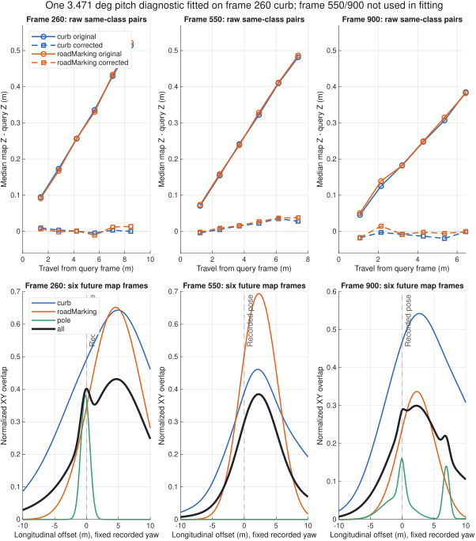

# Why recorded-data D2D alignment deviates

Investigation date: 2026-09-05, America/Chicago.
Algorithm baseline: `2fc2ba3d2c882f4a59edf506cae85cd329344432`.

The experiments identify **two separate causes**: a consistent vertical
geometry mismatch before map fitting, and a planar overlap objective that
matches view-dependent sampling density. Map support-to-mass conversion and
the acceptance criteria amplify the second problem. Coarse feature selection
and numerical differentiation are not the main causes in these cases.

Retaining height remains useful. Directly maximizing the current XYZ overlap
exposes inconsistencies that XY marginalization had hidden. Production
perception, map fitting, registration defaults, and recorded datasets are
unchanged by this diagnostic task. The pitch correction and alternative
weights below are research interventions, not deployed calibrations.

## Question and method

The question is why the preceding height experiment worsened pose consistency,
especially at query frames 260, 550, and 900. This is an exploratory controlled
engineering study, not a systematic literature review or independent
localization accuracy benchmark. Differences are measured against the same
GNSS/INS trajectory used to build the maps; its absolute accuracy is not
established here.

The original six-frame maps use 261:266, 551:556, and 901:906. Query frames are
excluded. Controls vary one mechanism at a time where possible:

- Coarse versus fine point selection, including same-frame fine-map controls.
- Temporal GMM versus a diagnostic 0.9 m fine-point grid.
- XY, XYZ, zero cross covariance, zero pose uncertainty, and 1 m height
  uncertainty. These are interventions, not a parameter search for deployment.
- A single pitch correction fitted using **260 versus 261:266 curb only**,
  then applied unchanged to both query and map geometry in all scenes.
- Integrated support mass, equal component mass, support-amplitude mass, and
  EM mass while holding the original map components fixed.
- Three starts: `[+0.5,-0.4,+2 deg]`, its negative, and the recorded pose.
- Expanded search bounds of 12 m and 12 degrees, class ablation, past versus
  future six-frame windows, and a 30-frame future window at frame 550.

The same MATLAB desktop ran **435 registrations**, **984 height scores**, and
**4,824 longitudinal objective samples**. The map resampling seed remains 1;
no random perturbation or random seed selection is used. All runs, including
rejections and unfavorable interventions, are in the CSV files under
[results/height_bias_20260905](results/height_bias_20260905).

The point-grid control shares the production 0.9 m output size and covariance
bounds, but uses fine points directly, grid membership per point, and saturated
hit weights without coarse evidence probabilities. It is therefore an
estimator/support comparison, not an exact isolation of only GMM fitting.
Same-frame controls and fixed-component weight interventions further separate
these effects.



Top: same-class nearest-XY height residuals before and after one diagnostic
pitch correction. Bottom: original XY objective versus longitudinal offset,
holding recorded yaw and lateral position fixed. Optimization tables allow
yaw and lateral position to move, so their optima need not equal these slices.

## 1. Height drift exists before Gaussian fitting

For each query/map frame pair, take offline fine curb or marking points,
transform them using the current extrinsic and recorded pose, and find the
nearest same-class point in XY within 0.3 m. Z is not used to choose matches.
The raw observations already show positive height residuals increasing with
vehicle travel:

| Query / feature | First future frame: travel / median Z residual | Sixth future frame: travel / median Z residual |
| --- | --- | --- |
| 260 / curb | 1.404 m / 0.095 m | 8.472 m / 0.514 m |
| 260 / marking | 1.404 m / 0.092 m | 8.472 m / 0.522 m |
| 550 / curb | 1.229 m / 0.071 m | 7.378 m / 0.482 m |
| 550 / marking | 1.229 m / 0.074 m | 7.378 m / 0.487 m |
| 900 / curb | 1.068 m / 0.045 m | 6.440 m / 0.385 m |

This is not created by conditional-height regression, GMM weights, or coarse
pillar labeling: none participate in this comparison. Exact results and pair
counts are in [rawResiduals.csv](results/height_bias_20260905/rawResiduals.csv).

A fixed orientation mismatch predicts this pattern. For small pitch mismatch
alpha and forward travel d, approximately

\[
\Delta z \simeq d\tan\alpha.
\]

Fit the slope through the origin using the six **curb medians at frame 260**;
the result is **3.471488 degrees**. The intervention applies
`R_y(-alpha)` to the currently stored vehicle-local points before the recorded
attitude transform. The identical rotation is applied to mapping and query
geometry; no per-frame Z correction is fitted.

| Query / feature | Before: median absolute frame-pair median (m) | After (m) | Role |
| --- | ---: | ---: | --- |
| 260 / curb | 0.2960 | 0.0035 | Calibration data |
| 260 / marking | 0.2938 | 0.0086 | Unfitted class, same scene |
| 550 / curb | 0.2817 | 0.0190 | Unfitted scene |
| 550 / marking | 0.2834 | 0.0215 | Unfitted scene |
| 900 / curb | 0.2155 | 0.0107 | Unfitted scene |
| 900 / marking | 0.2156 | 0.0067 | Unfitted scene |

These numbers summarize six frame-pair medians, not the full point-error
distribution. Some late marking pairs have only 3--11 correspondences; the
curb comparisons have 105--734 pairs. Pair counts and residual IQRs remain
available in [correctedResiduals.csv](results/height_bias_20260905/correctedResiduals.csv).

**Inference:** the dominant vertical inconsistency behaves like a nearly
constant pitch mismatch between the extracted LiDAR coordinates and the
recorded body attitude. Its persistence across scenes and two feature classes,
and the unfitted-scene response to one correction, support this interpretation.
They do not uniquely identify whether the erroneous calibration belongs to
the LiDAR extrinsic, INS installation rotation, or the assumed common body
frame. No authoritative sensor-to-INS calibration was recovered.

The original bag identifies the cloud as `front_ouster`; the extracted odometry
identifies `odom` and `base_link`. There are no `/tf` or `/tf_static` topics in
this bag. Frame names alone do not establish a measured transform. NovAtel's
documentation distinguishes IMU installation rotation, vehicle coordinates,
and lever arms; this is why the complete transform chain must be verified
before assigning the discrepancy to one sensor. [NovAtel SPAN configuration](https://docs.novatel.com/Tools/Content/WebUI_ConfigurationWindows/SPAN_Config.htm).

The intervention changes XYZ registration at frame 260 from **0.356 m /
1.318 degrees** to **0.187 m / 0.620 degrees**. At frame 900, the first start
changes from a rejected 3.513 m boundary result to an accepted 0.117 m result.
Frame 550 still reaches the approximately 3.6 m search boundary. Thus correcting
height geometry does not resolve the separate planar objective problem.

The earlier +0.2--0.3 m Z-offset preference is explained by fitting a single
query against a mixture of several vertically displaced observations. A
constant Z offset can hide some of that inconsistency within one window, but
does not correct the distance-dependent error across frames.

## 2. The planar objective follows sampling density

At frame 550, widening the search allows the original XY objective to converge
to a pose **3.828 m forward**, with score increasing from 0.2991 at the
recorded pose to 0.4140. The large displacement is almost entirely longitudinal
(3.827 m versus 0.061 m lateral). It is not just an early stop at the old bound.

Change only which side of the query supplies the map:

| Frame 550 map | XY longitudinal difference | Result under expanded search |
| --- | ---: | --- |
| Future six frames, 551:556 | +3.827 m | Accepted |
| Past six frames, 544:549 | -4.282 m | Accepted |
| Future 30 frames, 551:580 | +11.430 m | Accepted |

This directional reversal is strong evidence for view/window-dependent
support. A larger map window does not automatically improve alignment when
the objective tries to align the spatial density of the observations.

At frame 550, the query has **no offline fine pole points**. Coarse perception
has one pole component, but its overlap with the map's three pole components
is numerically zero throughout the investigated longitudinal neighborhood.
The available curb and marking fields mostly constrain lateral position and
heading; their density envelopes create longitudinal peaks that move with the
mapping viewpoints. The current curvature test interprets these objective
peaks as constraints.

The statistical assumption can be written as

\[
p_s(u)\propto v_s(u)\rho(u),\qquad
p_m(u)\propto v_m(u)\rho(u),
\]

where rho describes semantic geometry and v includes visibility, LiDAR
sampling, selection, and map support weighting. Even at the correct pose,
different v functions need not produce equal distributions. Along a long
uniform curb, maximizing overlap can align the v functions instead of
identifying a physical longitudinal landmark.

This is a known limitation of density registration rather than an argument
against Gaussian representations. Jian and Vemuri explicitly discuss degraded
density-registration performance for different sampling rates/viewing angles
in Section 2.1 of their original paper. [Author preprint](https://storage.googleapis.com/google-code-archive-downloads/v2/code.google.com/gmmreg/gmmreg_PAMI_preprint.pdf).
Generalized-ICP, Section III.B, instead models local surface directions to
avoid treating surface discretization as exact physical correspondence.
[Segal, Haehnel, and Thrun, 2009](https://www.roboticsproceedings.org/rss05/p21.pdf).
Overlap-guided GMM work addresses nonshared support explicitly; its learned
method is not implemented or evaluated here. [Mei et al., original manuscript](https://arxiv.org/abs/2210.09836).

## 3. Map export weights can suppress useful landmarks

The native temporal map is a peak-normalized support field with noisy-OR/max
query semantics. Its D2D export is a sum surrogate with component mass

\[
w_k\propto a_k\,2\pi\sqrt{\det\Sigma_{xy,k}}.
\]

That conversion correctly integrates the stated planar support surrogate.
It does not make it statistically identical to the online saturated-hit
distribution or the EM training distribution. Broad map components receive
more mass even if they represent few observations.

Frame 900 exposes the consequence. The dominant well-matched pole component
has a nearest source mean 0.043 m away. It carries **86.4% of pole EM mass**,
but only **18.3% of exported pole support mass**. Another broad component
receives 81.5% of exported pole mass despite only 6.18% EM mass.

Holding every mean and covariance fixed and replacing only exported mass by
EM mass changes the first-start XY result from a rejected **3.521 m** boundary
result to an accepted **0.050 m** result. A fine-point grid map built from the
same six fine frames produces **0.046 m** XY difference. This demonstrates
that the data contain useful constraints which the current surrogate can
underweight.

EM weights are **not a general solution**: at frame 550 they yield an accepted
2.682 m discrepancy. Equal mass and support-amplitude mass also have mixed
outcomes. All alternatives are retained in
[mechanisms.csv](results/height_bias_20260905/mechanisms.csv).

## 4. Acceptance checks do not establish measurement reliability

Convergence, overlap greater than 0.15, positive local curvature, and an
interior solution certify properties of this chosen objective. They do not
certify a correct observation model or physical observability. Enlarged
searches at frames 550 and 900 accept 3.8--6.6 m discrepancies. The preceding
height-offset experiment also accepted large discrepancies without enlarging
the production search bounds.

The three classes can disagree strongly. At frame 900, pole-only XY alignment
is near the recorded pose (0.075 m); curb-only and marking-only optima are
approximately 4.56 m and 4.91 m away. The overall scalar score loses this
disagreement. At frame 550 the absent matching pole constraint is also not
represented by a separate acceptance condition.

Degeneracy should be assessed from physical constraints and separated into
observable directions; Zhang, Kaess, and Singh motivate this approach in their
2016 paper. Only its author-hosted abstract was examined here.
[Author publication page](https://www.cs.cmu.edu/~kaess/pub/Zhang16icra.html).
Our additional finding is that even positive curvature can be misleading when
the objective is driven by sampling envelopes. A larger curvature threshold
alone would remain an uncalibrated workaround.

## Excluded or limited explanations

- **Coordinate algebra:** the full quaternion transform and yaw/tilt/Z split
  agree exactly in the tested recorded poses and diagnostic points. This
  verifies implementation consistency, not physical calibration.
- **MAT extraction mismatch:** 52,848 original bag returns at frame 260,
  finite and 1--80 m range, reproduce the current extraction rotation with
  4.22e-7 m coordinate RMS. The fitted affine transform has effectively zero
  translation. The stored MAT cloud is consistent with the extractor code.
- **Gross frame mismatch:** query MAT and pose-table LiDAR timestamps differ
  by approximately 4--5 microseconds. Nearest odometry offsets for the three
  queries are 0.51, 0.55, and 2.60 ms. These checks do not calibrate sensor
  latency or compensate within-scan motion. The extractor does not deskew.
- **Analytic-gradient bug:** real-data centered finite differences agree with
  analytic derivatives to maximum absolute error 1.81e-6 with a 1e-5 step.
  Existing gradient unit tests also pass. No sign, axis, or cross-covariance
  derivative defect was found.
- **Coarse masks alone:** replacing the source with fine selected points does
  not remove the future-map bias. In first-start same-frame fine-map controls,
  coarse-source XY discrepancies are only 0.016--0.040 m. Such controls do not
  establish cross-dataset semantic quality.
- **Optimizer failure alone:** original results reproduce, exact transformed
  self-cloud controls recover pose within 1.18e-6 m, and displaced solutions
  have higher objective values than the recorded pose. Local minima still
  exist; no global-optimality claim is made.

## Design consequences

1. Retain XYZ moments and cross covariance. First establish a common,
   measured LiDAR/INS body frame, with explicit rotation, lever arm, time
   reference, and deskew convention. Validate the 3.47-degree hypothesis on
   turns, grades, and additional sequences before applying it as calibration.
2. Specify the registration distribution independently of the native map
   support query. Make source/map mass semantics and visible support
   consistent. Do not silently substitute EM mass in the original map query.
3. For ground features, avoid inventing longitudinal information from where
   dense samples happen to stop. Evaluate distributions of geometric support,
   normal-direction residuals, and visibility-conditioned comparisons. Use
   pole geometry when present and make missing constraints explicit.
4. Model scan-wide height/roll/pitch uncertainty as shared nuisance variables
   or controlled compatibility terms. Per-component covariance inflation is
   not equivalent to calibrating a common pose error. Removing uncertainty
   worsened several original XYZ cases; increasing it did not solve planar
   bias. Neither intervention supports dropping height information.
5. Add class-consistency, physical observability, and predicted-pose innovation
   diagnostics before interpreting an accepted alignment as an observer
   measurement. Calibrate these criteria from held-out data; do not use this
   three-scene study to declare universal thresholds.

## Reproduction and verification

From the repository root, use the existing MATLAB desktop and run:

```matlab
setupVehicleLocalization;
% Required once if the preceding experiment cache is absent:
% evaluateHeightProbabilityCloud('output/height_retention');
diagnoseHeightRegistrationBias('output/height_bias_diagnosis');
diagnoseHeightRegistrationBias('output/height_bias_diagnosis','mechanisms');
```

Export the original bag cloud read-only:

```bash
uv run --with rosbags==0.11.5 --with numpy==2.5.2 python scripts/auditMississippiPointCloudTransform.py
```

Then export and assert the diagnostic invariants:

```matlab
finalizeHeightBiasDiagnostics('output/height_bias_diagnosis', ...
    'research/results/height_bias_20260905');
runtests({'tests/heightProbabilityCloudTest.m', ...
    'tests/distributionRegistrationTest.m', ...
    'tests/temporalStabilityGmmMapTest.m','tests/pipelineRegressionTest.m'});
```

The baseline stage caches fine observations and clouds in
`output/height_bias_diagnosis/diagnostic_inputs.mat`. Use a new output folder
or deliberately remove that generated cache when changing perception, map
configuration, source data, or frame selection. The algorithm revision for
this study is the baseline SHA above; reruns after algorithm changes are new
experiments, not reproduction of these numbers.

Validation: baseline pose differences reproduce within 4.89e-15 m; transformed
self-cloud, derivative, coordinate-chain, extraction, and query-exclusion
assertions pass. The **30 targeted MATLAB tests pass**, with zero failed or
incomplete. Both new MATLAB research functions are Code Analyzer clean.
Numerical evidence is exported; raw bags, MAT datasets, and large diagnostic
caches remain in their normal local locations and are not published.

This report was prepared with AI-assisted code inspection, literature lookup,
experiment execution, and writing. Sources were checked directly; the measured
results come from the local MATLAB experiments. The pitch attribution remains
an inference, and the report preserves negative results and counterexamples.
