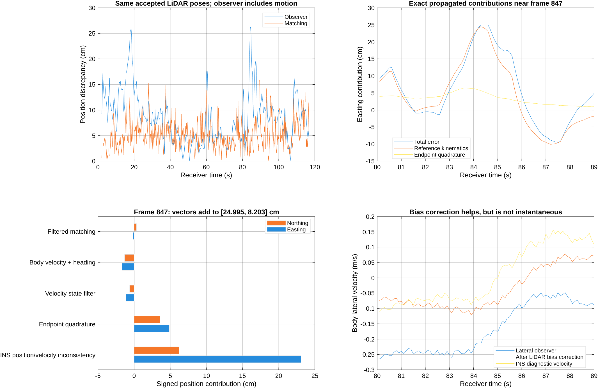

# Why the LiDAR-aided observer scores worse than matching

The saved complete Mississippi experiment shows a real **position-scoring
regression** in the LiDAR + wheel/IMU/steering scenario. On the same 1,121 accepted
post-startup LiDAR frames, matching RMSE is **5.7677 cm**, while the observer has
**9.7796 cm**. Heading improves from **0.15534 to 0.11999 degrees RMSE**.
The scenario name `lidar_only` excludes GNSS position corrections; wheel speed,
IMU and steering-based lateral estimation remain active.

There are two interacting issues: the observer gives persistent motion/reference
disagreement too much influence relative to the matching corrections, and the
recorded INSPVA position reference is not kinematically consistent with its own
reported velocity. At the maximum frame, the latter is the largest measured
term. It would be incorrect to attribute this peak simply to bad wheel speed,
missed poles, or poor lateral estimation.

This study executes 11 frozen-registration observer/position controls, exact
error attribution, and a native-recording consistency audit. It changes no
production algorithm, vehicle parameter, observer gain or sensor calibration.

## Exact attribution at frame 847

The baseline is reconstructed from **the LiDAR-only scenario's own registrations**,
not the fused scenario packets stored in the top-level experiment data. All
seven state coordinates reproduce the saved run exactly. Frame 847 at
84.599167 s has **5.0426 cm matching error** and **26.3065 cm observer error**.

For the actual position update, define

\[
 P_k=(I+\Delta t_k K_k)^{-1},\qquad
 e_k=P_k\{e_{k-1}+[\Delta t_k\hat v_k-\Delta p_k^{ref}]
       +\Delta t_k K_k(p_k^L-p_k^{ref})\}.
\]

The motion, matching and initial-error recursions sum to the actual error with
maximum coordinate residual **4.02e-9 m** over all 1,169 outputs. At frame 847:

| Propagated contribution | Easting | Northing |
| --- | ---: | ---: |
| Initial error | effectively zero | effectively zero |
| Matching errors | -0.1444 cm | +0.3208 cm |
| Motion increment disagreement | +25.1392 cm | +7.8824 cm |
| Total observer error | **+24.9948 cm** | **+8.2032 cm** |

The matching contribution has norm **0.3518 cm**, while the motion contribution
has norm **26.35 cm**. These are propagated vector contributions; their norms
must not be added or presented as independent error percentages. The matching
contribution is not the current raw matching error: it includes filtering of
past accepted matching errors.

Further exact decomposition of the motion term gives:

| Propagated contribution | Easting | Northing |
| --- | ---: | ---: |
| INSPVA velocity integral versus INSPVA position increments | +23.0806 cm | +6.2222 cm |
| Endpoint integration versus trapezoid integration of motion input | +4.8591 cm | +3.5702 cm |
| Filtered velocity state versus instantaneous motion input | -1.1375 cm | -0.6052 cm |
| Corrected longitudinal velocity versus INSPVA velocity | -0.7955 cm | +0.2969 cm |
| Corrected lateral velocity versus INSPVA velocity | -1.1630 cm | -1.6443 cm |
| Estimated versus reference heading used to rotate velocity | +0.2956 cm | +0.0425 cm |

These subdivisions are one explicitly defined additive decomposition, not
independent counterfactual reruns. INSPVA velocity enters diagnostics only.

## The reference consistency finding

The native INSPVA message contains position, velocity and GPS time. The audit
uses those same messages and GPS epochs directly, without the ROS-to-receiver
clock used to align wheel/IMU streams. Longitude/latitude reproject into the
stored evaluation XY to within **9.32e-10 m**. Velocity is rotated by meridian
convergence and multiplied by the UTM projection scale, approximately 0.999603.

Across native intervals ending in **83.0--84.6 s** (1.6 s total), the position
change minus the trapezoid integral of reported velocity is
**[-0.44810, -0.20004] m**, norm **49.07 cm**. This discrepancy exists before
our vehicle model or localization observer runs. A constant timing-offset scan
over +/-0.5 s finds -0.04 s, but changes velocity-consistency RMSE only from
0.302862 to 0.301376 m/s. A fitted constant rigid output-point offset changes
it to 0.300708 m/s. Neither simple explanation removes the inconsistency.
These fits are diagnostic, not accepted calibrations.

Replacing the motion increment by a trapezoid integral of **INSPVA's reported
velocity** still gives **23.8512 cm observer error at frame 847**. Replacing it
by **INSPVA's actual position increment** gives **0.3518 cm** with the same
matching packets and position gains. Both are explicit offline oracle controls,
not deployable results.

The audit does not determine whether the receiver's position, velocity, output
point conventions, internal corrections or another mechanism is closer to the
physical trajectory. It does rule out attributing this recorded peak entirely
to our wheel/lateral estimates. The map and evaluation trajectory also share
the recording's INSPVA positions, so matching accuracy against that reference
is not an independent assessment of absolute physical accuracy. Additional
motion data can disagree with that reference even when it agrees with the
receiver's velocity.

## Observer limitations established by code and controls

1. **Position innovation does not directly correct velocity or acceleration.**
   The seven-state runtime corrects position and yaw from LiDAR; the velocity
   and acceleration block follows rotated wheel/lateral/IMU inputs. An auxiliary
   body-velocity bias learner uses a two-second displacement window and a
   four-second relaxation time. It helps substantially, but cannot immediately
   absorb time-varying discrepancy. Disabling it raises paired RMSE to 19.70 cm.
2. **Position correction bandwidth is modest and its confidence scale is
   uncalibrated.** `W=I/(I+16*eye(3))` uses geometric registration curvature,
   not calibrated pose-error information. `K=4*Wxy`. At frame 847 the two
   position gain eigenvalues are 1.51165 and 1.85704 per second; current-pose
   innovation fractions are only **13.10% and 15.62%**. The preceding state
   plus motion prediction supplies the remainder in each eigen-direction.
   Copying the GNSS saturation scale does not establish probabilistic calibration
   for a differently normalized matching Hessian with mixed position/yaw units.
3. **The frame-rate position update uses endpoint velocity for the whole
   interval.** At roughly 10 Hz this adds a measured quadrature contribution
   during acceleration/turning. Replacing it with trapezoid integration of the
   saved velocity state improves this peak, but barely improves route RMSE.
   It is a contributor, not a complete diagnosis or repair.

| Frozen-packet control | Paired position RMSE | Frame 847 error |
| --- | ---: | ---: |
| Raw accepted matching | **5.7677 cm** | **5.0426 cm** |
| Current observer, exact replay | 9.7796 cm | 26.3065 cm |
| Disable velocity bias learner | 19.704 cm | 22.995 cm |
| Change LiDAR information saturation 16 to 1 | 6.7676 cm | 12.528 cm |
| Change LiDAR information saturation 16 to 0.001 | 6.6060 cm | 11.564 cm |
| Change nominal position gain 4 to 12 per second | 6.2747 cm | 11.662 cm |
| Trapezoid integration of saved velocity state | 9.6538 cm | 20.637 cm |
| Trapezoid integration of corrected motion input | 8.6055 cm | 21.909 cm |
| INSPVA reported velocity oracle | 7.5317 cm | 23.8512 cm |
| Reference position-increment oracle | 4.7538 cm | 0.3518 cm |

Sensitivity runs invoke the actual runtime with frozen packets. Position-only
controls retain the baseline heading, bias, velocity and information sequence;
they do not claim a new full-state implementation or closed-loop rematching
result. No setting is selected for production from evaluation-drive scores.

The engineering direction is to calibrate motion and matching uncertainty,
let pose innovations correct motion/bias states with appropriate cross-state
coupling, and use a consistent discrete propagation rule. Evaluation must also
separate agreement with the recorded map/reference from independent physical
accuracy. Merely increasing a gain reduces this dataset's regression but does
not resolve those issues or guarantee improved outage behavior.



## Reproduction and validation

```sh
uv run --offline --with numpy --with pyproj python research/lidar_observer_regression_20260930/auditReferenceKinematics.py
matlab -batch "addpath(pwd); addpath('research/lidar_observer_regression_20260930'); diagnoseLidarObserverRegression; plotLidarObserverDiagnosis;"
uv run --offline --with numpy python research/lidar_observer_regression_20260930/verifyDiagnosis.py
```

The input experiment is
`output/support_full_localization_20260930/observer/experiment.mat`; its actual
source versions are preserved in the preceding study's manifest and archived
working-tree patch. `input_hashes.json` identifies the experiment and raw
reference inputs. The ignored `output/lidar_observer_regression_20260930/inputs.mat`
is a compact cache; remove it when changing the source experiment. Large MAT
products and raw recordings remain outside the commit.

Validation includes exact saved-state reproduction, additive and nested motion
identities, reference projection/native-clock checks, independent NumPy scoring,
and all 310 preceding source hashes remaining unchanged. Both research MATLAB
files pass factory Code Analyzer. Production tests were not rerun for this
diagnostic-only change; the preceding experiment's unrelated near-zero lateral
gain-bound assertion remains unresolved (179/180 tests passed then).

All results retain the previous study's two-second startup convention, offline
alignment, zero processing delay, overlapping map/query recording and shared
receiver-reference limitations. No new all-scenario or independent-drive
performance claim is made.
