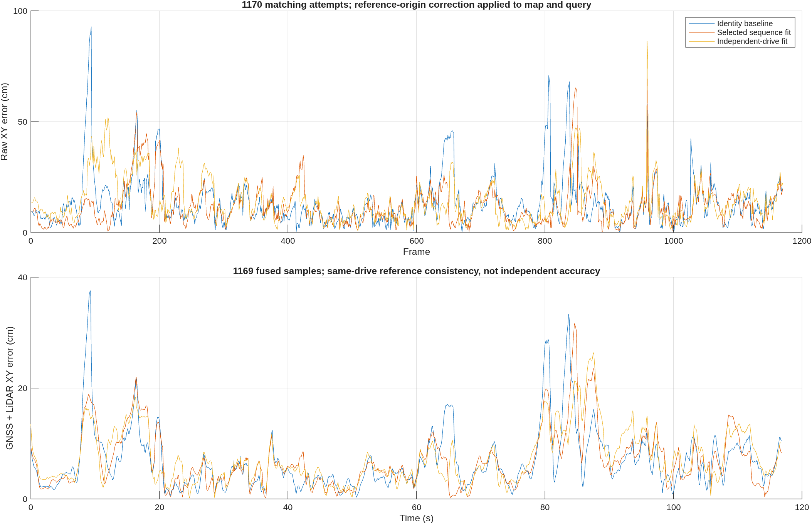

# LiDAR reference-point correction and complete sequence validation

Executed September 22, 2026. This implements the reference-point correction
identified in the [frame 94 investigation](../frame94_geometry_investigation_20260921/README.md).
It fixes the inconsistent origin assumption in the Mississippi mapping and
localization path. It does not establish a surveyed six-degree-of-freedom
sensor mounting calibration or eliminate every matching error.

## Implemented behavior

`config/mississippiLidarFrameCalibration.json` is the single selected empirical
profile. `perceptionConfig("Mississippi")` and `featureMapBuildConfig()` load it.
For stored point column vector `p`, the common mapping equation is

```text
p_reference = C p + b
p_world = R_INS p_reference + t_INS
C = identity increment after the existing stored-axis rotation
b = [2.2681473085890995, 0.1541085889268394, 0] metres
```

The output reference is the **recorded INS output point**, not an assumed
vehicle center of gravity. NovAtel documents that INSPVA defaults to the IMU
center of navigation, with configurable output translation. The recorded
`output/mncav_interface_audit_20260916/12-09-31/insconfig.json` contains one
INSCONFIG record with zero configured translations and rotations. This supports
the reference convention, but does not measure the LiDAR mounting position.
[NovAtel reference-point documentation](https://docs.novatel.com/OEM7/Content/SPAN_Operation/SPAN_Translations_Rotations.htm).

`reprojectSavedFeatureObservations` reverses both the original world pose and
original calibration, applies the new calibration, and then applies the new
world pose. This permits recalibration of cached fine features without rerunning
or changing perception. Rebuilding already calibrated data does not apply the
translation twice. Unknown source calibration is rejected when recalibrating.

Online coarse classification continues to use whole XY pillars and their point
statistics. Calibration is applied to the resulting probability-cloud geometry
before registration. The estimated pose and its computed information matrix
therefore refer to the same point as the map pose. There is no post-hoc error
subtraction or reference-position injection into successive online matches.

The active rebuilt bundle is `output/mississippi_mapping_calibrated/`; current
experiment entry points resolve its `probability_cloud.mat` through the mapping
configuration. Map and query calibration mismatches raise an error. Original
map and experiment artifacts remain immutable experiment evidence, not alternate
runtime implementations.

## Complete replay results

All figures below are horizontal errors relative to the recorded INSPVA
reference. Raw matching covers all 1170 attempts; fusion covers the existing
1169 synchronized samples. The selected candidate accepts all 1170 matches.

| Metric | Identity baseline | Selected sequence fit | Other-drive fit |
|---|---:|---:|---:|
| Raw matching RMSE (cm) | 18.0372 | **15.1725** | 17.1550 |
| Raw matching P95 (cm) | 40.6146 | **28.8244** | 33.5270 |
| Raw matching maximum (cm) | 92.7991 | **69.2822** | 86.3294 |
| Frame 94 raw error (cm) | 92.7991 | **13.9881** | 43.3887 |
| GNSS + LiDAR RMSE (cm) | 8.7684 | **8.5184** | 8.7639 |
| GNSS + LiDAR P95 (cm) | 16.8976 | 17.2572 | **16.0448** |
| GNSS + LiDAR maximum (cm) | 37.5665 | 31.6256 | **26.4153** |
| Accepted matches | 1170 | 1170 | 1169 |

The selected fit lowers aggregate raw RMSE by 15.9% and fused RMSE by 2.85%.
It does not dominate every metric: fused P95 slightly worsens and individual
frames regress. The remaining selected raw maximum is at **frame 959**.
`comparison.csv`, `observer_scenarios.csv`, and both error-curve CSVs preserve
complete comparisons, including all seven observer scenarios. The other-drive
candidate has one `notConverged` result; its all-attempt RMSE must not be confused
with its accepted-only RMSE of 17.1616 cm.



The lateral model, matcher settings, source-window policy, receiver-clock model,
GNSS point correction and observer configuration are unchanged. The observer
script initializes all scenarios from their experiment's first LiDAR pose;
that pose differs between candidates. Thus these are end-to-end reruns, not
identical-initial-state observer controls across candidates. Selected GNSS-only
RMSE is 8.7868 cm; selected LiDAR-only observer RMSE is 19.4990 cm. The latter is
not raw map-matching RMSE.

## Calibration evidence and limitations

The selected offset was fitted previously using 26 qualified pairs among frames
`[60 65 70 75 80 85 90 100 105 110]`. Frame 94 and its entire query window 92:94
are excluded. The fit uses
`delta_position(q,f) = (R_q - R_f) b`, with vector Huber scale 0.10 m, and needs
turning motion. A new reusable `fitLidarTranslationCalibration` implements this
model and rejects insufficient angular excitation.

The selected profile is **sequence-specific and reference-assisted**. It was
chosen after comparing the two complete replays. Neither the model selection nor
the reported sequence metrics constitute an independent accuracy evaluation.
The map is built from this same drive, including query observations. Initial
matching uses one biased reference seed; subsequent seeds use causal wheel,
gyro and lateral motion plus preceding accepted matches. Online fine perception
is absent, but reference tilt and offline synchronization remain experimental
assumptions. No independent ground-truth accuracy or real-time system guarantee
is claimed.

An additional calibration uses a separate recorded drive,
`raw_data_2024-06-07-12-11-24_0.bag`. It exports 54 clouds, uses frames 11:5:171
for training and 411:10:611 for validation, and obtains 96 qualified training
pairs and 10 qualified validation pairs. Its offset is
`[3.2923433, -0.2122027, 0] m`. Training disagreement changes from 1.1932 m to
0.4256 m; later validation disagreement changes from 0.4573 m to 0.1095 m.
The selected 2.268 m candidate gives 0.1667 m on those same later pairs.
These conflicting estimates and remaining training residuals prevent treating
either value as a measured physical lever arm. Mounting rotation, vertical
offset, residual acquisition latency and scan distortion remain unresolved.
No new clock shift or yaw correction was deployed.

A raw 3-D point-to-plane ICP cross-check on the independent drive yields
32 acceptable training pairs but **zero acceptable later validation pairs**.
Its approximately `[3.9664, -0.1829, 0] m` fit is inconclusive and is not deployed.
`raw_calibration_summary.json` and `raw_calibration_relative_poses.csv` retain
that failed validation evidence. The diagnostic tool requires Computer Vision
Toolbox; its final implementation uses `findNearestNeighbors`, not the absent
Statistics Toolbox. It does not relax the validation screen to manufacture
acceptable validation pairs.

## Verification and artifacts

- 78/78 tests passed across origin calibration, INS transforms, geometric
  registration, source windows, whole pillars, NDT products, height products,
  and receiver clocks. `tests.csv` contains the individual outcomes.
- Fine masks and selected coarse hit/pillar counts are identical before and
  after calibration for frames 28, 94, 260, 425, 600, 855 and 1137.
- The old identity map is explicitly rejected with the new online profile.
- Cached feature totals remain 133836 curb, 194300 pole and 70950 traffic-sign
  points. The selected rebuilt map publishes 1320 components.
- Code Analyzer using factory settings reports zero findings in the changed
  MATLAB sources and research helpers. Factory settings avoid a stale local
  R2025b settings-file reference; no global MATLAB preferences were changed.
- The stored NDT perception regression now explicitly retains its original
  sensor-origin lattice. Comparing its original bin-based scores to shifted
  bins was invalid. Thresholds and stored feature masks are unchanged; separate
  checks verify selected-profile geometry and point/pillar selection.
- `artifact_manifest.json` identifies the actual map, profile, input/clock and
  result files. Generated MAT datasets and map binaries stay out of source Git.

## Reproduction

Use the repository root and its existing MATLAB paths and cached input assets:

```matlab
setupVehicleLocalization();
rebuildInspvaSavedFeatureMap('output/mississippi_mapping_calibrated', ...
    ObservationFile='output/mississippi_mapping_synchronized/feature_observations.mat');
runMncavCoarseLocalizationExperiment('output/lidar_origin_20260922/reproduction');
addpath('research/lidar_origin_correction_20260922');
validate_correction('output/lidar_origin_20260922/reproduction');
```

The two measured candidate runs used explicit `MapFile` and `FrameCalibration`
options; see `publication.json`, the profile and comparison folder paths.
Independent calibration preparation and estimation were executed as follows:

```bash
uv run --offline --with numpy --with scipy --with pyproj --with rosbags python scripts/prepareLidarCalibrationFrames.py
```

```matlab
calibrateLidarReferencePoint();
calibrateLidarOriginFromScans();
```

`python research/lidar_origin_correction_20260922/summarize_results.py` refreshes
compact numerical comparisons; `plot_results` exports the verified PNG and
fused error curves from the saved experiments. Statistical fitting and fine
point processing occur only in these offline calibration/mapping workflows.
