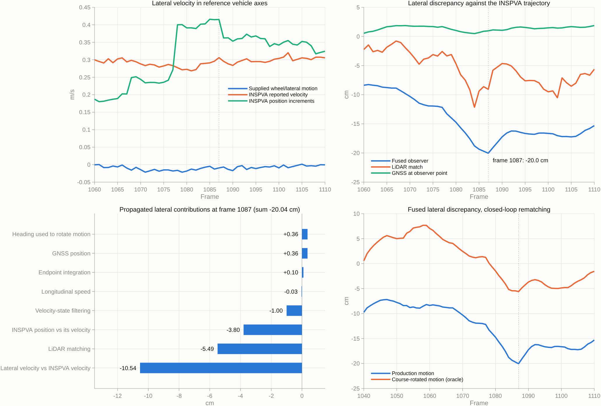

# Largest-error frame of the coarse localization experiment

`runMncavCoarseLocalizationExperiment` was rerun on the current working tree
(HEAD `a9d1642aecced9814ad26622d0435868573f387f` plus the uncommitted
lateral-observer changes captured in `input_hashes.json`). After the two-second
startup, the largest position discrepancy of the fused GNSS + LiDAR observer
(`both`) is **frame 1087 at 108.599 s: 20.04 cm**, of which **-20.04 cm is
lateral** (estimate to the right of the reference), +0.44 cm is longitudinal,
and heading differs by +0.083 degrees.

The discrepancy is not a perception or association failure. Its dominant
source is that the wheel/gyro/lateral motion is resolved along a yaw that, on
this recording, points about 1.4 degrees to the right of the direction in
which the reference trajectory actually moves. That offset enters twice: it
makes the observer's motion prediction drift laterally every frame, and it
misplaces the older scans of the five-scan matching horizon. All
discrepancies are relative to the recorded INSPVA trajectory, which at this
frame is an RTK-float solution with a self-reported 0.30--0.45 m horizontal
standard deviation; they are not surveyed errors.



## Which frame

| Stage | Population | Maximum | Frame |
| --- | --- | ---: | ---: |
| Fused `both` observer | including startup | 64.03 cm | 1 |
| Fused `both` observer | after 2 s | **20.04 cm** | **1087** |
| Raw recursive matching | after 2 s | 15.87 cm | 895 |

Frame 1 is the deliberate initial offset `[0.5, -0.4] m, 2 deg` and is not a
localization result. The raw-matching maximum, frame 895, is unchanged from
`research/frame895_diagnosis_20260930` and
`research/frame895_curb_geometry_20261001` and is not repeated here. This
study analyses frame 1087, the maximum of the experiment's final output.
The ten largest fused frames after startup are 1083--1090, 1105 and 1150, all
with lateral components between -17.2 and -20.0 cm.

Route metrics of this run: `both` 8.70 cm position RMSE over 1,169 frames
(8.42 cm after startup), 0.156 degrees heading RMSE; raw matching 1,142 of
1,170 scans accepted, 6.08 cm all-frame RMSE.

## What the inputs say at frame 1087

The vehicle drives straight at 12.20 m/s; yaw rate is 0.08 deg/s.

| Quantity at frame 1087 | Lateral value |
| --- | ---: |
| GNSS position at the observer point minus reference | +0.96 cm |
| Accepted LiDAR match minus reference | -9.07 cm |
| Seed predicted from the previous fused state | -23.74 cm |
| Fused output minus reference | **-20.04 cm** |
| Supplied lateral velocity (lateral observer) | -0.009 m/s |
| INSPVA reported velocity, resolved in reference yaw | +0.306 m/s |
| INSPVA position increment, resolved in reference yaw | +0.415 m/s |

The fused output lies outside both measurements. Each 0.1 s prediction moves
the estimate about 4 cm further right of the reference, and the position
correction cannot remove it: the lateral position gain is 2.65 1/s (GNSS
0.99, LiDAR 1.66), so one update applies about a fifth of the innovation.
A velocity disagreement `b` against gain `K` settles at a lag `b/K`;
`-0.42 / 2.65 = -16 cm` is the quasi-steady value at this frame.

## Exact attribution

With the saved GNSS and closed-loop LiDAR packets frozen, the position update
of `runSynchronousLocalizationObserver` is additive in its inputs. Replaying
those packets reproduces all seven saved state coordinates with zero
difference, and the nine propagated terms sum to the actual error within
2.7e-9 m over all 1,169 outputs.

| Propagated contribution at frame 1087 | Longitudinal | Lateral |
| --- | ---: | ---: |
| Lateral velocity input versus INSPVA velocity | +0.18 cm | **-10.54 cm** |
| LiDAR matching discrepancies | -0.87 cm | **-5.49 cm** |
| INSPVA position increments versus INSPVA velocity | +0.05 cm | **-3.80 cm** |
| Velocity state versus instantaneous motion input | +0.58 cm | -1.00 cm |
| GNSS position discrepancies | -0.90 cm | +0.36 cm |
| Estimated versus reference heading rotating the motion | 0.00 cm | +0.36 cm |
| Endpoint versus trapezoid integration | +0.01 cm | +0.10 cm |
| Longitudinal speed versus INSPVA velocity | +1.39 cm | -0.03 cm |
| Initial error | 0 | 0 |
| **Total** | **+0.44 cm** | **-20.04 cm** |

These are propagated vector contributions of one explicitly defined additive
decomposition, not independent counterfactual reruns. Over the route after
startup the fused lateral discrepancy has a mean of -6.88 cm; the
lateral-velocity term alone has a mean of -5.60 cm and the matching term
-1.69 cm. The error at frame 1087 is the peak of a route-wide bias.

## Source 1: reference yaw and reference course disagree

On nearly straight driving (speed at least 5 m/s, yaw rate within 1 deg/s;
516 frames) the supplied motion has a median slip angle of -0.005 degrees,
as expected for a car driving straight. The INSPVA velocity, resolved in the
INSPVA yaw, has a median slip of **+1.345 degrees**; the INSPVA position
increments give +1.258 degrees. Per 10 s interval the offset wanders between
0.70 and 1.55 degrees; it is 1.44 degrees (velocity) and 1.96 degrees
(increments) at frame 1087. `course_offset.csv` lists every interval.

`auditReferenceCourse.py` repeats the comparison on native INSPVA messages
only, without any wheel, IMU, LiDAR or localization quantity:

| Recording | Straight samples | Course minus azimuth, median | Interquartile range |
| --- | ---: | ---: | --- |
| 12-09-31 evaluation drive | 2,428 | **+1.344 deg** | +1.026 to +1.484 deg |
| 12-11-24 calibration drive | 810 | +0.020 deg | -0.102 to +0.137 deg |

The calibration recording starts 6.24 s after the evaluation recording ends,
on the same vehicle and installation. A fixed mounting misalignment or
vehicle geometry would appear in both; it appears in one. The offset is
therefore a property of this recording's attitude or velocity solution. The
receiver reports an azimuth standard deviation of 0.07--0.11 degrees
throughout, which does not cover it. The audit does not determine whether
the azimuth, the velocity or the positions are physically correct.

The map and the evaluation yaw both come from this INSPVA azimuth, and LiDAR
matching holds the estimated heading within 0.13 degrees RMSE of it. The
observer then rotates the wheel speed and the near-zero lateral velocity by
that heading, so its predicted motion points about 1.4 degrees to the right
of the reference course: `12.2 m/s * sin(1.44 deg) = 0.31 m/s`, the lateral
velocity disagreement measured above.

The `gnss_only` scenario shows the same offset from the other side: its
heading is reconstructed from the GNSS course and scores 1.35 degrees RMSE
against the reference yaw, while its position RMSE (6.49 cm) is lower than
that of `both` (8.70 cm).

## Source 2: the same offset biases the five-scan matching horizon

The accepted match at frame 1087 is itself 9.18 cm from the reference
(-9.07 cm lateral, +0.064 degrees). The five-scan horizon 1083--1087 was
recomputed from the raw scans and rematched with the saved fused seed and
GNSS selection aid; it reproduces the saved match with zero pose difference.

Odometry places the older scans too far left in current vehicle axes: the
lateral disagreement with the reference displacement is 4.2, 8.5, 12.8 and
16.9 cm for the scans aged 0.1 to 0.4 s, 8.49 cm on average over the five.

| Rematch of frame 1087 | Position | Lateral | Yaw |
| --- | ---: | ---: | ---: |
| Production (reproduced) | 9.18 cm | -9.07 cm | +0.064 deg |
| Reference seed | 9.18 cm | -9.07 cm | +0.064 deg |
| Without GNSS selection aid | 9.18 cm | -9.07 cm | +0.064 deg |
| Current scan only | 5.42 cm | -5.32 cm | +0.203 deg |
| Reference motion for horizon transport (oracle) | 2.45 cm | +2.25 cm | -0.303 deg |
| Odometry translation rotated by 1.374 deg (oracle) | 1.40 cm | -1.15 cm | -0.193 deg |

All rows are accepted with rank 3, using 3 poles and 21 curbs (2 and 15 for
the single scan). The matching discrepancy does not depend on the seed or on
the GNSS aid, so the 23.7 cm seed error is not what biases the match. It
follows the horizon transport. The route-wide mean matching lateral
discrepancy of -3.92 cm has the same sign.

## Source 3: the reference position moves away from its own velocity

From frame 1078 the INSPVA position increments show 0.39--0.42 m/s of
lateral motion while the INSPVA velocity stays at 0.27--0.31 m/s. Neither
the wheel input nor the matcher follows that additional shift, and it
contributes -3.80 cm at frame 1087. INSPVAX reports the solution as
`INS_RTKFIXED` until 44.6 s, `INS_PSRDIFF` at 44.6 s and `INS_RTKFLOAT` from
49.6 s to the end. At 108.6 s the reported standard deviations are 0.450 m
(latitude) and 0.297 m (longitude), after 0.52--0.53 m and 0.33--0.35 m
between 101 and 108 s. BESTPOS comes from the same receiver solution, so its
1 cm agreement with INSPVA is not independent confirmation of the reference.

## Controls

Frozen-packet controls rerun the actual observer with the saved GNSS and
LiDAR packets and change one input. The oracles use evaluation data and are
not deployable. Statistics are after the two-second startup.

| Frozen-packet control | Route RMSE | Maximum (frame) | Frame 1087 | Mean lateral |
| --- | ---: | ---: | ---: | ---: |
| Baseline, exact replay | 8.42 cm | 20.04 cm (1087) | 20.04 cm | -6.88 cm |
| Lateral velocity set to zero | 8.75 cm | 19.60 cm (1087) | 19.60 cm | -6.43 cm |
| Constant 1.374 deg course rotation (oracle) | 3.62 cm | 12.36 cm (847) | 9.76 cm | -0.50 cm |
| INSPVA reported lateral velocity (oracle) | 3.89 cm | 11.43 cm (844) | 9.59 cm | -1.30 cm |
| INSPVA position-increment lateral velocity (oracle) | 3.15 cm | 8.46 cm (377) | 6.53 cm | -1.32 cm |
| Position gains 4 to 12 1/s on both channels | 5.12 cm | 11.97 cm (933) | 10.86 cm | -3.27 cm |

Setting the lateral velocity to zero changes almost nothing: the lateral
observer's dynamics are not the cause. One constant rotation of the body
translation removes the route-wide lateral bias and more than halves the
route RMSE. The frozen LiDAR packets still carry their own transport bias,
which leaves 9.76 cm at frame 1087.

`closedLoopCourseControl` therefore also rematches frames 1040--1110 from
the fused seed, with the same 1.374 degree rotation applied to the observer
propagation and to the source-window transport. With production motion this
harness reproduces the saved run with zero state difference.

| Closed-loop control around the maximum | Frame 1087 | Match lateral | Fused RMSE, frames 1060--1110 |
| --- | ---: | ---: | ---: |
| Production motion (reproduced) | 20.04 cm | -9.07 cm | 14.90 cm |
| Course-rotated motion (oracle) | **5.68 cm** | -1.13 cm | 4.14 cm |

The remaining -5.60 cm lateral coincides with the reference position shift
of Source 3 and with the local offset exceeding the route median. The
1.374 degree value is fitted on the evaluation drive itself; it is a
diagnostic, not a calibration, and it is not constant along the route.

## Conclusions

1. The largest fused discrepancy is frame 1087, 20.04 cm, almost purely
   lateral, on a straight segment with good matching support (3 poles, 21
   curbs, rank 3) and valid GNSS.
2. About 70 % of it (-14.3 cm lateral: -10.54 and -3.80) is
   disagreement between the body-frame motion input and the reference
   trajectory, accumulated through a position gain of 2.65 1/s. A further
   -5.49 cm is matching discrepancy, itself mainly caused by transporting the
   older horizon scans with the same motion.
3. The common root is an offset between the INSPVA yaw, which defines the map
   and the estimated heading, and the INSPVA course: 0.7--1.6 degrees along
   the route and 1.4--2.0 degrees at this frame. It is specific to this
   recording and absent from the next one. Since commit
   `9219f05` no mechanism absorbs such a persistent body-velocity disagreement.
4. The reference near this frame is RTK-float with 0.30--0.45 m reported
   horizontal standard deviation. The data do not establish how much of the
   20 cm is physical localization error.

No production code, configuration, gain or calibration was changed.

## Reproduction

```matlab
addpath('~/MATLAB/toolboxes/sedumi'); addpath(genpath('~/MATLAB/toolboxes/YALMIP'));
addpath('scripts'); setupVehicleLocalization;
set(groot,'DefaultFigureVisible','off');
runMncavCoarseLocalizationExperiment('output/max_error_frame_20261001/run');
addpath('research/max_error_frame_20261001');
findMaximumErrorFrame; diagnoseMaximumErrorFrame;
diagnoseMaximumFrameMatching; closedLoopCourseControl; plotMaximumErrorDiagnosis;
```

Then run `python3 research/max_error_frame_20261001/auditReferenceCourse.py`.
`diagnoseMaximumErrorFrame` reads the INSPVA grid velocity exported by
`research/lidar_observer_regression_20260930/auditReferenceKinematics.py`.

The first launch stopped in `designLateralObserverGains` because YALMIP was
not on the MATLAB path; the rerun with the solver paths completed with exit
code 0. MATLAB Code Analyzer reports no findings in the five scripts. No
repository test suite was run for this diagnostic-only study. The experiment
outputs, MAT files and the working-tree patch remain in the ignored
`output/max_error_frame_20261001/` folder; `input_hashes.json` identifies them.

| File | Content |
| --- | --- |
| `frame_errors.csv`, `raw_matching_errors.csv` | Per-frame discrepancies of the fused observer and of raw matching |
| `error_budget.csv`, `decomposition.csv` | Additive attribution at the maximum and for every frame |
| `motion_reference.csv`, `maximum_window.csv`, `course_offset.csv` | Motion input against INSPVA velocity and increments |
| `controls.csv` | Frozen-packet controls |
| `matching_controls.csv`, `window_transport.csv`, `matching_pairs.csv` | Rematch of frame 1087 |
| `closed_loop_control.csv`, `closed_loop_control.json` | Closed-loop course-rotation oracle |
| `reference_course_audit.json` | Native INSPVA course audit of both recordings and INSPVAX quality |
