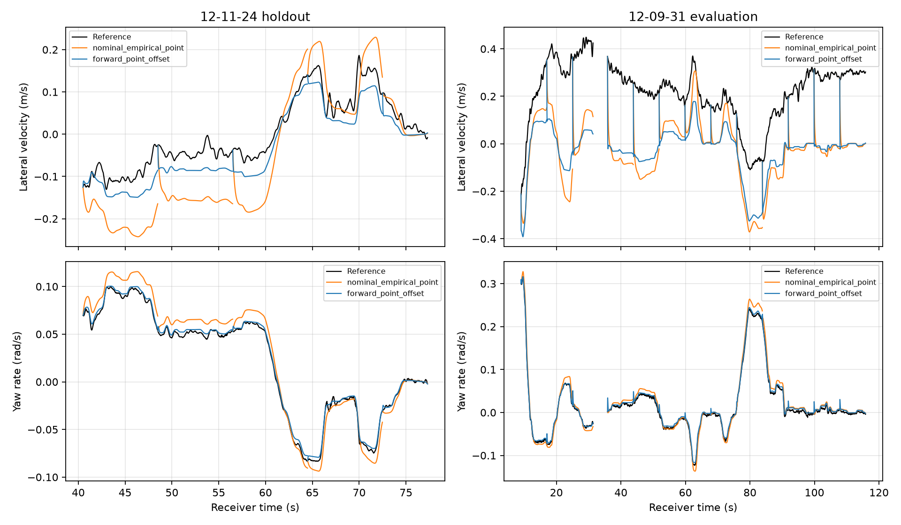

# MnCAV identification from recorded motion

## Material Passport

- Origin Skill: academic-research-suite / experiment-agent
- Origin Mode: run
- Origin Date: 2026-09-25
- Verification Status: computational checks passed; physical identification not established
- Version Label: mncav_identification_v1
- Experiment status: completed, exit code 0

## Decision

The recordings support useful sensor-consistency calibration, but do **not**
currently establish reliable absolute vehicle parameters. Keep the production
vehicle parameters unchanged. The best model selected on calibration holdout
improves yaw prediction on a second recording, but retains a large lateral
velocity offset and reaches the rear-stiffness constraint. Its coefficients
are diagnostic candidates, not measured MnCAV physical properties.

This experiment evaluates a plant model. It does not rerun or certify the
production lateral observer. Good synthetic observer performance alone does
not establish correct real-vehicle dynamics, sensing, or reference alignment.

## Raw recording and reference audit

Read both original June 7 bags under `data/raw/Missisipi/`:

| Drive | INSPVA messages | DBW IMU messages | Steering messages | INS status 6 interval, receiver seconds |
|---|---:|---:|---:|---|
| 12-11-24 | 3897 | 3897 | 7792 | 16.44–19.42 (150 samples) |
| 12-09-31 | 5847 | 5847 | 11693 | 31.60–35.58 (200 samples) |

For all six input exports, decoded motion values match the raw bag exactly
(maximum absolute difference zero). `raw_bag_audit.json` records publishers,
frames, solution-status intervals and SHA-256 hashes of selected topic streams.
These stream hashes include bag timestamps and payload lengths; they are not
whole-bag hashes. `source_hashes.csv` identifies the 13 input/configuration
artifacts used by the identification run.

The DBW IMU is published by `/vehicle/dbw_node` in `base_footprint`; INSPVA is
published by the NovAtel driver in `gps`. They are separate signal sources.
See the [preceding sensor audit](../mncav_parameters_20260925/README.md) for
native sampling rates, the recorded IMU-type code and hardware uncertainties.

[NovAtel's status definition](https://docs.novatel.com/OEM7/Content/SPAN_Logs/INSATT.htm)
describes status 6 as navigation without accepted updates and suspected GNSS
error. It does not mean every such sample is invalid. This experiment uses the
conservative rule of retaining status 3 only, with a smoothing-support collar
around excluded intervals. A status-3 solution is still an estimated reference,
not independently surveyed lateral-velocity truth.

[INSPVA documentation](https://docs.novatel.com/OEM7/Content/SPAN_Logs/INSPVA.htm)
defines north/east velocities and clockwise-from-north azimuth. We transform
these into a planar forward/left frame using yaw = pi/2 - azimuth. The SPAN
output frame may differ from the IMU enclosure frame; the fitted offsets below
cannot establish a surveyed CG or sensor installation.

## Identification method

Fix the existing priors `m = 2273 kg`, `lf = 1.374605 m`, `lr = 1.714395 m`,
and steering ratio 16.2. Define `qf = Cf/m`, `qr = Cr/m`, `j = Iz/m`, where
stiffness is total axle stiffness in N/rad. For road-wheel angle delta:

```text
alpha_f = delta - (vy_cg + lf*r)/vx
alpha_r = -(vy_cg - lr*r)/vx
vy_cg_dot = qf*alpha_f + qr*alpha_r - vx*r
r_dot = (lf*qf*alpha_f - lr*qr*alpha_r)/j
vy_reference ~= vy_cg + x_reference*r - phi*vx
delta(t) = steering_wheel(t + tau)/16.2 - delta_zero
```

The heading correction phi is a small-angle approximation. Positive tau reads
a later steering sample; it is an alignment parameter, not a measured physical
latency. `x_reference` is measured forward from the assumed model CG. The
model assumes planar linear tires; roll, road bank, tire relaxation, compliance,
load transfer and changing payload are not modeled explicitly.

Scaling `(m, Cf, Cr, Iz)` by the same positive number leaves these motion
equations unchanged. Steering and kinematics alone therefore cannot identify
absolute mass and all three extensive parameters simultaneously. Dimensional
candidate values are conditional on the fixed mass, geometry and steering
ratio. Raw CAN is present, but this experiment has not decoded an independent
force/torque channel or established the force balance needed to break that
ambiguity.

- Use native INSPVA receiver time at 50 Hz. Map asynchronous DBW timestamps
  with the existing audited affine receiver-clock conversions. Do not estimate
  derivatives on the approximately 1.09-times-compressed ROS clock.
- Cubic Savitzky–Golay smoothing uses 25 samples, approximately 0.50 s; derive
  yaw rate and acceleration from the reference. Retain speed >=5 m/s,
  absolute reference lateral acceleration <=4 m/s², and endpoint margins.
- Fit drive 12-11-24 at 1–39.5 s; select structure using >=40.5 s. Effective
  accepted equation counts are 1318 fit and 1841 holdout.
- Compare four structures: fixed reference frame; free longitudinal reference
  point; added heading correction; added steering zero/time shift. Each has
  a derivative-residual fit and an integrated output-error fit, for eight
  fitted candidates plus two nominal baselines.
- Use positive log-parameter bounds: `qf,qr` in [5,150], `j` in [0.4,6],
  point offset ±3 m, heading correction ±0.05 rad, road-steering zero ±0.01 rad,
  time shift ±0.15 s. These are analyst-selected search bounds, not confidence
  intervals or measured physical limits.
- Robust soft-L1 residual scales are 0.15 m/s² and 0.03 rad/s² for derivative
  fits, 0.1 m/s and 0.01 rad/s for output fits. Select the lowest sum of squared
  holdout RMSE divided by the output scales. No second-drive parameter fit.
- Forward simulations use nonoverlapping windows up to 8 s, initialized from
  measured reference vy and r. Score after a 0.5 s burn-in in each window;
  windows shorter than 1 s are discarded. Longitudinal speed is supplied from
  the reference. This is conditional open-loop prediction, not a continuous
  reference-free observer deployment test.

Both drives have been examined in earlier project work; the second recording
is held out from fitting and selection **in this experiment**, not historically
unseen. `experiment_plan.txt` preserves the plan written before fitting.
After the first run, raw-status auditing motivated the status-3 quality gate;
an existing empirical-point baseline and straight-driving diagnostics were
added. Those additions did not fit the evaluation recording or change the
selection rule. Initial unfiltered results remain locally under
`output/mncav_identification_20260925/initial_unfiltered/`.

## Forward prediction results

| Model | Calibration holdout vy RMSE, m/s | Holdout r RMSE, rad/s | Second-drive vy RMSE, m/s | Second-drive r RMSE, rad/s |
|---|---:|---:|---:|---:|
| Nominal, coincident reference point | 0.087212 | 0.011973 | 0.272812 | 0.010419 |
| Nominal, existing empirical point | 0.091739 | 0.011962 | 0.276285 | 0.010416 |
| Selected: forward fit, free point | **0.038360** | **0.002860** | **0.262475** | **0.004182** |

Holdout has 1716 scored samples in five windows. Evaluation has 4792 scored
samples in 13 windows. Relative to the nominal empirical-point model, the
second-drive vy improvement is only about 5%, while yaw improves about 60%.
The selected model still has a -0.249899 m/s second-drive vy bias.



The plot includes initialization transients that are excluded from scoring.
The existing empirical-point baseline uses `x_reference = -2.3597989 m` solely
as a comparison; the production observer's effective sensing point was not
established as a physical CG.

| Conditional quantity | Selected forward fit | Derivative fit with free point |
|---|---:|---:|
| Cf/m | 89.8509 | 21.1311 |
| Cr/m | **150, upper bound** | 19.4632 |
| Iz/m, m² | 2.10917 | 2.67588 |
| Cf, N/rad, if m = 2273 kg | 204231 | 48031 |
| Cr, N/rad, if m = 2273 kg | **340950, imposed upper bound** | 44240 |
| Iz, kg m², if m = 2273 kg | 4794 | 6082 |
| Effective reference x, m | -2.864 | -1.361 |

The large difference between objectives is evidence of sensitivity to model
and reference assumptions, not two independent physical measurements. The
selected fit's second-drive lateral equation residual is 5.222 m/s², despite
its improved yaw trajectory. Different residual objectives weight reference
inconsistency differently.

Removing individual 4 s blocks from the selected fit yields conditional Cf
114200–219057 N/rad, Cr 136918–340950 N/rad and Iz 2694–5285 kg m²; six of
eight fits reach the Cr bound. Heading-enabled fits also show saturation.
Eight seeded optimizer starts test local minima for the seven-parameter
model. Smoothing and block-deletion diagnostics are in
`parameter_sensitivity.csv`; they are **not confidence intervals**. Jacobian
condition numbers depend on the stated parameter/residual scaling and robust
loss; they are not physical identifiability certificates.

## Sensor findings with better cross-recording support

Using the calibration fit interval only:

```text
raw_DBW_yaw_rate - reference_yaw_rate ~= +0.01222098 rad/s
-raw_DBW_ay - reference_ay ~= 0.12720356 + 2.35782341*r_dot
```

Subtracting the yaw bias gives reference residual RMSE 0.001857 rad/s on
calibration holdout and 0.002031 rad/s on the second drive. The acceleration
lever model reduces second-drive residual RMSE from 0.194355 to
0.175812 m/s² versus a fitted bias alone. Its effective 2.358 m separation
closely matches the earlier 2.360 m motion-output calibration. This agreement
supports an effective measurement-point correction, not a surveyed sensor-CG
distance. A fitted roll regressor further reduces residual to 0.159661 m/s²,
but is a diagnostic correlation, not an adopted gravity-removal formula.

For approximately straight motion (`abs(r)<0.01 rad/s`), mean reference vy is
-0.00561 m/s in calibration fit, +0.01532 m/s in its holdout, and +0.25971 m/s
on the second drive. The latter has mean course-minus-heading of 1.2495 deg.
This does not prove an erroneous heading or zero true sideslip. Frame alignment,
actual sideslip, bank and reference-estimator behavior remain competing
explanations; changing stiffness alone does not resolve this discrepancy.

## Verification and reproduction

From the repository root, using the existing local exports and raw bags:

```bash
uv run --offline --with rosbags --with numpy python research/mncav_identification_20260925/auditRawBag.py
uv run --offline --with numpy --with scipy --with pandas --with matplotlib --with numba python research/mncav_identification_20260925/identifyMncav.py
uv run --offline --with numpy --with scipy --with pandas --with matplotlib --with numba python research/mncav_identification_20260925/verifyResults.py
```

Remove `--offline` on an environment without the cached dependencies. Software
versions are in `summary.json`. The multistart random seed is 20260925.
Raw bags, dense derived signals, dependencies and bytecode stay outside Git.

Checks passed: all six export-to-bag motion comparisons; 13 source hashes;
30 independently recomputed metric rows (maximum difference 9.98e-17);
positive finite candidate parameters; speed/status masks; known-parameter
synthetic recovery, including seven jointly fitted parameters (maximum scaled
error 3.15e-9); common-mass scaling invariance. Synthetic recovery checks the
implementation using its own model; it does not validate real tire dynamics.
No MATLAB production code, saved gains or vehicle parameters were modified.

Next physical-identification work should establish loaded mass, CG/measurement
point geometry, and steering ratio/zero independently, then use maneuvers with
both steady curvature and transient steering across speeds. The current
accepted speeds span roughly 5–15 m/s, so these results do not establish a
higher-speed model. Preserve the current qualified priors until the reference
alignment and cross-recording lateral discrepancy have been resolved.
