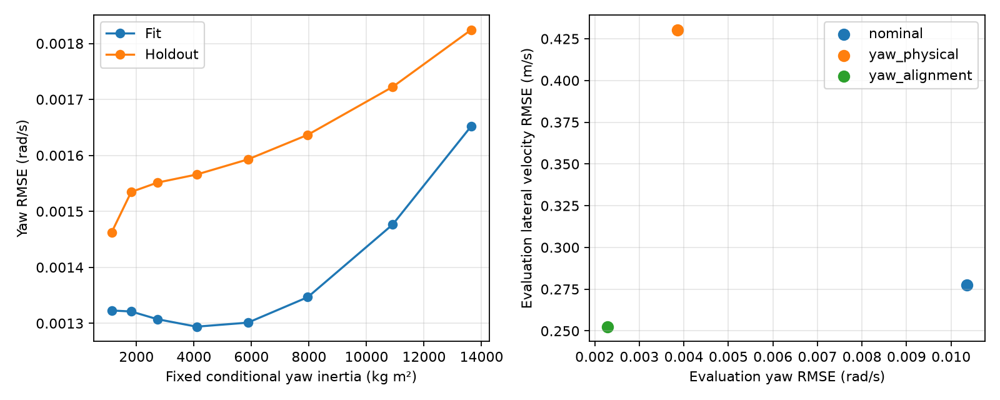

# MnCAV identification follow-up: sideslip-free methods

## Decision and scope

The literature search identifies useful alternatives to fitting INSPVA lateral
velocity directly. A new experiment improves yaw prediction, but still does
not establish reliable physical stiffness and inertia. Keep production
parameters unchanged. The most useful next identification architecture is a
small, sensor-aware parameter model with explicit excitation checks and fixed
independent priors, rather than simultaneously adapting every physical and
sensor parameter.

Material Passport: academic-research-suite, targeted literature search and
experiment, 2026-09-25. This work used AI-assisted retrieval, derivation, coding
and checking; independent human review is not claimed. `passport.json` records
the intended claims and limits. `search_strategy.md` records sources, queries
and access limitations. This is a focused engineering investigation, not an
exhaustive systematic review or a reproduction of a published estimator.

## What the literature changes

| Source | Verified content and project implication |
|---|---|
| [You, Hahn & Lee (2009)](https://doi.org/10.1016/j.conengprac.2009.07.002) | The publisher preview describes eliminating sideslip while using steering, yaw and lateral acceleration. This motivates testing a reduced relation that avoids direct lateral-velocity fitting. |
| [Wesemeier & Isermann (2009)](https://doi.org/10.1016/j.conengprac.2008.10.008) | The abstract identifies parameter combinations from speed-dependent stationary gains. Steady turns should constrain combinations first; they do not directly measure yaw inertia. |
| [Cerone, Piga & Regruto (2011)](https://doi.org/10.1016/j.automatica.2011.04.016) | The abstract describes LPV input-output identification with bounded output and scheduling errors. A useful prediction model need not provide unique physical parameters; a guaranteed set would require justified error bounds. |
| [Liao & Borrelli (2019), accepted-paper preprint](https://arxiv.org/abs/1905.08881) | Sections II–III distinguish kinematic and dynamic observability, include bank/bias effects, and regularize stiffness adaptation toward nominal values (Eq. 19). Algorithms gate adaptation using yaw/excitation information. These assumptions matter before adopting an adaptive filter. |
| [Wittmer, Henning & Sawodny (2023)](https://doi.org/10.1016/j.ifacol.2023.10.437) | The publisher abstract presents a beta-less stiffness estimator using series-production sensors and vehicle measurements. It supports the direction of investigation; full implementation details were not retrieved. |
| [Lu et al. (2026)](https://doi.org/10.1109/TIE.2025.3610738) | The local Zotero abstract describes uncertainty/excitation-dependent stiffness compensation and roll-related virtual measurements. Validation concerns a Dongfeng E70, not MnCAV; this is a later option, not evidence that those trained corrections transfer. |

The Liao paper specifically omits a separate bias state from its kinematic
observer because adding it destroys observability in that formulation. Its
dynamic observer handles bias and bank jointly, and its stiffness update is
regularized. This supports separating assumptions and adaptation stages; it
does not justify adding unrestricted bias, geometry and tire states to one
filter. The current experiment does not implement that EKF.

No traceable published MnCAV-specific Cf, Cr or yaw inertia measurement was
located in this targeted search. The existing stock-vehicle priors remain
conditional inputs, not measured loaded-vehicle properties.

## Independently derived reduced relation

Let `qf=Cf/m`, `qr=Cr/m`, `j=Iz/m` and `L=lf+lr`. Under the planar linear-tire
model, eliminate lateral velocity between the force and yaw equations:

```text
r_dot = A*(delta - L*r/v) + B*a_CG
A = L*qf*qr / (j*(qf+qr))
B = (lf*qf-lr*qr) / (j*(qf+qr))
```

Here `a_CG` is the lateral tire-force-per-mass signal compatible with the
accelerometer model, not an arbitrary gravity-compensated reference channel.
For measured acceleration `a_s = a_CG + x_s*r_dot + b_a` and steering report
`delta_report = delta + delta_zero`, the identifiable reduced equation becomes

```text
r_dot = A_eff*(delta_report-L*r/v) + B_eff*a_s + c
A_eff = A/(1+B*x_s)
B_eff = B/(1+B*x_s)
c = -(A*delta_zero+B*b_a)/(1+B*x_s)
```

The offset enters the same coefficients as stiffness/inertia, and the constant
combines steering and acceleration biases. Even if `x_s=0`, knowing A and B
alone leaves this family, parameterized by positive j:

```text
qf = A*j/(lf-j*B)
qr = A*j/(lr+j*B)
```

Positive denominators are required. `conditional_parameter_family.csv` lists
29 algebraically equivalent examples; they are not confidence samples or all
validated physical candidates. This ambiguity is specific to the reduced
relation alone. It does not prove that informative full dynamic data can never
identify inertia. The separate common mass-scale ambiguity remains as derived
in the [preceding experiment](../mncav_identification_20260925/README.md).

`algebra_check()` verifies the elimination and inverse formulas on 100 seeded
physical/state combinations. The implementation below is an independently
derived diagnostic, not a claimed replication of You or Wittmer.

## Experimental design

Use the same two June 7 recordings and quality intervals as the preceding
audit. Train on 12-11-24 receiver seconds 1–39.5; select on >=40.5 s; score
12-09-31 without fitting it. Both drives were known before this follow-up,
so this is exploratory held-out fitting, not a blind confirmation study.

Use horizontal INS speed magnitude, smoothed DBW yaw rate and lateral
acceleration, steering report, status-3 support and speed >=5 m/s. Exclude
absolute measured lateral acceleration >4 m/s². Correct gyro bias using the
preceding calibration-only value 0.01222098 rad/s. That correction used INS
yaw reference previously; this is not a completely reference-independent
calibration. Lateral velocity is excluded from the new fitting objective and
initial state. It remains an evaluation output.

Two tests serve different purposes:

1. **Integral reduced relation:** integrate over 0.1, 0.2, 0.5 and 1 s windows
   to avoid directly differentiating gyro data. Fit A_eff, B_eff and c with
   soft-L1 residual scale 0.003 rad/s. Select duration on held-out conditional
   yaw reconstruction. Shared window endpoints remain correlated.
2. **Yaw-only physical simulation:** fit three normalized physical parameters,
   optionally also steering zero and time alignment, using soft-L1 yaw
   residual scale 0.003 rad/s. Integrate the full bicycle model from zero vy
   and measured initial r in windows up to 8 s, with 1 s burn-in. Supply
   measured speed. Evaluate predicted vy at the existing effective output
   point x=-2.359799 m, without fitting a new point or reference offset.

The physical model uses the prior mass, geometry, steering ratio and positive
parameter bounds from the previous experiment. Eight starts per fit and three
starts per fixed-inertia profile reduce local-minimum dependence. Cubic
interpolation of the already smoothed steering signal avoids artificial
time-shift minima at linear-interpolation knots. These searches still do not
prove global optimality.

`experiment_plan.txt` was written before the first follow-up run. Multi-start
checks and smooth time-shift interpolation were added after a fixed-inertia
diagnostic exposed a lower cost than an initial free-inertia fit. A separate
acceleration-driven predictor was also added diagnostically; it did not change
the predeclared duration-selection rule. No evaluation-drive coefficients
were fitted during those revisions.

## Results

The selected 0.5 s integral model gives `A_eff=37.8791 s^-2`,
`B_eff=-0.131109 m^-1`, and `c=-0.0731228 rad/s²`. Integrating its derivative
with measured r in the regressor accumulates error: yaw RMSE is 0.032751 rad/s
on holdout and 0.077184 rad/s on the second drive. Small short-window residuals
therefore do not establish good accumulated prediction.

A distinct stable predictor feeds back **predicted** r and takes steering,
speed and measured acceleration as inputs. With the same coefficients, it
achieves 0.001821/0.002202 rad/s holdout/second-drive yaw RMSE. Subsequent
measured yaw is not fed back, but measured acceleration remains an input;
this result is not a steering-only plant prediction or a vy validation.

The following comparisons share the new yaw-only protocol and evaluation
samples. They should not be directly subtracted from the preceding experiment,
which used different initial conditions, burn-in, masking and yaw reference.

| Model | Holdout yaw RMSE, rad/s | Holdout vy RMSE, m/s | Second-drive yaw RMSE, rad/s | Second-drive vy RMSE, m/s |
|---|---:|---:|---:|---:|
| Existing nominal physical model | 0.011963 | 0.092508 | 0.010358 | 0.277406 |
| Fit physical parameters, fixed steering alignment | 0.001978 | 0.380715 | 0.003852 | 0.430350 |
| Fit physical parameters and steering alignment | **0.001575** | **0.034002** | **0.002285** | **0.252543** |

There are 1118/1591/4467 scored samples for fit/holdout/evaluation. The
alignment-enabled fit lowers second-drive yaw RMSE by about 78%, but lateral
velocity RMSE by only about 9%; its lateral bias remains -0.237829 m/s.
The fixed-alignment fit illustrates why yaw alone is insufficient: yaw improves
while lateral velocity becomes much worse.

The selected dimensional values, conditional on m=2273 kg, are Cf=200393 N/rad,
Cr=340950 N/rad at the imposed upper bound, and Iz=4798 kg m². Steering-wheel
zero is 2.256 deg and the equivalent time shift is -18.469 ms. These are
diagnostic fit coefficients, not new measured physical parameters or a measured
actuator/sensor latency.

Fixing Iz anywhere from 1136.5 to 5874.6 kg m² and refitting the other
parameters gives fit yaw RMSE about 0.001294–0.001323 rad/s and holdout RMSE
0.001462–0.001593 rad/s. That broad range of inertia with similar prediction,
plus rear-stiffness saturation, argues against reporting a precise inertia.
These profiles are not confidence intervals.



## Available data and next implementation priority

Metadata inventory found 19 local bags; only the two June 7 bags contain the
exact `/novatel/oem7/inspva` topic. The other 17 can potentially supply wheel,
steering and DBW inertial measurements, but they are not yet an independent
INS-referenced lateral validation set. ROS durations in `bag_inventory.csv`
are not assumed to be native receiver time.

The recorded `UlcReport` schema contains reference/measured speed and
acceleration, not wheel force or drive torque. Raw DBW CAN frames are present;
their presence alone is not an independent calibrated force measurement.
`inventoryBags.py` inventories metadata only; it has not decoded the 17 extra
recordings or concluded that no force information could ever be recovered.

Prioritize calibration of steering alignment and effective acceleration
measurement point, then freeze independently justified mass/geometry/inertia
priors and estimate a small stiffness parameter set with excitation gating.
Use bank/bias-aware regularization if implementing the Liao-style adaptive
observer. Require lateral-output and cross-recording validation as well as yaw
fit. A yaw input-output model is already useful as a diagnostic without claiming
it identifies all physical properties. Production adoption remains deferred.

## Reproduction and verification

```bash
uv run --offline --with rosbags python research/mncav_identification_followup_20260925/inventoryBags.py
uv run --offline --with numpy --with scipy --with pandas --with matplotlib --with numba python research/mncav_identification_followup_20260925/followup.py
uv run --offline --with numpy --with scipy --with pandas --with matplotlib --with numba python research/mncav_identification_followup_20260925/verifyFollowup.py
```

`summary.json`, the CSVs and `verification.json` preserve model definitions,
selection and numerical checks. Input identity includes the preceding audit's
source manifest. Downloaded source PDFs, schemas and logs remain in the ignored
`output/mncav_identification_followup_20260925/` folder. No production observer,
parameter catalog, saved gain or raw bag was modified.
