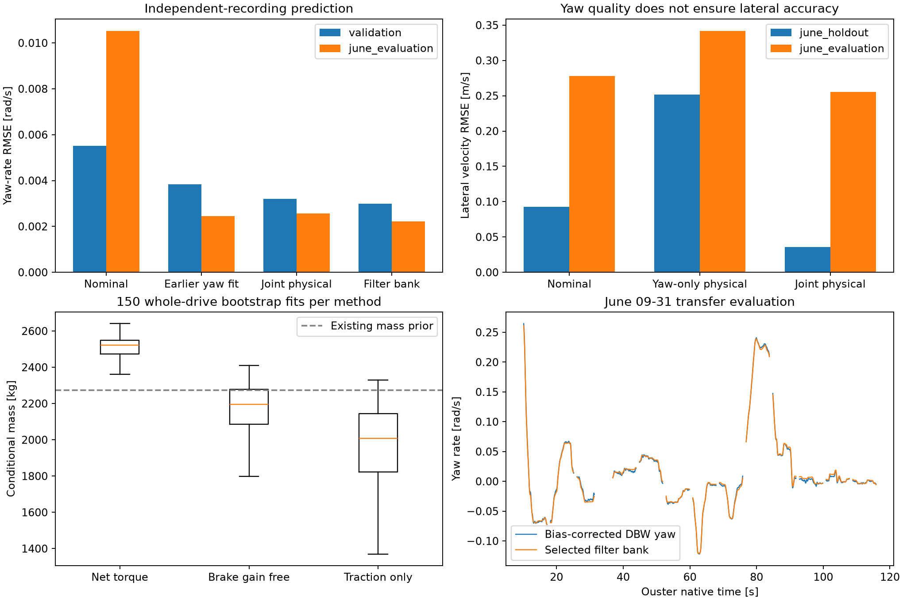

# Multi-recording MnCAV identification, 2026-09-25

This experiment expands identification beyond June-only bicycle fitting. It
extracts motion and torque from 19 real ROS bags, compares 13 lateral candidates
and three longitudinal candidates, and exports a usable **conditional physical
model** and a separate empirical yaw predictor. Production configurations and
observer gains are unchanged. These are model-prediction experiments, not a new
closed-loop observer certification.

## Main findings

- Raw CAN contains both axle-torque (`0x075`) and brake-information (`0x074`)
  messages. This provides a force input that was missing from the previous
  steering/kinematics-only analysis. Conditional mass identification is now
  possible; its accuracy still depends on torque, radius and road-load assumptions.
- The selected stable filter-bank predictor reduces mean per-recording May
  validation yaw RMSE from **0.005507 to 0.002989 rad/s**. On June 09-31,
  RMSE decreases from **0.010521 to 0.002211 rad/s** (about 79%). This predictor
  uses steering and speed, not measured yaw after initialization; the filter bank
  actually does not use measured yaw even for its own state initialization.
- A joint yaw/lateral-velocity physical fit has no active fitted parameter bounds,
  and five initializations converge to essentially the same solution. It gives
  June calibration-holdout lateral RMSE **0.035991 m/s**, versus **0.092545 m/s**
  nominal. On the separate June recording, however, lateral RMSE remains
  **0.255611 m/s**, with **-0.241085 m/s** mean error. The model does not explain
  away that cross-recording offset.
- Yaw-only physical fits are unsuitable substitutes for the lateral observer's
  plant: their June holdout lateral RMSE is approximately **0.25–0.27 m/s**,
  despite excellent yaw scores. The ratio/lag fit also reaches the lower inertia
  bound and has two local solution groups. The joint fit is the exported physical
  candidate; the May yaw-selected physical candidate is retained for comparison.



## Conditional parameter set

The machine-readable result is [identifiedMncavModel.json](identifiedMncavModel.json).
It combines the net-torque mass estimate with the joint lateral fit; it is a
candidate for simulation and sensitivity analysis, not a claim of surveyed physical
truth or approval for replacing the existing observer's gains.

| Quantity | Candidate | Status |
|---|---:|---|
| Mass | 2530.70 kg | Torque-balance estimate |
| Front axle cornering stiffness | 138257.56 N/rad | Joint fit, conditional on mass/frame |
| Rear axle cornering stiffness | 155371.97 N/rad | Joint fit, conditional on mass/frame |
| Yaw inertia | 4994.32 kg m² | Joint fit, conditional on mass/frame |
| Steering ratio | 16.2 | Manufacturer value, fixed in joint fit |
| Steering-wheel zero | 2.36638 degrees | Fitted; subtract before dividing by ratio |
| Wheelbase | 3.089 m | Existing geometry prior |
| CG-to-front/rear axle | 1.374605 / 1.714395 m | Existing load-split prior, not identified |

More transferable quantities are `Cf/m=54.63215`, `Cr/m=61.39486`, and
`Iz/m=1.973494`. At the existing 2273 kg mass prior, exactly the same normalized
lateral dynamics correspond to `Cf=124178.87 N/rad`, `Cr=139550.52 N/rad`, and
`Iz=4485.75 kg m²`. Cornering stiffness refers to an entire axle, not one tire.
The frozen effective lateral-output point is `x=-2.359798894 m` relative to the
model state, with `vy_output=vy_state+x*r`; it is not a surveyed sensor position.

## Data, timing and split

[extraction_manifest.json](extraction_manifest.json) records all 19 bags, topic
counts, CAN identifiers, frames, selected-stream SHA-256 values and CSV hashes.
Stream hashes concatenate little-endian uint64 bag timestamp, uint64 serialized
payload length and the original ROS1 payload for each selected topic. They are
not whole-bag hashes. Recorded datasets and extracted time-series remain under
ignored `data/` and `output/`, not in this research commit.

The 17 May bags contain no NovAtel INSPVA topic. Their sorted inventory indices
`0,3,6,9,12,15` are validation; the remainder train. One 0.238-second validation
bag provides no eligible windows, leaving 11 May training and five May validation
recordings. June 11-24 contributes its native-time 1–39.5 s interval to lateral
training; >=40.5 s is a separate holdout. June 09-31 is transfer evaluation only.
That recording was examined in previous tasks: it is a historical holdout, not
an untouched blind test. Its score never selects this experiment's hyperparameters.
The wheel-radius and DBW gyro-bias calibrations were frozen from earlier June
11-24 work. Thus May recordings are held out from these model fits, but the
preprocessing calibration is shared and is not independently estimated in May.

Legacy Ouster IMU hardware timestamps provide an independent time scale. The
recorded ROS packet buffers are 49 bytes with a checked zero trailing byte;
48 bytes decode the documented little-endian packet. Hardware times are strictly
increasing. Robust affine clock fits retain >95% of samples, with inlier p95
residuals below 0.42 ms. May scale ranges approximately 0.99886–0.99995, while
June is 1.09080. June NovAtel scales are 1.09090, differing by about 98 ppm;
Ouster timing is a useful cross-check, not an assertion that either oscillator
is exact. Absolute receipt latency is not identified. The very short May bag's
clock slope is descriptive and contributes no modeling samples.

Uniform 50 Hz signals use centered 25-sample, degree-3 Savitzky-Golay smoothing.
This is offline preprocessing with approximately 0.24 s of future support.
A causal model recurrence does not make the complete preprocessing chain an
online observer. Lateral fitting requires speed >=5 m/s, |measured ay|<=4 m/s²,
|yaw rate|<0.6 rad/s, endpoint collars and good June INS status including filter
support. Prediction windows are at most 8 s, with a 1 s unscored initialization
period. Physical models initialize vy=0 and yaw to the first measurement; no
subsequent measured yaw drives them. Empirical filter states start at the first
input value. May has no lateral-velocity ground truth.

## Methods and selection

The physical bicycle uses positive `Cf/m`, `Cr/m`, `Iz/m`; candidates fit wheel
zero, optionally steering ratio and first-order steering lag. Bounds are
`Cf/m,Cr/m in [5,400]`, `Iz/m in [0.3,8]`, wheel zero ±0.15 rad, optional ratio
[12,22] and lag [0.005,0.5] s. Five starts per family use seed 20260925.
The joint fit adds June training vy residuals scaled by 0.05 m/s to yaw residuals
scaled by 0.01 rad/s. Each window has equal squared-residual weight. The output
point and reference-heading convention remain frozen; no evaluation-specific
heading or velocity bias is subtracted.

An understeer/first-order model and seven ridge-regularized filter banks are
also fitted. Each filter bank contains seven time constants (direct, 0.04, 0.1,
0.25, 0.5, 1, 2 s) for `v*sw/16.2`, that input times `v²/100`, and `v/10`, plus
an intercept. It is a stable input/output model, not a physical parameter
identification. Ridge strengths are 0.0001–100. Selection uses the mean of
per-drive May validation yaw RMSE. The chosen 0.0001 is at the tested grid edge;
no claim of a globally optimal regularizer is made. June evaluation would favor
another strength slightly, but it was not used to change selection.

Longitudinal fitting uses

`T_axle/R - k_brake*T_brake/R = m*dv/dt + c_drag*v² + F0`.

Data require speed >3 m/s, |yaw|<0.15 rad/s and endpoint collars, subsampled to
10 Hz. Effective R=0.361877 m is frozen; acceleration comes from differentiated
wheel speed, not an IMU treated as a gravity-free reference. Only May training
records fit these models. Bounds: mass [500,6000] kg, drag [0,10] N/(m/s)²,
offset ±2000 N, optional brake gain [0,2]. Robust force residual scale is 300 N.
The default net-torque model fixes brake gain=1 and has the lowest May validation
acceleration RMSE of the three models.

| Longitudinal assumption | Mass kg | May validation acceleration RMSE m/s² |
|---|---:|---:|
| Net axle minus brake torque | 2530.70 | 0.17330 |
| Fit effective brake gain (0.64809) | 2221.34 | 0.18883 |
| Fit traction-only samples | 2087.89 | 0.32465 (all validation samples) |

The selected model's June calibration/evaluation acceleration RMSE is
0.26365/0.25607 m/s². Its 150 whole-training-record bootstrap mass percentile
interval is **2252.23–2596.38 kg**. This interval excludes systematic errors;
uncertain grade, torque calibration, rotating inertia, wheel slip, regenerative
brake overlap and radius transfer can move the estimate outside it. The other
models' bootstrap distributions are much broader, showing real assumption
sensitivity. Constant F0 cannot represent varying road grade. Neither a learned
brake gain nor the lumped force offset is a measured hardware calibration.

## Primary-source verification

- [Dataspeed FCA RU Hybrid FAQ, May 13 2022](https://www.dataspeedinc.com/app/uploads/2022/05/FCA_RU_FAQ.pdf),
  throttle and steering sections: confirms axle/brake torque availability and
  ratio 16.2. Its generic mass table conflicts with the existing hybrid curb-mass
  source, so that FAQ mass range is not adopted as the vehicle's measured mass.
- [Official FCA ROS release, pinned commit](https://github.com/DataspeedInc-release/dbw_fca_ros-release/tree/a8015bce561412ccf3711dd842ca84237f404081):
  `dispatch.h` identifies 0x074/0x075 layouts; `DbwNode.cpp` lines 537–581 specify
  sentinel handling and torque scales. Axle torque is signed 15-bit times
  1.5625 Nm; -16384 is invalid. Requested/actual brake torque is 12-bit times
  3 Nm; 4095 is invalid. Actual brake torque, not requested torque, enters fitting.
  Compatibility with the recorded firmware remains an assumption.
- [Ouster software user manual v2.2.x](https://data.ouster.io/downloads/software-user-manual/software-user-manual-v2.2.x.pdf),
  section 3.3.1: legacy IMU format, timestamp units, gyro degrees/s and acceleration
  in g. PDF text was read through the browser; direct local download returned 403.

[sources.json](sources.json) contains local reference hashes when downloads
succeeded. Official sources stay in ignored output; no external source tree
is vendored. Ouster z-yaw versus corrected DBW yaw regression is recorded as a
sensor-consistency diagnostic, not an independent absolute heading calibration.

## Verification and reproducibility

[verification.json](verification.json) records 95 exact export-hash checks,
36,864 decoder cases compared with compiled **official C++ bitfields**, and
247 independently recomputed lateral and 24 longitudinal metric rows (lateral maximum difference below
1.4e-16). Four implicit-midpoint substeps per input sample agree with high-accuracy
`solve_ivp` on a real joint-fit input window to 7.96e-5 m/s and 2.28e-5 rad/s.
Feature checks confirm no dependence on measured output labels and no use of
future input samples inside the recurrence. These do not validate causal
preprocessing, firmware calibration or unseen maneuvers.

An initial explicit-RK4 search became numerically unstable for extreme allowed
stiffness/inertia combinations. It was replaced by implicit midpoint; its first
20 ms integration failed the independent accuracy threshold, so four 5 ms
substeps were introduced and all candidate fits rerun. Final fitted trajectories
are checked separately from optimization's large-state numerical guard. The
joint-vy family was added after yaw-only training results exposed poor vy fit;
this is a documented adaptive exploration, not a preregistered confirmation.

Run from the repository root:

```bash
python research/mncav_multidrive_identification_20260925/fetchSources.py
uv run --offline --with rosbags --with numpy python research/mncav_multidrive_identification_20260925/extract.py
# For prepare.py, longitudinal.py, lateral.py, summarize.py and verify.py:
uv run --offline --with rosbags --with numpy --with scipy --with pandas --with matplotlib --with numba python research/mncav_multidrive_identification_20260925/prepare.py
```

Then run `longitudinal.py`, `lateral.py`, `summarize.py`, and `verify.py` with the
same environment prefix. Extraction reuses existing per-bag manifests; delete
only a generated per-bag manifest if deliberate raw re-extraction is desired.
The verification script requires g++ and the downloaded pinned `dispatch.h`.
Dependencies are recorded in [environment.json](environment.json). CSV metrics,
model coefficients, bootstrap samples, all starts and provenance are committed;
large prediction tables and extracted data remain in ignored output. `nominal`
and `previous_yaw` are rerun under this experiment's wheel-speed, timing,
initialization and integration protocol, so their scores need not equal older
reports using INS speed or optimized time shifts.

The next physical validation need is to resolve the approximately 0.24 m/s
cross-recording lateral offset using independently justified heading, coordinate
frame, installation geometry and reference quality checks. Its cause is not
established by these fits. Synthetic success alone does not establish real-car
observer accuracy.
