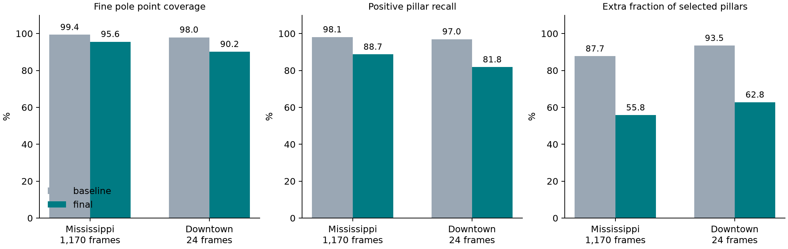

# Coarse pole alignment to frozen fine point references

Date: September 26, 2026. This study corrects the evaluation target and adds
continuous support validation to the production 0.6 m pole detector.

## Final results

The final production replay uses the unchanged fine identities and exact
0.6 m ownership. There is no neighbor tolerance or denominator filtering.

| Recording | Variant | Covered fine points | Positive pillars covered | Extra / selected pillars | Extra fraction |
|---|---|---:|---:|---:|---:|
| Mississippi, 1170 frames | baseline | 193047/194300 (99.36%) | 2829/2884 (98.09%) | 20179/23008 | 87.70% |
| Mississippi, 1170 frames | final | 185729/194300 (95.59%) | 2558/2884 (88.70%) | 3226/5784 | 55.77% |
| Downtown, 24 frames | baseline | 5749/5869 (97.96%) | 128/132 (96.97%) | 1828/1956 | 93.46% |
| Downtown, 24 frames | final | 5292/5869 (90.17%) | 108/132 (81.82%) | 182/290 | 62.76% |

Extra pillar counts decrease by **84.01%** and
**90.04%**, respectively. Fine-point miss fractions
are **4.41%** and **9.83%**. Positive-pillar miss
fractions are **11.30%** and **18.18%**. These denominators
are different; none of these metrics is an object-level pole recall or the
classical false-positive rate over all negative pillars.

The aggregate 80% coverage criterion is met on both recordings. Remaining
extras are substantial: 55.77% and 62.76% of selected pillars contain no
reference fine pole point. Precision has improved, but this is not a solved
false-alarm problem. Mississippi has 212 extras on its 68 zero-reference
frames; these are included, not discarded.

Mississippi range coverage is 97.86% at 0--10 m, 91.45% at 10--20 m, and
76.17% at 20--30 m. The last band does **not** reach 80%. Only 50/116
positive pillars containing fewer than ten fine points are recovered, versus
570/579 containing at least 100. Sparse support and low-population boundary
owners remain the main observed recall limitation. Raw proposal search and
statistical support requirements can reject valid sparse poles; selected
pillar coverage is not equivalent to fine point classification. The method
also retains geometrically similar non-reference vertical structures.



Warmed paired timings use 24 frames from each recording, three repetitions
per implementation, and alternate execution order. Frame loading is excluded.
Both implementations use the existing native interface 6 with four workers.

| Recording | Baseline median | Final median | Change |
|---|---:|---:|---:|
| Mississippi | 58.467 ms | 60.368 ms | +1.901 ms (+3.25%) |
| Downtown | 64.671 ms | 71.840 ms | +7.169 ms (+11.09%) |

This revision trades a small measured latency increase for fewer candidate
pillars; it does not claim a further pipeline speedup. The previous exact
native acceleration is retained. Limiting fallback axes through existing
pillar-statistic gates and rejecting impossible height/ratio candidates
before fitting avoid unnecessary full point-distribution checks. Other
simulations ran concurrently, so absolute timings describe this shared
workstation session. Downstream registration/localization was not rerun.

## Verification

All **192 tests pass**, with zero failures or incomplete cases, including
mixed-pillar and sparse-boundary physical fixtures with their original
assertions, fine-point metric denominators, three recorded native/MATLAB
coarse parity cases, original fine rejection/continuity/boundary checks, and
pipeline perception/mapping regression. `tests_initial.csv` preserves the two
physical failures that motivated the proposal/window fixes; `tests.csv`
contains the final passing run.

All 1194 evaluated frames preserve ground/filter counts and every non-pole
component field except the globally normalized mixture weight. The independent
Python audit verifies target denominators, count identities, exported ratios,
production source freeze hashes and 288 alternating timing calls. Python
sources compile. MATLAB Code Analyzer with factory settings reports eleven
advisories across 21 files: two logical-indexing suggestions in the production
measurement, and nine research-helper style/unused-value suggestions. No source
error is reported; a stale user analyzer-settings path was bypassed by explicitly
using factory settings. MATLAB is R2026a Update 3; the native interface is 6.

## Reference and provenance

The designated reference is the **original offline 0.3 m fine pole point
mask**, not the earlier coarse pole mask. Each fine label identifies a point
in its original raw frame. The reference is algorithmic; matching it does
not establish physical pole accuracy against independent manual labels.

The four files `output/fine_matching_20260919/inputs_1.mat` through
`inputs_4.mat` contain all 1,170 Mississippi frames. Their saved
`cfg.featureNames` is `["curb","pole","trafficSign"]`; pole indices are in
the corresponding `selectedIndices` column. The original study records
runtime revision `48d043b083ccc2fb44c19726655223b1d5054484`. All four files
still match their original SHA-256 values in
`research/fine_matching_20260919/artifact_hashes.json`.

These files contain 194,300 fine pole point occurrences before any coarse
region-of-interest restriction. They retain raw point identities, unlike
the Gaussian clouds also stored in those files. The recording's calibrated
Gaussian coordinates are not used to project the reference.

The 117 frames in `output/coarse_lattice_20260924/fine_pole_pillars.mat`
are `1:10:1170`. Every saved `polePoints` array exactly matches the
corresponding full-cache array, including order. The sparse cache also
stores projected `polePillars`, but those are not the source for the new
metrics. `verifyFrozenFineReferences.py` records the checks in
`fine_reference_provenance.json` and exports counts per frame.

The pre-migration revision is
`796c737344e6c29c3e7aa8869aab2630dc0ebbb1`. Between the recorded fine runtime
revision and that revision, the perception source tree and fine, structural,
ground-segmentation, and pillar-grid configuration files are unchanged.
The perception configuration entry point changes its dataset-specific
calibration selection; calibration and recorded tilt apply to the Gaussian
product, while the selected indices address original input points. The
September 24 lattice study separately records equality of its offline
configuration with the pre-migration version apart from the mode tag.
The exact 117-frame point-index cross-check is independent of those source
and configuration observations. No original mask is regenerated or edited
by the reference loader.

The preceding Downtown 24-frame shaft capture stores projected fine pillar
IDs but not original fine point indices. Before testing the new detector,
`captureDowntownFineReference` froze the original offline fine point masks
on `round(linspace(1,539,24))`. Their pillar projections exactly match all
24 prior references. All four default semantic channels were retained;
16 fine-source/configuration files were verified unchanged against
`35cdb88388300ba1b8bb215905435bde670dff03`. The frozen reference is
`output/pillar_fine_alignment_20260926/downtown_reference.mat`. The raw
Downtown recording contains 539 frames. Earlier unrelated point-mask
snapshots exist for a few Downtown frames; their older, differing provenance
does not make them interchangeable with the designated frozen reference.

## Exact metrics

Let `F` be the original fine pole point indices whose finite raw XY lies
inside the published 0.6 m coarse geometry, and let `D` be the output coarse
pole pillar IDs. Project each point directly using
`floor((rawXY-origin)./cellSize)+1` and the geometry's `[Ny,Nx]` map size.
Let `R` be the unique projected pillar IDs of `F`.

- **Point coverage:** the number of points in `F` whose pillar is in `D`,
  divided by `numel(F)`. Every original fine point has equal weight. This
  measures coverage by the pillar product; it is not a fine-point classifier
  output or a test of distance to the estimated shaft axis.
- **Positive-pillar recall:** `numel(intersect(D,R))/numel(R)`. Any original
  fine pole point makes its containing pillar positive; no minimum fine
  point count, old coarse agreement gate, or spatial dilation is applied.
- **Extra-pillar fraction:** `numel(setdiff(D,R))/numel(D)`. These are
  disagreements with the designated reference, not independently verified
  physical false positives. Its complement is exact pillar precision.

Report counts as well as ratios. Aggregate by summing numerators and
denominators over frames, without averaging per-frame percentages. A frame
with an empty denominator has an undefined (`NaN`) ratio and still
contributes its counts to the aggregate. Extra predictions on frames with
no positive references are retained in the extra-pillar count.

`measureFinePoleAlignment` also reports total reference points, reference
points outside the coarse ROI, global coverage before the ROI restriction,
and optional retained-point counts. Coarse filtering or ground removal
**never changes the primary target denominator**: those losses are part of
the perception result. Input-filter eligibility is diagnostic only. No
coarse-cell-center projection, nearest-neighbor tolerance, old coarse mask,
fine traffic-sign exemption, or conditional shaft point selection enters
the primary metrics.

## Locked split and leakage control

- Development: Mississippi frames `1:780`, containing 124,708 original fine
  pole point occurrences before ROI restriction. The 78 frames `1:10:780`
  may support economical exploratory sweeps, with final development scoring
  on the full block.
- Temporal evaluation: Mississippi frames `781:1170`, containing 69,592
  original fine point occurrences before ROI restriction. Do not inspect
  their new fine-alignment results while selecting thresholds or features.
- Independent sequence evaluation: Downtown, with frame selection and
  frozen fine reference capture recorded before its new alignment results
  are examined. Keep its labels out of tuning.

The temporal split is a newly locked evaluation split, not an unseen-route
claim: later Mississippi frames have appeared in earlier detector studies,
and nearby scans remain spatially correlated. Downtown has likewise been
used for earlier detector validation. Report these exposure limits rather
than presenting either set as pristine manual-label generalization.

Reference labels may be loaded by research exports, fitting, and scoring
only. The production coarse detector must consume point-distribution
statistics computed from the current 0.6 m pillars and their raw points.
It must not look up frame IDs, cached fine masks, future scans, or reference
coordinates, nor run a 0.3 m fine detector at runtime. Changes must preserve
the original fine algorithm and its frozen outputs.

## Helper interface

```matlab
setupVehicleLocalization();
addpath('research/pillar_fine_alignment_20260926');
frames = 1:1170;
[referenceIndices, metadata] = loadFineAlignmentReference(frames);
% After loading the original frame and running coarse perception:
ids = double(result.candidates.pillarIndices{ ...
    result.candidates.semanticNames=="pole"});
[metrics, detail] = measureFinePoleAlignment(frame,referenceIndices{k}, ...
    ids,result.candidates.geometry);
```

The loader returns cells in requested frame order and checks complete,
nonoverlapping partitions and valid original point-index arrays. It does
not rerun perception. Its persistent cache is an evaluation convenience;
it is not a production dependency.

```bash
python research/pillar_fine_alignment_20260926/verifyFrozenFineReferences.py
```

The audit requires NumPy, SciPy, and h5py. Original recordings, full point
indices, and large MAT outputs remain in their existing ignored locations.
Detailed detector results and execution checks follow below.


## Implemented detector

`structuralPillarConfig` selects `validatedShaft` for coarse spacing above
0.3 m. The original `shaft`, `subset`, and `pillar` branches remain available
for reproducing earlier experiments. Offline 0.3 m still selects `pillar`.

1. The existing native shaft search proposes axes from raw points belonging
   to the shared 0.6 m pillars. For columns without a found mode, sufficiently
   tall and compact whole-pillar covariance supplies an additional axis
   proposal only where the existing inexpensive pillar-statistic gates admit
   a candidate. Every such proposal goes through the same support validation.
   Identical assigned axes are measured once.
2. Around each axis, gather points over all available heights within a
   bounded XY search (half-width 1.5 m) and a 0.75 m axis-distance context.
   A 0.25 m radial core is a continuous geometric measurement, **not a
   finer XY grid**. No vertical lattice or fixed slice origin is introduced.
3. Sweep events at every return height plus/minus 0.25 m. Supported height
   intervals require at least three structural core returns and core/context
   count ratio above 0.60. Integral mean and mass ratios must reach 0.70,
   with at least 1.5 m total qualified window-center support. Fit the dense
   interiors first. If no interior fit exists, use the returns actually covered
   by qualified windows and their connected union; this recovers sparse pairs
   whose windows qualify only between sampled heights.
4. Fit the complete core distribution at those heights **before** radial
   trimming. Reject wide transverse strips using covariance anisotropy,
   excessive tilt, weak isolation, and short unstable support. Long supports
   allow at most 10 degrees tilt; supports no longer than 2 m require at
   most 6 degrees, RMS at most 0.10 m, and a qualified run of 1.5 m.
   Isolation within 0.25/0.75 m must reach 0.80.
5. Apply robust radial trimming and require actual retained runs of at least
   six points, 1 m vertical span, and no gap above 0.75 m. An output pillar
   must itself own at least ten retained points spanning 0.30 m. A neighboring
   proposal cannot transfer a label to an unsupported pillar. The old coarse
   candidate mask is no longer unconditionally unioned into the output.

Finite intensity above 1800 is excluded **only from density qualification**,
consistent with the original fine seed semantics. Such returns may still
contribute to fitting and ownership. All off-ground points, including clutter,
continue to contribute to the output pillar's empirical XYZ moments. Curb,
facade and sign components keep their original membership, moments and
semantic evidence. Global mixture weights necessarily renormalize when pole
components change. Confidence is geometric evidence, not a calibrated class
probability.

## Findings and rejected alternatives

The previous detector's very high fine-point coverage hid a large number of
extra cells. In 117 sparse frames, the legacy-only union added 231 pillars
but bought only four positive fine-reference pillars; shaft assignment added
396 owners for only six net additional target owners. Cropped narrow modes
could also pass despite the complete supporting distribution being a strip.
For example, frame 111 pillar 5343 was rejected by the original fine validator
as a wide surface: transverse maximum standard deviation 0.12351 m, aspect
4.98, RMS 0.12568 m. The earlier narrow shaft score was 0.906. Frame 491 pillar
4367 exhibited the same failure. Another reviewed owner contained peripheral
returns of a nearby accepted fine object without containing its fine pole
points. Trace CSVs retain those observations.

Development-only distribution and classifier probes did not establish a
reliable separation with the old scalar features. Blocked temporal folds and
20-frame purges reduced the risk of memorizing adjacent scans, but the best
high-recall classifier still had poor precision. No learned classifier is
installed. Transverse connected components, stricter total support counts,
owner-height gates and radius-consensus variants likewise did not justify
extra production complexity. Raising count thresholds could make precision
look attractive by discarding many small positive targets; that operating
point was rejected.

The first frozen strict profile used a 0.30 m core, 15 owner points, 6-degree
tilt and point-score threshold 0.70. On the 78 development frames it covered
12630/13464 fine points (93.81%) and 148/184 positive pillars, with 72 extra
pillars. It failed the initial Downtown check: only 77.34% point coverage.
The final profile instead uses the single 0.25 m core, ten owner points,
10-degree long-support tilt, and no additional coarse point-score gate.
Those revised settings deliberately recover sparse supports. Both freezes
and the failed strict results are retained.

**Evaluation reuse:** the sparse temporal and Downtown results were examined
before selecting that final coverage profile. They are validation data reused
for selection, not untouched test sets. Full Mississippi scoring then used all
1170 frames. Two existing physical regression tests exposed a missing
proposal and incorrect window-center membership: sparse split-boundary poles
and a mixed pillar could be lost. The implementation was corrected without
changing those test assertions or retuning thresholds (apart from a 1e-10
height comparison tolerance). All 25 focused checks then passed, and the full
recordings were rerun. `pre_regression_full_frames.csv` and
`tests_initial.csv` retain the preceding results; `regression_fix_freeze.json`
identifies that repair before its replay. The complete-window variant
(`expanded_windows_full_frames.csv`) reduced Mississippi point coverage to
90.93% and increased computation. The final implementation prefers dense
interiors, expands windows only for sparse supports without an interior fit,
and limits extra covariance axes to legacy statistical proposals. Every
proposal is independently revalidated. This restores the mixed-pillar tests
while avoiding unconditional boundary clutter and hundreds of unnecessary
axis evaluations. `final_implementation_freeze.json` records that decision
before the last full replay. These iterations reused recorded evaluation
results, so there is no untouched-test claim. New manually labeled sequences
would be required to establish physical accuracy and broader generalization.

## Reproduction

Run the following from the project root after building the existing native
kernels. Original raw recordings and frozen reference MAT files are required.
The native interface remains version 6 with four workers.

```matlab
setupVehicleLocalization();
addpath('research/pillar_fine_alignment_20260926');
captureFineAlignmentBaseline();
% Reuses the existing frozen Downtown point identities:
captureDowntownFineReference();
captureValidatedAlignment('Mississippi',1:1170,'final_full');
captureValidatedAlignment('Downtown',round(linspace(1,539,24)),'final_downtown');
benchmarkValidatedAlignment();
validateFineAlignment();
analyzeFinalResiduals();
```

```bash
python research/pillar_fine_alignment_20260926/auditFineAlignment.py
python research/pillar_fine_alignment_20260926/summarizeFineAlignment.py
```

Large point and hypothesis tables stay local and are reproducible from the
research helpers; compact metrics, diagnostic traces, configs and reports
are versioned. The complete capture can outlive the MATLAB tool's 300-second
response timeout; saved progress and completion must be checked before any
rerun. Runtime measurements exclude frame loading and alternate warmed old
and revised pipelines. Other simulations ran on this shared workstation, so
these are descriptive paired timings, not a hard real-time guarantee.
