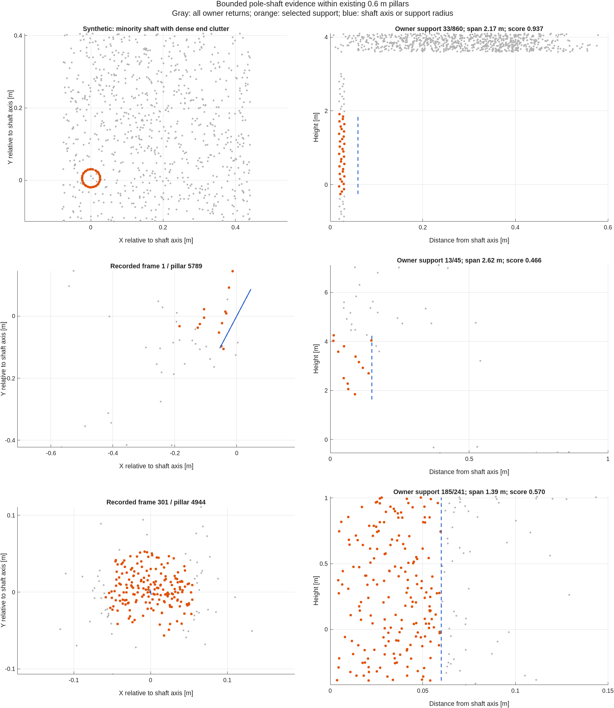

# Bounded shaft evidence in mixed 0.6 m pillars

Date: September 26, 2026. This implementation changes coarse pole detection
from whole-pillar gates to a union of established detections and independently
supported shaft modes. The latest instruction permits redesign of coarse
perception while retaining pillar point-distribution statistics. Under that
instruction, recognition coverage takes priority in this iteration; the old
80% agreement criterion remains reported and **has not passed**.

The new `shaft` detector is the default for structural spacing above 0.3 m.
The production lattice remains 0.6 x 0.6 m. It uses original off-ground returns
in those pillars and their existing neighbors, with no auxiliary 0.3 m
runtime detector, vertical voxel lattice, or learned classifier. Offline
0.3 m detection is used only as an algorithmic evaluation reference.

## Why the algorithm changed

The preceding [candidate-loss investigation](../pole_miss_analysis_20260925/README.md)
identified three different mechanisms:

1. Whole-height core isolation penalizes a minority shaft when other heights
   or nearby surfaces supply many unrelated points. Among 46 fine-reference
   omissions of the prior default, 33 failed the measured isolation gate.
2. The earlier subset experiment examined maximal gap-connected runs. A valid
   short shaft could disappear when its run expanded into clutter, even
   though the original qualifying subset remained present.
3. Connected candidate cells competed for a single footprint. Connectivity
   neither establishes one physical pole nor justifies removing a separately
   supported neighbor. Conversely, boundary fragments need shared axis
   evidence and their own supporting returns.

The new detector addresses these mechanisms explicitly. It is not a global
relaxation of count, height, or whole-pillar isolation thresholds.

## Implemented distribution tests

`findPillarShaftModes` searches multiple possible axes within each existing
pillar. Four spatially separated observed seeds, 0.10/0.20 m fitting radii,
the full observed height, and two 2 m height windows initialize hypotheses.
Height-balanced regression supports leaning poles up to 20 degrees. A second
family uses median XY location and a vertical slope, reducing displacement
by irregular end clutter. Two neighborhood refinements update each axis.
Near-identical fits are merged; distinct fit-scale support is retained as
diagnostic metadata. Requiring two fit scales was explored but was not chosen
as the default because it lost reference support.

For radii 0.06, 0.10, and 0.15 m, the algorithm sorts cylindrical support by
height and separates it at gaps exceeding `0.5 + 0.005 * range` meters. It
then examines bounded subintervals using up to twelve observed-rank endpoints
per connected run. This preserves qualifying local height spans within a
larger contaminated run. The search is bounded, not exhaustive: four seeds
and sampled endpoints cannot guarantee discovery of every valid subset.

A qualifying interval requires at least ten support returns, 1.3 m total
height, 1.0 m 5th-to-95th-percentile height, and an initiating owner with at
least four returns over 0.35 m. Radial RMS must be no more than both 0.10 m
and 65% of the search radius. Central-disk mass must exceed the largest of
eight equal-radius disks shifted one radius: ratio at least 1.2 and at least
three excess returns.

To reject diffuse support, let `N(r)` count points within radius `r` over
the interval. A radial concentration score is

```text
Z = (N(r) - 0.25 * N(2r)) / sqrt(max(0.1875 * N(2r), 1)).
```

The complete interval requires `Z >= 2.5`. Each half of its physical height
also requires `Z >= 3` and a central-to-shifted-disk ratio of at least 1.05.
Thus a dense short blob alone cannot explain the entire accepted span.
Although the code field is named `radialSignificance`, this is an adaptive
concentration score, **not a calibrated statistical test or probability**:
hypotheses are searched adaptively and LiDAR returns are not independent,
uniform samples.

The bounded score combines robust height, support count, radial RMS, height
coverage, and transverse peak contrast. It must reach 0.30 and either 0.70
on its own or 0.25 after multiplication by the existing spatial pillar
`pointScore`. Strong shaft evidence therefore does not require a favorable
whole-pillar shape. Per-column thresholds apply the same decision early to
prune work; they do not impose a whole-pillar foreground fraction.

`assignPillarShaftSupport` associates axes using position at both endpoints
of their shared height interval, slope, and vertical overlap. Association
uses fixed representatives to avoid transitive merging of different poles.
Alternative valid intervals remain available for ownership assignment even
when their axes are duplicates. An output pillar must itself provide at
least three returns spanning 0.30 m inside a validated cylinder. Adjacent
unsupported cells cannot borrow a detection merely through connectivity.
Each owner keeps its highest-scoring supported mode; this is a pillar mask,
not a complete inventory of multiple physical objects within one pillar.

The final mask is the union of these supported owners and the previous
`pillar` detector. This deliberately preserves established candidates,
including any legacy false positives. All off-ground points still contribute
to each output pillar's Gaussian moments. Shaft-only moment estimation is
outside this change; mixed-pillar covariance contamination is not solved.

MATLAB and C++ implement the same search (native interface version 5). Prefix
counts, score upper bounds, owner thresholds, and removal of zero-contribution
probe rows reduce cost without changing the accepted evidence.

## Recorded results

All counts below are **frame/pillar occurrences**, not unique physical poles.
The fine reference consists of offline pole-labeled point identities projected
onto the common 0.6 m lattice. Neither this reference nor the old coarse
output is manual ground truth. These measurements establish reference
retention, not real-world detection accuracy or precision.

| Evaluation | Previous default | Previous subset experiment | New shaft default |
|---|---:|---:|---:|
| Mississippi fine reference, 117 sampled frames | 260/306 (84.97%) | 296/306 (96.73%) | **299/306 (97.71%)** |
| Downtown fine reference, 24 held-out frames | 111/132 (84.09%) | 118/132 (89.39%) | **128/132 (96.97%)** |
| Mississippi candidates, all 1170 frames | 8909 | 20806 | 23008 |
| Downtown candidates, 24 frames | 634 | 1402 | 1956 |
| Mississippi paired median frame time | 32.610 ms | 121.559 ms | 201.007 ms |

The full Mississippi replay retains every one of the 8909 previous-default
candidates and adds 14099. It recovers 39 of that default's 46 fine-reference
omissions in frames `1:10:1170`; seven remain. Downtown uses
`round(linspace(1,539,24))` from a separate sequence and retains every one of
its 634 previous-default candidates. These frames were evaluated after the
final thresholds were chosen and were not used for this iteration's tuning.
This is an independent sequence check, not independent annotation.

The earlier 0.3 m coarse reference projects to 9129 frame/pillar occurrences
over Mississippi. Exact agreement precision/recall are 28.89%/72.81%.
With one-cell tolerance they are **36.29%/79.01%**: 8349/23008 new cells have
old matches and 7213/9129 old cells have new matches. Matching independently
queries the eight adjacent cells, permitting 0.6 m per axis or 0.849 m
diagonally; it is not a one-to-one physical-object association. Both tolerant
directions improve over the previous subset experiment (31.47%/70.85%), but
the simultaneous 80% migration target remains unmet. Fine-reference
retention does not replace that criterion.

Timing used three warmups per variant and a rotating evaluation order on
117 identical frames. The median paired increase over the previous default
is 167.832 ms. The 1170-frame capture preceded the final zero-row prefix
optimization and had a 215.630 ms median. After optimization, all 117 sampled
masks and every Gaussian component field exactly match that stored capture.
Downtown's final-kernel median is 259.119 ms. These costs are material; no
real-time or localization-performance improvement is claimed.

## Validation and remaining risks

- **126/126 tests passed**, with no failures or incomplete tests, across
  shaft modes, prior subset/distribution evidence, pillar shape/core/radial
  tests, whole-pillar perception, semantic clouds, feature selection,
  performance equivalence, and the stored pipeline regression.
- New cases cover minority support, a competing dense short mode, separate
  nearby shafts, shared boundary ownership, unsupported neighbors, broad
  oblique sheets, disconnected blobs, bounded support above a wide base,
  a leaning pole, empty input, and backend parity.
- MATLAB/native found flags, NaN locations, and all numeric evidence fields
  agree on 129 reference cells in twelve recorded frames; maximum numeric
  difference is `8.881784197001252e-15`.
- Full replay checks preserve retained/ground/off-ground source counts,
  non-pole candidates and component geometry/probabilities. Global mixture
  weights can change when the pole population changes. Paired Downtown
  checks additionally assert equality of all-point statistics and moments.
- Broader null controls draw 800 points uniformly from one 0.6 x 0.6 x 4 m
  volume using seeds 1 through 32. **Five of 32 produce raw shaft evidence**
  (seeds 7, 13, 23, 26, 28; scores 0.3521--0.4433). The four fixed regression
  seeds pass their rejection tests, but the broader experiment demonstrates
  remaining adaptive-search false alarms. No zero-false-positive claim is
  warranted, and 5/32 is not an estimated field false-positive rate.
- The new candidate population is substantially larger. Manual examination
  and object-level annotations are still needed to distinguish newly
  recovered poles from narrow clutter, vegetation, facade details, and
  accidental concentrations. Preserving legacy detections also preserves
  their errors. No mapping/localization replay was performed in this study.

The final source passes factory Code Analyzer checks for all sixteen changed
or added MATLAB files. Python compilation and summary consistency checks
pass. The native build produced the environment's known post-build MEX
inspection warning; the resulting binary loaded and passed the executed
native tests. A MatFile irregular-index error in the research harness was
fixed before the Downtown comparisons by scalar reads for irregular frame
indices. The full-drive tool call timed out while MATLAB continued; its
completed 1170/1170 progress log and output files were verified.

## Point-distribution examples



Gray points are all returns owned by the displayed pillar; orange points
belong to its selected interval/cylinder. The synthetic example contains
60 shaft points plus 800 end-clutter points. The detector selects a valid
33-point subset over 2.17 m, demonstrating minority support. Recorded
frame/pillar examples 1/5789 and 301/4944 show 13/45 and 185/241 owner support
respectively. These plots illustrate evidence, not manually certified poles.
Exact measurements are in `example_measurements.csv`.

## Reproduction and artifacts

The public repository contains source, compact measurement tables, validation
exports, the figure, and independent technical hashes. Original recordings,
large replay caches, generated binaries, and development pillar tables stay
in their normal ignored locations. Required local inputs are
`data/raw/MissisipiPointClouds.mat`, `data/raw/downTownPointClouds.mat`, and
the earlier caches under `output/coarse_lattice_20260924/`,
`output/pole_distribution_20260925/`, and `output/pole_miss_analysis_20260925/`.
Those caches are identified in `artifact_hashes.csv`; they are not bundled
into the public commit. Earlier reports document their capture procedures.

```matlab
setupVehicleLocalization;
addpath(fullfile(pwd,'research','pillar_shaft_20260926'));
buildPerceptionKernels;
captureShaftPipeline("Mississippi",1:1170,'full',false);
captureShaftPipeline("Downtown",round(linspace(1,539,24)),'downtown',true);
benchmarkShaftPipeline;
validateShaftStudy;
plotShaftStudy;
```

```sh
python research/pillar_shaft_20260926/summarizeShaftStudy.py
python research/pillar_shaft_20260926/hashShaftArtifacts.py
```

`full_pipeline.csv`, `downtown_pipeline.csv`, `paired_timing.csv`,
`uniform_controls.csv`, `tests.csv`, `validation.json`, and `summary.json`
contain final results. `code_analysis.csv` records static analysis.
The eight development `*_frames.csv` files preserve intermediate trials:
prototype, fit-scale consensus, axis association, tilt restriction, median
vertical axes, compact search, radial excess, and height-half persistence.
They used earlier implementation revisions and varying configurations;
they are diagnostic history, not repeated measurements of the final code.
The corresponding local MAT files retain trial configurations and evidence.
Their early large raw-mode counts motivated radial concentration/persistence
checks. No post-holdout threshold tuning was performed.

To reproduce the previous default on the same 0.6 m lattice:

```matlab
cfg=perceptionConfig();
cfg.offGroundFeatures.pole.detector="pillar";
cfg.offGroundFeatures.pole.probabilityEvidence="distribution";
```

The earlier subset experiment uses `"subset"` for both fields. The new
default uses `"shaft"`; parameters are in `config/pillarShaftConfig.m`.
