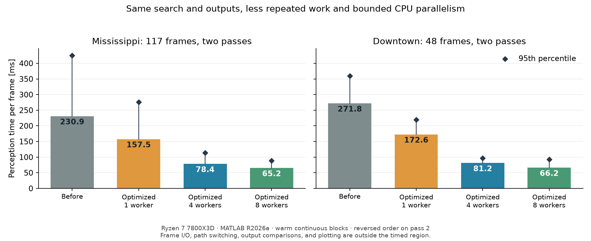

# Exact-output coarse pillar perception acceleration

Date: September 26, 2026. Frozen baseline:
`35cdb88388300ba1b8bb215905435bde670dff03` (native interface 5).
The optimized interface is 6; its default shaft worker cap is 4.

## Result

The default 0.6 m coarse pipeline takes about one third of its previous
median time in the paired replay below. All compared pole masks, source
summaries, and complete semantic Gaussian components remain exactly equal.
The pole detector still searches for compact, vertically continuous subsets
of the original points belonging to existing pillars and their neighbors.
No seeds, fit scales, support radii, height windows, endpoints, thresholds,
or semantic outputs were removed to obtain these timings.

| Sequence and sampled frames | Frozen median / p95 (ms) | Optimized serial median / p95 (ms) | Default 4 workers median / p95 (ms) | Optional 8 workers median / p95 (ms) |
| --- | ---: | ---: | ---: | ---: |
| Mississippi, `1:10:1170` (117 frames) | 230.913 / 425.513 | 157.524 / 275.990 | **78.406 / 113.461** | 65.230 / 88.265 |
| Downtown, `round(linspace(1,539,48))` | 271.785 / 359.660 | 172.614 / 219.889 | **81.156 / 97.070** | 66.171 / 92.851 |

Median runtime reductions, computed as one minus the ratio of medians, are
31.8% / 36.5% for serial execution, 66.0% / 70.1% for the default, and
71.8% / 75.7% for 8 workers (Mississippi / Downtown). The median of paired
baseline-to-default time ratios is 3.02 / 3.38, a different statistic.



Each variant ran continuous frame-order blocks, with three untimed frame
warmups after its backend switch. There were two passes; the second reversed
the variant order. Each sequence therefore has twice its frame count in
timing samples per variant. Only `perceiveFrame` was timed. Frame loading,
backend switching, warmups, comparisons, and file writes were excluded.
Percentiles use linear interpolation at `(n-1)*p` in sorted times.
The primary CSVs are `mississippi_steady_paired.csv` and
`downtown_steady_paired.csv`; `summary.json` contains all aggregates.

Measurements used MATLAB R2026a Update 3 on a Ryzen 7 7800X3D (8 physical,
16 logical CPUs), Linux, under normal desktop load. Background jobs were
not stopped or controlled, including another CPU-intensive MATLAB job.
`environment.json` records the environment and observed load average.
Reversing order reduces order sensitivity but does not establish isolated
CPU performance or a hard real-time bound. The older study's 201.007 ms
median used a different run protocol and is not the baseline for these
speedup claims.

## Why these changes preserve the detector

The initial profiler recorded 2.611 s inside `findPillarShaftModes` out of
3.802 s in `perceiveFrame` over 18 calls: approximately 68.7% of the parent
time. Both profiles use frames `[1 71 301 501 851 1031]`, three warmups and
three repeats. Profiling adds overhead; these profiles locate work rather
than replace the paired timing experiment. The final profiled shaft time
is 0.456 s out of 1.730 s. See `baseline_profile.csv` and
`optimized_profile.csv`.

The implementation removes repeated work within the same search:

1. Compute an axis's XY residuals and radial distances once and reuse them
   across all support radii. Retain every point that can contribute to any
   existing disk probe, including the original boundary tolerance.
2. Build the eight shifted-disk prefix counts only after some interval
   passes the existing geometric upper bound. These counts cannot affect a
   hypothesis that already fails that bound.
3. Reuse fitting and interval scratch buffers. Obtain medians by selection,
   with the original even-count interpolation arithmetic. Reuse sorted
   height order while retaining the balanced fit's accumulation order.
4. Walk equal-height boundaries monotonically, cache previous/next owner
   support indices, and limit axis refinement scans to the existing height
   window. These replace repeated searches without changing interval ends.
5. In MATLAB ownership assignment, reject an equal or stronger existing
   assignment before gathering its returns. Track winning source rows and
   copy each diagnostic field in one batch. Score updates, tie order, own
   support, grouping, and unassigned diagnostic values are preserved.
6. Schedule independent owner pillars across bounded C++ workers. Each owns
   its scratch and writes disjoint output rows. The per-owner hypothesis
   order is unchanged, so thread scheduling does not decide winners.

The worker cap is the minimum of `nativeThreads`, reported hardware
concurrency, and `max(1,floor(eligibleOwners/8))`. Four includes the calling
thread (at most three additional threads). No MATLAB API executes inside
workers. Exceptions are captured, threads joined, and errors rethrown on
the caller; partial thread creation also joins already-created workers.
No OpenMP, GPU, persistent worker pool, or Parallel Computing Toolbox is
required. MATLAB fallback remains available. Older saved shaft configs
without `nativeThreads` use serial native execution. Stale MEX versions
are rejected by the existing version gate and must be rebuilt. Only this
Linux build was exercised; Windows and macOS builds were not run.

Eight workers have lower medians but require more CPU concurrency. The
largest Downtown sample was 137.757 ms at 8 workers versus 102.555 ms at
4 workers. This isolated observation does not establish a general tail
ordering. Four is the default to limit CPU competition with other pipeline
stages. CPU time, energy, memory peaks, and concurrent localization latency
were not measured. Only the native shaft stage gains this parallelism.

## Quality and validation

The comparisons cover **1,238 distinct recorded frames**:

- All 1,170 Mississippi frames: 23,008 pole pillar occurrences retained,
  zero additions or losses, exact source summaries and complete Gaussian
  component structures. All 8,909 legacy candidates remain retained.
- The original 24 Downtown reference frames: 1,956 pole occurrences and
  all 634 legacy candidates retained, with the same exact comparisons.
- The 48-frame paired Downtown sample adds 44 frames to that set, making
  68 distinct Downtown frames. Every variant and timing repeat matches the
  freshly rebuilt baseline, including non-pole candidate masks. The
  Mississippi paired sample is contained in the full replay.

The full captures compare against the preceding study's stored outputs.
Those caches lack explicit non-pole candidate masks; full component
structures are compared instead. The paired blocks freshly record every
semantic candidate mask and compare those as well. Exact component equality
includes means, covariance and inverse covariance, semantic and occupancy
probabilities, and mixture weights; measured numeric errors are zero.

Fine-reference retention remains **299/306 (97.71%)** on the 117-frame
Mississippi sample and **128/132 (96.97%)** on the original 24 Downtown
frames. These are algorithmic frame/pillar references, not manual physical
pole accuracy. The additional Downtown frames have no new fine labels.

`validation.json`, `tests.csv`, `evidence_parity.csv`, and
`arithmetic_validation.json` record:

- **161 tests passed, zero failed/incomplete**, across 12 suites including
  the stored pipeline regression. The 35 new execution tests cover analytic
  scenes at 1/2/4 workers, threaded/serial equality on 64 occupied shafts,
  repeated heights, exact radius boundaries, duplicate axes and ties,
  owner endpoints, unsorted radii, sparse/empty inputs, and invalid caps.
- All raw mode fields, assigned fields and groups are exactly equal for
  **292,355 occupied pillars in 117 recorded frames**. The optimized serial
  cache was first checked against the frozen baseline, then the final
  implementation against that cache. Both local proof files are hashed.
- A standalone C++ fixture, seed 82609126, compares the frozen and current
  arithmetic on 5,000 deterministic scenes: 10,000 axis fits and 15,000
  interval evaluations agree exactly (corresponding NaNs accepted). This
  fixture tests arithmetic only; the MATLAB tests exercise threading.
- All 32 uniform-volume controls retain the original decisions: five
  accepted scenes at seeds 7, 13, 23, 26, 28. Score differences versus the
  preceding decimal CSV are at most `2.220446049250313e-16`.
- Factory Code Analyzer reports no findings in 16 MATLAB files. Python
  source compilation and exported-result assertions pass.

The first new test run exposed a scalar empty-array shape regression in
preallocated assignment and an overly broad C++ exception handler that
changed MATLAB's input error identifier. Both were corrected before final
replay and the passing suite. The baseline builder now disables Git's pager
explicitly after its initial invocation blocked on `less`. Its fresh rebuild
was subsequently checked against all ten Git source objects byte for byte.
The environment's known post-build MEX inspection warning remains; fresh
binary loading, smoke checks and native tests pass.

The preceding detector's five accepted null controls and its old 0.3 m
coarse agreement (36.29% tolerant precision, 79.01% retention) are unchanged.
This optimization does **not** resolve the simultaneous 80% migration
criterion, establish field precision, or prove localization improvement.
Its result is measured latency reduction with unchanged observed outputs.

## Reproduction and artifacts

Original recordings remain under `data/raw/` and are not committed.
Previous reference caches are under `output/pillar_shaft_20260926/` and
`output/pole_miss_analysis_20260925/cases.mat`. New large replay, profile,
and validation MAT files are local under
`output/pillar_shaft_speed_20260926/`. `artifact_hashes.csv` identifies the
source, measurements, inputs, and local proof files without admitting raw
data or binaries into Git. Weekly archive reports are not hashed.

Build and paired timing in MATLAB, from the repository root:

```matlab
setupVehicleLocalization();
addpath('research/pillar_shaft_speed_20260926');
buildPerceptionKernels();
baseline = prepareShaftSpeedBaseline( ...
    fullfile(pwd,'output','pillar_shaft_speed_20260926','baseline_rebuilt'));
% A new unmarked target is built in a temporary directory and admitted only
% after smoke checks. Existing unmarked targets are preserved and rejected.
datasets = ["Mississippi","Downtown"];
frameSets = {1:10:1170, round(linspace(1,539,48))};
labels = ["mississippi_steady","downtown_steady"];
for k = 1:2
    cfg4 = perceptionConfig(datasets(k));
    cfg1 = cfg4; cfg8 = cfg4;
    cfg1.offGroundFeatures.pole.shaft.nativeThreads = 1;
    cfg8.offGroundFeatures.pole.shaft.nativeThreads = 8;
    benchmarkShaftSpeedBlocks(datasets(k),frameSets{k},labels(k), ...
        baseline,["serial","threads4","threads8"],{cfg1,cfg4,cfg8},2);
end
```

The 1,170-frame capture uses twelve separate calls (batches no larger than
100) to `captureShaftSpeedBatch("Mississippi",frames,"mississippi_full",cfg,b)`.
The Downtown reference capture uses `round(linspace(1,539,24))` and label
`"downtown_reference"`. These require the previous stored references.
`validateShaftSpeed()` additionally requires the recorded serial-cache and
baseline-parity proof MAT files identified above. It is a reproduction of
this experiment, not a standalone reference generator. Unit tests can be
run directly with `runtests('tests/pillarShaftExecutionTest.m')` after setup.
`profileShaftSpeed("optimized",false,baseline)` recreates the final profile;
the baseline profile uses `("baseline",true,baseline)`.

```bash
python research/pillar_shaft_speed_20260926/verifyShaftArithmetic.py
python research/pillar_shaft_speed_20260926/summarizeShaftSpeed.py
python research/pillar_shaft_speed_20260926/plotShaftSpeed.py
python research/pillar_shaft_speed_20260926/hashShaftSpeedArtifacts.py
```

The plot helper requires NumPy and Matplotlib; the other Python helpers use
the standard library and the arithmetic fixture additionally requires g++.
`first_exact_paired.csv`, `thread_probe_paired.csv`, and
`mississippi_paired.csv` retain exploratory measurements with per-frame
backend switching; the continuous-block tables are the final timing basis.
The full Mississippi optimized replay has median 63.941 ms and p95
101.987 ms, but this is a different frame population and is not used for
the paired percentage improvements.
