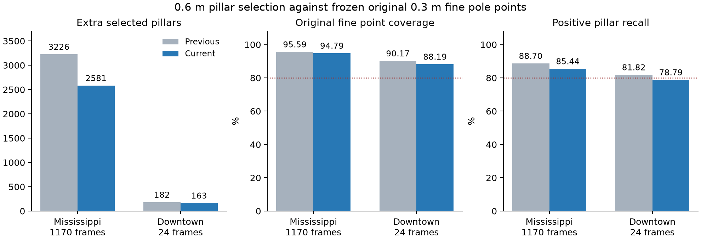

# Reducing extra coarse pole pillars with conditional support validation

The implemented change reduces false selections relative to the frozen original
0.3 m **fine pole point identities**, while retaining the shared online 0.6 m
pillar representation. This is an algorithm-reference comparison, not manually
annotated physical-pole accuracy. An extra pillar contains none of those reference
points; it can still contain a physical pole that the reference missed.

The previous implementation is commit
`cb8c76b80ec22e0c6daca7455e348eb7e8e8e64a`. The first profile was frozen before this iteration's temporal and Downtown
checks. Distance-stratified failures prompted two further measured revisions;
`profile_freeze.json` identifies the installed one. These datasets and previous
evaluations were reused, so no independent held-out accuracy is claimed.

## Findings and rejected alternatives

Development used Mississippi frames `1:10:771`, with 410 hypothesis/owner rows,
336 distinct selected pillars, 184 reference pillars and 13464 reference points.
Features were computed from raw off-ground point distributions first; reference
labels were joined afterward. Metrics union all accepted hypotheses for an owner,
so multiple proposals do not inflate precision or coverage.

Eight high-support extra pillars were traced through the original offline fine
pipeline. The trace shows multiple mechanisms:

- Frame 111 / pillar 5343: the original full-support covariance rejects a wide
  surface (maximum transverse standard deviation 0.12351 m, aspect 4.98), while
  a 0.25 m cylinder crops it into a narrower-looking shaft.
- Frames 701 / 4642, 631 / 4235 and 161 / 3743: original fine footprint/context
  gates reject candidates near surrounding structure. Their original context
  ratios are approximately 0.40, 0.42 and 0.43.
- Frame 511 / 5256: original fine slice support fails despite many local points.
- Frames 61 / 6772 and 221 / 4974: original short-support continuity/tilt gates
  reject the object. Frame 1 / 7873 fails the original wide-surface gate.

These traces diagnose disagreements; they do not establish that every rejected
structure is a physically false pole. The offline trace helper is research-only.

The study measured continuous Gaussian peak curvature at four radial scales,
height-quarter center stability, radial distribution quantiles, expanded-radius
covariance, and persistent surrounding angular-sector height support. None uses
an auxiliary XY grid. Expanded covariance alone can reject true poles mixed with
nearby points. For example, a 0.35 m radius with standard deviation >0.12 m and
aspect >3 removes 19 extras but also loses 444 covered reference points in the
78-frame development sample. It was not installed.

Five statistical model probes used five temporal development folds with a
20-frame exclusion zone and seed 927. Frame ID, pillar ID, hypothesis ID and
reference labels were not input features; sensor-relative support height was
included. Thresholds were selected from the pooled out-of-fold predictions, so
these are exploratory tuning results, not unbiased final accuracy estimates.
The best high-coverage boosted probe still had 98 extra pillars and only 83.15%
positive-pillar recall. No trained classifier or its features were installed.
See `model_protocol.json`, `model_comparison.csv`, `expanded_gates.csv`,
`conditional_gates.csv` and the individual feature exports.

## Installed rule

Existing continuous-height shaft support, density, width, isolation, trimming,
and actual per-owner support checks remain in force. A hypothesis must additionally
have at least 30 retained support points **or** satisfy the extra tight/upright
geometry condition. Each selected owner must have at least 15 retained points
**or** satisfy that condition. The earlier hard minimum of 10 owner points and
0.30 m owner height still applies.

For sensor XY range up to 15 m, the extra geometry limits are 4 degrees tilt and
0.10 m residual RMS. Between 15 and 20 m they interpolate linearly to 6 degrees
and 0.12 m, then remain capped at those values. The bounded relaxation allows
less precise axes from sparse distant sampling; it is an empirically checked
heuristic, not a calibrated sensor uncertainty model. Input coordinates must
retain the sensor/vehicle-frame convention already used by the perception ROI.
No original density, continuity, width or hard owner-support check is relaxed.

This treats weakly supported shafts and peripheral owners more cautiously without
eliminating every sparse pole. Dense support retains the preceding acceptance
envelope. Counts and geometry already exist; the change adds scalar comparisons
and range interpolation. Mixed pillars still qualify from a concentrated,
vertically continuous subset. All online detection remains on 0.6 m pillars.

The initial fixed 4-degree/0.10 m profile reduced Mississippi extras by 29.76%,
but the aggregate concealed a 20-30 m coverage drop from 76.17% to 51.78%. It
was rejected. An inverse-square relaxation of point thresholds restored far
coverage but reduced extras by only 2.36%; it was also rejected. Their full
results remain in `fixed_count_*` and `count_scaled_*` artifacts. The installed
profile recovers part of the distant coverage while retaining a measurable
reduction in extras. Its remaining range loss is reported below.

Setting both sparse point thresholds to zero reproduces the preceding decisions.
The paired timing baseline uses this setting and checks selected pillar identities
against frozen previous records on every timed frame. Both timed variants share
diagnostic support extents.

Development ablation (`ablation_development.csv`):

| Variant | Extra pillars | Fine point coverage | Positive pillar recall |
|---|---:|---:|---:|
| Previous | 165 | 98.14% | 92.93% |
| Fixed sparse shaft gate only | 130 | 97.56% | 90.22% |
| Fixed weak owner gate only | 139 | 97.48% | 90.22% |
| Both fixed gates, rejected | 117 | 96.90% | 87.50% |
| Blanket 20-point minimum, rejected | 96 | 95.57% | 80.43% |
| Count scaling, rejected | 161 | 98.01% | 92.39% |
| Installed bounded geometry relaxation | 130 | 97.42% | 89.67% |

## Full-sequence and transfer results

Raw reference point XY is projected into exact 0.6 m owners, without dilation,
nearest-neighbor tolerance, old coarse ground truth or ground-filter denominator
exclusions. Rates pool counts across frames. These are not per-frame means or
physical-object recall. `full_frames.csv` concatenates disjoint runs of frames
1:780 and 781:1170. Downtown uses `round(linspace(1,539,24))`.

| Dataset | Extra pillars, previous -> current | Extra fraction, previous -> current | Fine point coverage, previous -> current | Positive pillar recall, previous -> current |
|---|---:|---:|---:|---:|
| Mississippi, 1170 frames | 3226 -> 2581 (-19.99%) | 55.77% -> 51.16% | 95.59% -> 94.79% | 88.70% -> 85.44% |
| Development prefix, 780 frames | 1757 -> 1438 (-18.16%) | 51.75% -> 47.55% | 96.38% -> 95.69% | 90.10% -> 87.24% |
| Temporal suffix, 390 frames | 1469 -> 1143 (-22.19%) | 61.49% -> 56.56% | 94.17% -> 93.17% | 86.30% -> 82.36% |
| Downtown, 24 frames | 182 -> 163 (-10.44%) | 62.76% -> 61.05% | 90.17% -> 88.19% | 81.82% -> 78.79% |

Mississippi, 1170 frames: 184177/194300 fine points covered; 2464/2884 reference pillars matched; 5045 selected pillars. Point miss rate: 5.21%.

Downtown, 24 frames: 5176/5869 fine points covered; 104/132 reference pillars matched; 267 selected pillars. Point miss rate: 11.81%.

Extra fraction is `FP / selected`, not the background false-positive rate
`FP / (FP + TN)`. Counts refer to frame/pillar occurrences, not unique physical
poles. The primary point-containment measure exceeds 80% in both pooled datasets;
Downtown positive-pillar recall remains below 80%. Remaining extra fractions are
high, and no claim of universal per-frame 80% coverage is made.

Distance stratification on Mississippi is critical: final point coverage is
97.78% at 0-10 m, 89.58% at 10-20 m and 66.47% at 20-30 m, compared with preceding
97.86%, 91.45% and 76.17%. The 20-30 m denominator is 4674 points; the final change
loses 453 previously covered points there. Positive pillars with fewer than 10
reference points have 37/116 recall; those with at least 100 have 570/579.
This iteration improves false selection with an explicit remaining sparse/far
tradeoff; it does not solve the full precision/recall problem.



## Validation and timing

All 199 selected MATLAB tests pass with zero failures or incomplete cases
in the final combined result. Seven new controls cover tight sparse support,
diffuse/leaning sparse rejection, dense tilt allowance, peripheral ownership,
distant sparse tolerance and persistent wide-surface rejection. Existing mixed
pillar, boundary, native/MATLAB parity, original fine and mapping assertions remain.
The first distant fixture crossed a second pillar unintentionally; its translation
was corrected. The affected 18-test suite was rerun and replaced in the full-run
result; `fixture_initial_tests.csv` preserves the initial failure. The clean full
reproduction command remains `validateContextAlignment`.

All 1194 evaluated frames retain identical ground/filter source counts and non-pole
Gaussian component fields, except the global mixture-weight normalization that
changes when pole components change. Code Analyzer output and exact results are
in `code_analysis.csv` and `tests.csv`.

Paired runtime uses 24 preloaded frames per dataset and three alternating warmed
repetitions, or 72 measurements per variant/dataset. I/O and configuration are
excluded. Median milliseconds, disabled-gate preceding profile -> current:

- Mississippi: 73.112 -> 71.546 ms.

- Downtown: 82.820 -> 80.949 ms.

These workstation measurements do not establish hard real-time operation. Earlier
studies' absolute timings are not used as the baseline for this paired comparison.
See `paired_runtime.csv`, `summary.json` and `residual_groups.csv`.

## Reproduction and artifact scope

From the repository root with local recordings and the preceding study's frozen
references present:

```matlab
addpath(pwd); setupVehicleLocalization;
addpath('research/pole_context_20260927');
exportPoleContext(1:10:780,'development');
exportExpandedContext;
exportContextContinuity;
exportDevelopmentRanges;
traceContextFailures([511 5256;701 4642;111 5343;631 4235;161 3743;61 6772;221 4974;1 7873]);
captureContextAlignment('Mississippi',1:780,'development_full');
captureContextAlignment('Mississippi',781:1170,'temporal');
captureContextAlignment('Downtown',round(linspace(1,539,24)),'downtown');
validateContextAlignment;
benchmarkContextAlignment;
analyzeContextResiduals;
checkContextCode;
```

```sh
python research/pole_context_20260927/analyzeContext.py
python research/pole_context_20260927/screenExpandedContext.py
python research/pole_context_20260927/screenPhysicalRules.py
uv run --with scikit-learn python research/pole_context_20260927/exploreContextModels.py
python research/pole_context_20260927/summarizeContext.py
uv run --with matplotlib python research/pole_context_20260927/plotContextResults.py
```

Original recordings remain under `data/raw/`. Frozen reference point identities
and previous candidates remain under `output/pillar_fine_alignment_20260926/`;
117 sparse raw cases are in `output/pole_miss_analysis_20260925/cases.mat`.
New MAT caches remain under `output/pole_context_20260927/`. Raw recordings,
binaries, dependency environments and unrelated observer edits are excluded from
the project commit. CSV statistics, result summaries, diagnostic traces and
reproduction code are research outputs. No online path reads any reference/cache,
frame number, label table, learned model or original fine detector.
