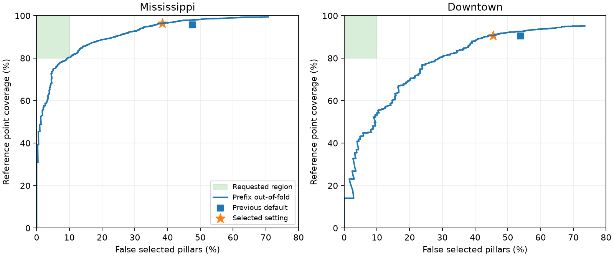

# Joint coarse-pillar pole validation — 2026-09-27

The default 0.6 m pole detector now uses a joint point-distribution validator
after continuous shaft proposal measurement. It improves both false selection
and reference point coverage over the preceding production profile. **The
requested at-most-10% false-selection target is still not achieved.**

The reference remains the original offline 0.3 m fine pole points. A selected
0.6 m pillar is false only if it contains **zero** such points. One reference
point is sufficient, irrespective of clutter. False selection is
`FP / (TP + FP)`; point coverage divides covered original reference points by
all reference points inside the original coarse XY ROI. Ground filtering does
not shrink this denominator. There is no spatial tolerance, dilation, purity
threshold, or minimum reference-point count. The lattice is unchanged:
`[-29.9, 30.1)` m, 100 by 100 pillars at 0.6 m spacing.

## Measured results

The baseline is the production geometry profile at
`c4d7c864f3e4edf8efe489fa50ca0ee02b12057f`, not the rejected high-precision
research classifier from the previous study. Both versions were replayed from
raw recordings on the same frames and against the same frozen references.

| Full replay | Previous | Joint distributions |
|---|---:|---:|
| Mississippi, 1,170 frames: false pillars / selected pillars | 2,581 / 5,045 = 51.16% | 1,824 / 4,466 = 40.84% |
| Mississippi: covered / reference points | 184,177 / 194,300 = 94.79% | 189,286 / 194,300 = 97.42% |
| Downtown, 128 frames: false pillars / selected pillars | 845 / 1,504 = 56.18% | 459 / 1,185 = 38.73% |
| Downtown: covered / reference points | 31,463 / 34,829 = 90.34% | 32,762 / 34,829 = 94.07% |

These are frame/pillar occurrences, not tracked physical objects. The full
replay includes training frames and must **not** be described as independent
generalization performance. Evaluation that separates fitting from prediction
also improves both requested quantities:

| Check | Dataset | False selection, previous → new | Point coverage, previous → new |
|---|---|---:|---:|
| Prefix out-of-fold | Mississippi | 47.55% → 38.38% | 95.69% → 96.44% |
| Prefix out-of-fold | Downtown | 53.81% → 45.51% | 90.51% → 90.71% |
| Temporal suffix, 390 frames | Mississippi | 56.56% → 50.28% | 93.17% → 94.45% |
| Temporal suffix, 43 frames | Downtown | 62.98% → 54.31% | 89.65% → 89.88% |

The Downtown suffix coverage gain is only 16 points, so it is a small measured
improvement, not evidence of a large or universal recall gain. These suffixes
have been reused during this project; no independent new-recording benchmark
or manually annotated physical-pole accuracy is claimed.

`acceptance_checks.csv`, `selection_transitions.csv`, `temporal_examples.csv`
and the raw replay tables retain counts and gains/losses, including reference
points that the new rule loses. Coverage is not inferred from pillar recall.

## Diagnosis and algorithm change

The diagnosis first uses the preceding broad validator, with its two sparse
point thresholds disabled. Only 306 of its 3,226 Mississippi false owners
(9.49%), and 67 of its 937 Downtown false owners (7.15%), share a qualified
hypothesis with a reference-positive owner. Most disagreement therefore belongs
to entire reference-negative shaft hypotheses, rather than merely extra owners
beside a reference-positive shaft.

For Mississippi, the broad profile misses 8,571 reference points: 562 are
attached to a geometrically accepted hypothesis but fail owner gates, 6,210
occur on recorded hypotheses rejected by geometric vetoes, and 1,799 have no
recorded qualified owner support. Downtown's corresponding counts are 342,
1,033 and 1,673. The second group includes separate width, tilt, residual,
isolation and short-support vetoes. These findings motivate replacing
independent vetoes with a joint test of supported point subsets and context.
They do not identify physical objects from manual ground truth.

The implemented sequence is:

1. Preserve the existing coarse shaft proposals and continuous radial/height
   qualification: a 0.25 m core, 0.75 m context, sliding 0.5 m height windows,
   at least 1.5 m qualified support and the existing density-ratio/continuity
   requirements. No finer XY ownership grid is created.
2. Admit actual owners with at least three supported returns and 0.15 m own
   height extent. Owner evidence is measured separately; a neighbor is not
   automatically labeled because a shaft passed elsewhere.
3. Jointly score 60 shaft/owner/context features and 83 additional joint XYZ
   statistics. The latter are moments through total degree four for the whole
   owner and its supported core (34 each), plus 15 coordinate quantiles. They
   retain how lateral scatter changes with height, beyond a single covariance.
   Context probes overlap continuously and remain on raw points from the
   existing 0.6 m pillars.
4. Select an owner when at least one supported hypothesis reaches the frozen
   score threshold `0.1488746496646483`. The portable model contains 250 trees
   of maximum depth five and needs no Python or machine-learning toolbox at
   inference. Tree traversal advances all trees together in MATLAB.

The model does not receive frame, dataset, pillar or hypothesis identity,
reference labels, or global XY coordinates. It does use range and normalized
positions/moments within the existing coarse pillar. Original fine points are
offline training/evaluation labels only. Runtime reads current-frame point
statistics and the versioned numeric model. Scores rank reference agreement;
they are not calibrated physical-pole probabilities.

The recordings exclude the central vehicle region. When callers widen the ROI,
shafts within 3 m range retain the preceding geometric validator instead of an
untrained learned extrapolation. No captured training/evaluation hypothesis is
inside that range. The learned configuration is enabled for 0.6 m only. Other
configured spacings retain the geometric path.

Selected pillars still emit all-point XYZ moments. Ground membership and all
non-pole component fields are unchanged on the complete replay, except for
globally normalized mixture weights, which necessarily depend on the changed
pole components. Original fine detection rules and stored reference masks are
preserved. No localization-accuracy improvement is claimed here.

## Model selection and implementation safeguards

There are 17,317 captured hypothesis/owner rows (13,767 Mississippi and 3,550
Downtown). Training uses Mississippi frames 1–780 and the 85 selected Downtown
frames at or before 360. Five proportional contiguous folds purge 20 and 10
frames, respectively, around each validation block. Seed: 927. Positive
examples receive point-count weighting; duplicate hypotheses for one owner
are normalized, and evaluation takes exact owner unions.

Twenty exploratory configurations compare compact, base, full-context and
joint-moment descriptors, depths three/five and two positive-weight powers.
The selected operating rule minimizes the worse prefix false-selection
fraction while both datasets improve their previous coverage by at least
0.2 percentage points and reduce false selection. This is an incremental
promotion criterion, **not a replacement for the user's 10% acceptance goal**.

Full raw replay exposed two defects that sampled inference checks missed:

- At Mississippi frame 31 / pillar 7672, an unquantized tree split on
  `fraction010 = 0.40816326530612201`. The raw ratio was
  `0.40816326530612246`; CSV rounding sent it down a different branch.
  Training and inference now both apply `floor(x * 1e8 + 0.5) / 1e8` after
  zero-imputing nonfinite features. The selected configuration was retrained
  with this preprocessing and its threshold reselected using prefix folds.
  Unquantized exploratory results are not production validation.
- Downtown frame 375 used a cropped 98 by 96 off-ground raster instead of the
  original 100 by 100 raster. Empty-margin cropping changed edge shape scores.
  The branch now retains the source pillar geometry, and the pole model and
  its proposal gates recover shape context on the original **0.6 m** raster.
  Other semantic classifiers retain their previous maps. The edge regression
  checks the full and cropped paths on exactly the same point set.

At the final model's prefix setting constrained to at most 10% false selection,
point coverage is only 78.58% for Mississippi and 54.24% for Downtown. A higher
threshold therefore does not solve the requested joint target. The deployed
setting preserves coverage while reducing false selections; the joint target
remains open.



## Validation and performance

All 210 MATLAB regression/physical/metric tests pass, including the new joint
moment, numerical-stability and empty-margin controls. The distribution suite
is refreshed after the final assertion edits. All 17,317 exported scores match
Python within `5.56e-16`, with identical selected rows. The final model reproduces
its frozen selections on 24 feature-level raw replays and on the full 1,298
frame pipeline replay. Every frame preserves ground/filter counts and non-pole
components, subject to the global mixture-weight exception above.

`paired_runtime.csv` and `summary.json` report three alternated warmed repeats
on 24 frames per dataset. Loading, configuration and first model loading are
outside timed intervals. Timing is measured on the shared development machine;
no real-time deadline guarantee is inferred.

| Dataset | Previous median / mean (ms) | Final median / mean (ms) |
|---|---:|---:|
| Mississippi | 61.65 / 64.68 | 79.20 / 86.15 |
| Downtown | 72.34 / 72.33 | 108.58 / 115.53 |

The quality improvement carries a measured median cost of 17.55 ms and
36.24 ms, respectively. Unused radial/Gaussian/histogram feature groups are
omitted, and polynomial expectations and quantiles are computed in batches.
The complete raw replay and distribution controls were repeated after this
optimization with identical selections and coverage. The earlier timing
capture is retained as `paired_runtime_before_batching.csv`; machine baseline
timings also changed between captures, so their raw absolute medians do not
isolate an optimization speedup.

The first diagnostic script invocation lacked the repository path when run from
`/tmp`; it was rerun correctly. An initial vectorized singleton tree call had a
MATLAB row/column expansion error, which was fixed and covered by explicit
singleton/empty tests. Both raw replay failures above were diagnosed and fixed
before the final complete replay. No failed or partial run is counted as a
passing final check.

## Reproduction and configuration

Default controls are in `config/pillarPoleDistributionConfig.m`; the model is
`config/polePillarDistributionModel.json`. To reproduce the previous production
selection without changing the offline detector:

```matlab
cfg = perceptionConfig('Mississippi');
cfg.offGroundFeatures.pole.distributionValidation.enabled = false;
```

Original recordings stay in `data/raw/`. Frozen fine references and measured
pre-veto hypotheses are in `output/pole_precision_20260927/{mississippi,downtown}.mat`.
If those caches need rebuilding, the previous study's
`capturePrecisionTraining` explicitly disables the new validator and retains
the original broad proposal configuration. Downtown frames are
`unique([1:5:539 round(linspace(1,539,24))])`. Fine labels are joined only after
candidate features have been measured.

```matlab
root=setupVehicleLocalization; addpath(root);
addpath('research/pole_geometry_20260927');
diagnoseOwnerSupport;
captureGeometryFeatures('Mississippi','mississippi');
captureGeometryFeatures('Downtown','downtown');
captureMomentFeatures('Mississippi','mississippi');
captureMomentFeatures('Downtown','downtown');
```

```sh
uv run --with scikit-learn==1.9.1 python research/pole_geometry_20260927/trainGeometryModel.py
uv run --with scikit-learn==1.9.1 python research/pole_geometry_20260927/trainGeometryModel.py --moments
uv run --with scikit-learn==1.9.1 python research/pole_geometry_20260927/trainGeometryModel.py --moments --stable
uv run --with scikit-learn==1.9.1 python research/pole_geometry_20260927/exportGeometryModel.py --moments --stable
```

Then run `validateGeometryCandidate('stable_moments_')`,
`replayGeometryModel('stable_moments_')`, `validateGeometryPipeline`,
`checkGeometryCode` and `benchmarkGeometryPipeline` in MATLAB. Run
`summarizeGeometryStudy.py` with scikit-learn and matplotlib to regenerate the
tables and figures. MATLAB: R2026a; scikit-learn: 1.9.1.

Large feature matrices, original recordings, MAT/pickle/NumPy caches and
generated native binaries remain outside the commit. The committed numeric
model, exact replay/prediction counts, fold-selection reports, tests and source
code document the implemented behavior. Unrelated observer, lattice-study,
README, agent-instruction and `reference/` changes are excluded.
