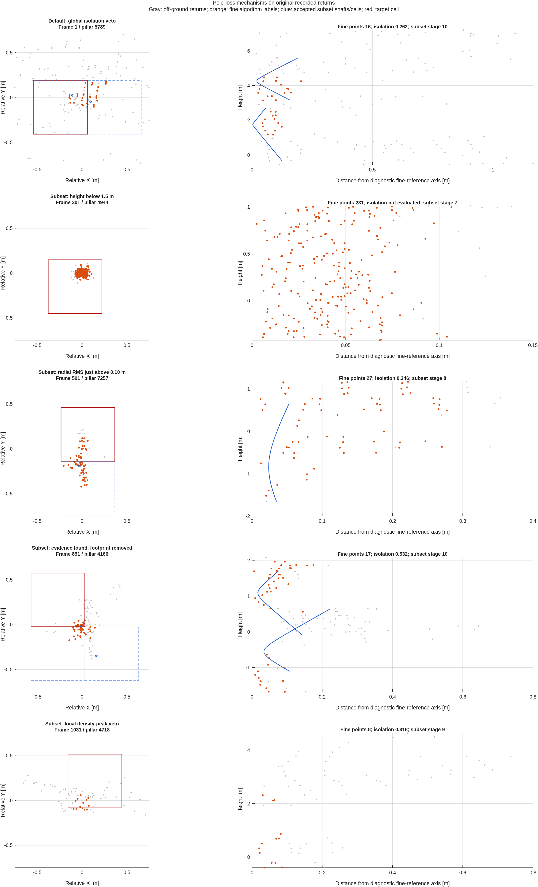

# Why pole agreement remains below 80 percent

Prepared 2026-09-25. Diagnostic study of the 0.6 m pillar migration, using
`MissisipiPointClouds.mat`. Production detector/configuration behavior is unchanged
by this study. The subset detector remains an opt-in experiment.

## Finding and interpretation

The reported disagreement includes **old candidate cells missing from the new
output, new candidate cells absent from the old output, and changed footprint
cells for a nearby shaft**. It does not establish a physical pole miss rate.
The full-drive experiment does fail the requested 80 percent consistency target.
Reinterpreting a different reference's recall does not make that target pass.

The measured units below are **frame/pillar occurrences**, including repeated
observations across frames. They are not counts of unique physical poles. Neither
the old coarse output nor the offline fine extraction is manual ground truth.
An old candidate not supported by the fine extractor is not thereby proven false.

### Full-drive agreement: 1170 frames

This table reuses the completed full-drive capture from
[`../pole_subset_20260925/full_summary.json`](../pole_subset_20260925/full_summary.json).
The 0.3 m reference is projected to the common 0.6 m comparison lattice.

| Quantity | Exact cell match | One-cell tolerant match |
|---|---:|---:|
| Old reference cells | 9129 | 9129 |
| New experimental cells | 20806 | 20806 |
| Old cells with a new match | 5681 | 6468 |
| Old cells without a new match | 3448 | 2661 |
| New cells with an old match | 5681 | 6548 |
| New cells without an old match | 15125 | 14258 |
| Old-output retention (agreement recall) | 62.23% | 70.85% |
| New-output agreement precision | 27.30% | 31.47% |

Recall asks what fraction of old cells has a new match. Precision asks what
fraction of new cells has an old match. Thus 70.85 percent does mean 29.15
percent of **old candidate cells** lack a tolerant new match. It does not mean
29.15 percent of real poles were missed. The much larger number of unmatched new
cells also explains the low overall agreement; those additions need examination
as potential recovered poles, duplicate footprints, or false candidates.

Tolerant matching independently queries each set's eight neighbors, allowing
0.6 m per axis and 0.849 m diagonally. It is not one-to-one matching, explaining
the two different tolerant matched counts. It is diagnostic, not an agreed
physical-object acceptance rule.

### Detailed replay: frames 1:10:1170

The 117 sampled frames contain 924 old coarse cells and 306 fine-reference
cells, with a union of 980 cells. We replayed the actual off-ground inputs using
original recorded XYZ values and point identities, traced the detector gates,
and inspected the final footprint selection.

| Measurement | Existing default 0.6 m | Experimental subset 0.6 m |
|---|---:|---:|
| Output pole cells | 869 | 2104 |
| Exact matches to the 306 fine-reference cells | 260 (84.97%) | 296 (96.73%) |
| Fine-reference cells without an exact match | 46 | 10 |
| Fine-reference cells with a tolerant match | 280 | 301 |

The subset experiment recovers 38 of the default's 46 fine-reference omissions
and loses two previously matched cells. Of its **333 exact old-coarse omissions,
330 have no fine-reference support and only three have it**. The coarse and fine
references select substantially different sets. This is evidence that coarse
agreement alone cannot identify true physical misses; it is not evidence that
all 330 cells are false positives or that the experiment's physical recall is
96.73 percent.

## What actually removes candidates

### Existing default: clutter enters an all-height isolation denominator

Among the 46 fine-reference cells omitted by the default, the exclusive
breakdown is:

| Gate group | Cells |
|---|---:|
| Whole-pillar point count or height prefilter | 7 |
| Measured density-core isolation below 0.35 | 33 |
| Other density-core geometry, without isolation failure | 1 |
| Core found, then omitted by footprint selection | 5 |

Isolation is the **only failed core gate in 31** of those cells. Their measured
ratios are 0.2020--0.3472. No eligibility or line-score rejection occurs among
these 46 cells. The other two isolation failures also fail core height or count.

`computePillarDensityCore` divides the points within 0.15 m of the XY peak by
all points within 0.60 m, across the entire available height. Dense foliage or
nearby surfaces can enlarge that denominator despite a compact vertical shaft.
This is the main measured failure of the default on the fine-reference subset,
and conflicts with accepting an independently supported minority shaft.

The seven prefiltered cells have zero-valued, **unevaluated** core statistics.
Counting those zeros as measured isolation failures would incorrectly report
40 rather than 33 failures. This study records `densityCoreEvaluated` explicitly.

Ground removal is not the dominant measured explanation: the fine-labeled owner
points in the 46 default omissions total 1089, of which only two points in one
cell were removed by ground segmentation. Across all 306 fine-reference cells,
32 of 20305 fine-labeled owner points were removed, in 13 cells. These numbers
describe this algorithmic reference, not all physical poles in the drive.

### Subset experiment: ten exact fine-reference omissions

The trace records the furthest successful gate over all tested hypotheses.
It is a rejection funnel, not a claim of one unique physical cause per cell.

| Frame / pillar | Furthest failure or final omission | Diagnostic detail |
|---|---|---|
| 21 / 6586 | Transverse density peak | Best peak ratio 1.2727, threshold 1.3 |
| 21 / 7773 | Gap-separated run count | Maximum run has 11 returns, threshold 12 |
| 301 / 4944 | Continuous height | Longest eligible run 1.4343 m, threshold 1.5 m |
| 501 / 4644 | Footprint selection | Shaft found; nearby accepted fine-axis distance 0.00965 m |
| 501 / 7257 | Radial RMS | Minimum tested RMS 0.100071 m, threshold 0.10 m |
| 641 / 3864 | Continuous height | Longest eligible run 1.4497 m |
| 851 / 4166 | Footprint selection | Shaft found; nearby accepted fine-axis distance 0.03184 m |
| 1031 / 4717 | Local window contrast | Too few qualified returns after local contrast filtering |
| 1031 / 4718 | Transverse density peak | Best peak ratio 1.25 |
| 1081 / 7532 | Continuous height | Longest eligible run 1.3843 m |

Five of the ten have a selected one-cell neighbor. In particular, the two
footprint omissions have accepted axes close to the diagnostic fine-reference
axis, with 2.7184 m and 1.7897 m of vertical overlap. These are strong examples
of cell disagreement despite nearby shaft evidence. Conversely, frame 21 /
6586 has a nearby XY axis but zero vertical overlap: XY proximity alone is not
sufficient evidence of retaining the same pole. Fine-axis fitting is a diagnostic
association, not manually established pole identity.



Gray points are original off-ground returns; orange points carry offline
fine-extractor labels. Blue lines/cells are accepted experimental shafts; the
red box is the target pillar. The right column plots radial distance from a
diagnostic fine-reference axis versus height. Curved blue traces there are the
distance between straight axes evaluated at varying heights.

### A verified violation of the intended subset logic

The implementation scores only **maximal gap-connected runs**. It does not
reconsider valid subruns after a longer run fails. Qualifying additional points
can extend or merge a run, enlarge the height interval used to measure density
contrast, and destroy acceptance even though the old valid subset still exists.

`auditPoleRunExpansion` fixes the same axis and radius for frame 71 / pillar
7035 and lowers only local contrast from 4 to 3:

| Support evaluated on that fixed axis | Points | Height | Peak ratio | Result |
|---|---:|---:|---:|---|
| Original maximal run | 42 | 4.0602 m | 52/40 = 1.3000 | Pass |
| Expanded maximal run | 56 | 4.3531 m | 56/44 = 1.2727 | Fail |
| Original subset retained under the relaxed rule | 42 | 4.0602 m | 1.3000 | Still valid, not revisited |

All three pass the other count, owner-support, height, robust-height, radial-RMS
and gap tests. The original points are a subset of the relaxed qualified run.
The full detector changes from found to not found on this cell. This establishes
a specific defect in the search relative to the intended existential criterion,
not simply a threshold that should be lowered. See [`run_expansion.csv`](run_expansion.csv).

The local radial contrast also retains a limited dominance requirement:
`3 * inner / max(outer - inner, 1) >= 4`. For a nonempty annulus this requires
at least 4/7 of the local outer-circle mass to be inside the shaft circle.
Although restricted to a one-meter sliding height window, it can still reject
a minority shaft beside dense clutter. Removing all contrast checks would also
admit arbitrary narrow strips of walls; the distinction needs better geometric
evidence, rather than assuming every compact subset is a pole.

### Footprint selection introduces a second, independent loss

`selectPillarFootprints` groups core candidates by eight-neighbor cell
connectivity. With the current zero context threshold, it selects one best
singleton per component. `completeSplitShafts` may add an edge neighbor. Thus a
connected group of candidates competes for one or two output cells even when
it contains different shaft hypotheses.

Lowering local contrast from 4 to 3 gains four fine-reference cells but loses
eleven. Ten of those eleven still have qualifying shaft evidence and are removed
later by footprint selection; the remaining cell is the maximal-run failure
above. Some changed footprints follow nearly identical axes, while other
nearest selected axes are about one meter away (frame 1021 / pillars 2827,
2828). Cell connectivity alone does not establish that two hypotheses describe
the same physical shaft. [`footprint_losses.csv`](footprint_losses.csv) records
components, selected cells, and axis distances evaluated at a common height.

## Why uniformly lowering thresholds is not a solution

These counterfactuals change one parameter and rerun final structural selection
on all 117 frames. Coarse agreement uses one-cell tolerance in this table.

| Variant | Output cells | Fine exact matches / 306 | Coarse precision | Coarse recall |
|---|---:|---:|---:|---:|
| Existing default | 869 | 260 | 70.08% | 71.21% |
| Default isolation 0.20 | 2778 | 289 | 27.97% | 86.80% |
| Default isolation disabled | 5415 | 289 | 14.37% | 86.04% |
| Subset experiment | 2104 | 296 | 32.56% | 73.48% |
| Subset minimum height 1.35 m | 2302 | 299 | 30.41% | 75.43% |
| Subset peak ratio 1.25 | 2172 | 298 | 32.14% | 74.78% |
| Subset RMS 0.101 m | 2106 | 296 | 32.53% | 73.48% |
| Subset minimum points 11 | 2282 | 296 | 30.85% | 75.22% |
| Subset local contrast 3 | 2862 | 289 | 24.91% | 77.06% |

No tested variant reaches 80 percent in both agreement directions. Candidate
expansion is substantial, and relaxed gates can reduce retention due to the
two nonmonotonic selection mechanisms above. These are same-data diagnostics,
not independent validation of an optimized configuration.

Separate fixed-case probes on the ten fine-reference omissions show:

- Increasing covering seeds from 12 to 48 and height hypotheses from 4 to 12
  rescues none of the eight cells without shaft evidence. Search budget alone
  is not the measured bottleneck in these cases.
- Changing fit radius from 0.15 to 0.10 m rescues frame 501 / 7257 with radial
  RMS 0.0492 m. Raising the RMS gate to 0.101 m does not rescue it because later
  gates still fail. Axis/support estimation matters more than the numerical
  closeness of its first failed threshold.
- Fit radius 0.20 m rescues three other cells; no single direction of radius
  change serves every case. These probes measure owner evidence before final
  footprint selection, not an end-to-end improvement on the full drive.
- Lowering minimum run points to 11 does not rescue frame 21 / 7773 by itself.
  Changing one first failed gate does not guarantee final acceptance.

## Design decision from the diagnosis

The next implementation should preserve qualifying bounded subruns when a
larger run fails, and group duplicate shaft hypotheses using axis position,
slope and overlapping height support before selecting pillar footprints.
An XY-connected set of cells should not be assumed to be one shaft. Multiple
fit radii merit evaluation with an explicit runtime budget; simply increasing
the number of seeds did not help the diagnosed cases.

Keep the user's 0.6 m detection lattice. Candidate-local support searches must
use the existing points and pillars; no auxiliary 0.3 m detector is needed for
these changes. Acceptance must continue reporting **both** retention of the
frozen old output and additions relative to it, alongside physical-axis
association diagnostics. Fine-reference recall cannot replace the original
80 percent consistency requirement. Real miss/false-positive rates require
reviewed physical labels, particularly among unmatched old and new candidates.

This study establishes causes and counterexamples. It does not implement those
production fixes or claim the migration is complete.

## Reproduction and validation

Inputs are the original raw cloud file and the cached reference/membership
records created by the prior studies. References: frozen 0.3 m coarse commit
`796c737344e6c29c3e7aa8869aab2630dc0ebbb1`, previous 0.6 m default
`3ff90ea2a195aa91d766c7be94902cc4d0d6e2bd`, and subset implementation
`c7229148e17c9b3095d6b67ce1a3070da71366fb`. Native interface version 4,
MATLAB R2026a. No random sampling or random seed is used.

```matlab
setupVehicleLocalization;
addpath(fullfile(pwd,'research','pole_miss_analysis_20260925'));
capturePoleMissCauses;
probePoleMissSearch;
sweepPoleMissGates;
auditPoleFootprintLoss;
auditPoleRunExpansion;
plotPoleMissExamples;
```

```bash
python research/pole_miss_analysis_20260925/summarizePoleMissCauses.py
```

The research trace matches native found flags and evidence scores for all 980
reference cells over 117 frames, maximum score error 1.0103e-14. The default
masks exactly reproduce the cached default on all 117 frames. The fixed-axis
counterexample checks subset containment and all other run gates explicitly.
The summary checks reference totals, exclusive failure counts, and sweep
outcomes. Factory MATLAB Code Analyzer reports zero findings in seven research
files after replacing `setfield` in the probe helper. Python compilation and
summary assertions pass. The plot was rendered and visually inspected.

Research-harness issues corrected during analysis included adding the research
folder to the MATLAB path, a plotting string/cell formatting mismatch, and an
accidental undefined diagnostic expression. They do not indicate a production
runtime failure. The production test suite was not rerun for this research-only
change; the preceding implementation's 110 passing tests remain separate
historical validation, not tests performed by this study.

`reference_cell_causes.csv`, `missed_case_counterfactuals.csv`,
`gate_sweep_frames.csv`, `gate_sweep_summary.csv`, `footprint_losses.csv`,
`run_expansion.csv`, `trace_validation.json`, `code_analysis.csv`, `summary.json`,
and the figure are committed technical outputs. Large per-frame structures in
`output/pole_miss_analysis_20260925/{cases,gate_sweep}.mat`, original recordings
and generated MEX binaries remain local and excluded from Git. Independent
technical artifact hashes are recorded in `artifact_hashes.csv`; weekly and
monthly archive reports are not included or hashed.
