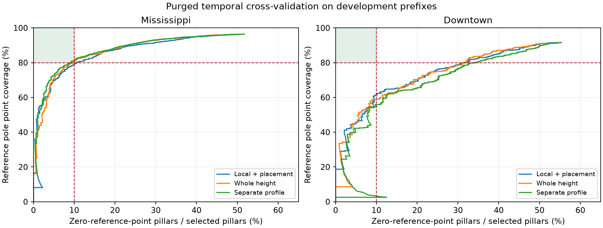

# Coarse pole precision study — 2026-09-27

The requested joint target is **at most 10% false selected pillars and at least
80% coverage of original fine pole points**. This study did **not** establish
that target on the temporal checks. No candidate classifier was installed in
the default perception pipeline. Production remains commit
`c4d7c864f3e4edf8efe489fa50ca0ee02b12057f` for this operation.

False selection means exactly `FP / (TP + FP)`: a selected 0.6 m pillar is
false only when it contains **zero** reference pole points. One reference
point is sufficient, irrespective of the amount of clutter. This is not a
point-purity test or `FP / (FP + TN)`. Reference point coverage is the number
of original fine pole points in selected pillars divided by all reference
pole points inside the coarse XY ROI. Ground filtering never shrinks that
denominator. Projection uses the actual `[-29.9, 30.1)` m lattice, without
spatial tolerance, dilation, minimum reference count, or IoU matching.

The reference is the original offline 0.3 m fine detector associated with
`35cdb88388300ba1b8bb215905435bde670dff03`, not the original coarse mask or
manual physical-object annotations. All 1,170 Mississippi references and the
previous 24 Downtown references are reused. Downtown expands to the 128 unique
frames in `unique([1:5:539 round(linspace(1,539,24))])`; the additional 104
references use the unchanged offline fine path. The fine configuration,
fine structural analysis, candidate selection, shared footprint selector and
point refinement code have not changed from that reference revision.

The current production baseline is:

| Replay | Selected | Zero-reference pillars | False selection | Point coverage |
|---|---:|---:|---:|---:|
| Mississippi, all 1,170 frames | 5,045 | 2,581 | 51.16% | 184,177 / 194,300 = 94.79% |
| Downtown, 128 frames | 1,504 | 845 | 56.18% | 31,463 / 34,829 = 90.34% |

The Downtown percentage differs from the earlier 24-frame result because the
frame set expanded. The expanded baseline was rerun with the unchanged
production configuration; the Mississippi baseline reuses its completed
full-sequence measurement.

## Implemented experiments

`detectPrecisionPillars.m` implements a research detector from raw frame input
to selected coarse pillar IDs. It uses the existing 0.6 m ground filtering,
shaft proposals and physical support checks, measures distribution features,
and applies a portable exported tree model. It reads no reference labels,
frame identity, saved candidate lookup, or fine XY grid during inference.
The preceding sparse support/owner gates are disabled inside this experimental
branch so that the classifier can compare the broader validated proposal set.
The minimum 10 owner points and 0.30 m owner height remain. Captured broad
Mississippi selections exactly reproduce the preceding validator's 5,784
owners and 185,729 covered reference points.

The implemented features include continuous radial density, axis residuals,
circle-fit shape, height-quarter consistency, owner contribution, transverse
surface growth, sensor range, and surrounding sector distributions. Additional
overlapping cylindrical probes measure continuous height support at metric
offsets; they are not an XY partition. Full-height variants include neighboring
structure above and below the fitted shaft. Owner centroids, covariance,
skewness and axis position are measured relative to the existing 0.6 m pillar.
No 0.3 m auxiliary ownership grid is constructed. Model inputs exclude dataset,
frame, pillar and hypothesis identities, reference counts and global XY.

The full capture contains 8,710 hypothesis/owner rows: 6,809 Mississippi and
1,901 Downtown, representing 5,784 and 1,611 distinct frame/pillar owners.
Labels are joined only after features exist. Counts are frame/pillar
occurrences, not tracked physical poles.

There are 28 model configurations on this full capture: six initial models,
12 local-height/placement models, six whole-height models and four separately
trained semantic-profile models. An earlier 24-configuration probe used the
previous small development capture. Separate profiles test the existing
reference-policy difference: Mississippi excludes facade semantics, whereas
Downtown includes them. They do not introduce frame or pillar identifiers.

## Validation and outcome

Training/model selection uses Mississippi frames 1–780 and the 85 selected
Downtown frames at or before 360. Five contiguous folds remove a 20-frame
Mississippi / 10-frame Downtown margin around each validation block. The seed
is 927. Owner confidence is the maximum over its hypotheses. Thresholds are
selected from out-of-fold predictions; positive point-count weighting is an
explicit part of the coverage objective. The initial six models also tested
an analytic narrow/isolated-shaft bypass; it admitted Downtown false selections
and was omitted from the subsequent models.

The common local-context/placement model selected on the best minimum
out-of-fold coverage across datasets was `context_p1_d3_w1.0`, threshold
`0.7047407872190024`:

| Check | Dataset | False selection | Reference point coverage |
|---|---|---:|---:|
| Prefix out-of-fold | Mississippi | 104 / 1,045 = 9.95% | 98,897 / 124,708 = 79.30% |
| Prefix out-of-fold | Downtown | 28 / 282 = 9.93% | 17,171 / 27,716 = 61.95% |
| Temporal suffix, 390 frames | Mississippi | 65 / 553 = 11.75% | 50,686 / 69,592 = 72.83% |
| Temporal suffix, 43 frames | Downtown | 13 / 70 = 18.57% | 3,684 / 7,113 = 51.79% |

The separate Mississippi profile briefly satisfies both targets in prefix
cross-validation: 111/1,115 = 9.96% false selections and
101,513/124,708 = 81.40% point coverage. Its temporal suffix instead has
70/575 = 12.17% false selections and 51,496/69,592 = 74.00% coverage.
The selected Downtown profile has 14.29% false selections and 46.10% coverage
on its suffix. Whole-height context also fails the joint temporal target.

The suffixes have been reused in this project. These are temporal regression
checks, **not an independent new-sequence benchmark**. The JSON files' raw
`development` predictions are training fits, and `all` combines training and
suffix frames. `acceptance_checks.csv` explicitly distinguishes those from
out-of-fold and suffix results. For example, the separate Mississippi profile
scores 5.87% false selections and 81.53% coverage on the mixed full replay;
that is not accepted as generalization evidence. The default detector was not
replaced using such a result.



The curves show why a stricter confidence threshold is insufficient: Downtown
loses substantial reference coverage before reaching 10% false selection.
These experiments establish limitations of the tested features and models,
not impossibility of the requested task.

## Diagnostic findings

Sixteen high-confidence development false selections were traced through the
unchanged fine detector. All eight Mississippi examples reached fine object
validation: five failed slice support and three failed short-support
continuity/tilt. Grid-boundary footprint reduction can remove part of a compact
shaft before those checks. For frame 285 / coarse pillar 4643, coarse support
has 291 owner returns, 3.215 m height, 1.29-degree tilt and 0.062 m radial RMS;
the nearby fine object contains 98 returns and has zero qualified support
height after its footprint restriction. Thus strong physical shaft statistics
alone do not guarantee agreement with this algorithmic reference.

Downtown examples include fine context contrast (frames 26 and 328), footprint
selection (165), facade exclusion (86), insufficient or overly linear core
seeds (251, 282 and 356), and compact footprint/object support (118). These
are development examples selected for diagnosis, not an estimate of the
population frequency of each failure mode. They do not establish whether a
reference-negative object is a real physical pole.

## Checks and reproduction

Ten MATLAB tests pass: five continuous-context physical controls and five
reference-metric cases. Both exported common models reproduce all 8,710 Python
probabilities in MATLAB to maximum absolute error `2.22e-16`, with identical
selected rows. Each model also reproduces its frozen selections from 24 raw
frames (48 model/frame comparisons). These checks establish implementation
consistency, not perception acceptance. No production runtime improvement is
claimed; the experiment prioritizes diagnosing the precision/coverage tradeoff.

Final checks use MATLAB R2026a, Python 3.13.12 and scikit-learn 1.9.1. The first
test invocation lacked an absolute repository path after MATLAB changed its
working directory; the runner was corrected and all tests rerun. A preliminary
feature call to the unavailable `range` function was replaced by `max-min`
before the final capture. Profile training was interrupted for OpenMP
oversubscription and resumed with one worker, retaining completed outputs with
the same model parameters and inputs. No partial run is counted as a complete
validation result.

From the repository root, with the original recordings and frozen reference
MAT files available locally:

```matlab
root=setupVehicleLocalization; addpath(root);
addpath('research/pole_precision_20260927');
capturePrecisionTraining('Mississippi',1:1170,'mississippi');
frames=unique([1:5:539 round(linspace(1,539,24))]);
capturePrecisionTraining('Downtown',frames,'downtown');
captureVerticalContext('Mississippi','mississippi');
captureVerticalContext('Downtown','downtown');
captureOwnerPlacement('Mississippi','mississippi');
captureOwnerPlacement('Downtown','downtown');
captureWholeContext('Mississippi','mississippi');
captureWholeContext('Downtown','downtown');
capturePrecisionBaseline;
```

```bash
uv run --with scikit-learn==1.9.1 python research/pole_precision_20260927/trainPrecisionModel.py
uv run --with scikit-learn==1.9.1 python research/pole_precision_20260927/trainContextPrecision.py
uv run --with scikit-learn==1.9.1 python research/pole_precision_20260927/trainContextPrecision.py --whole
uv run --with scikit-learn==1.9.1 python research/pole_precision_20260927/trainProfilePrecision.py
uv run --with scikit-learn==1.9.1 python research/pole_precision_20260927/exportContextModel.py
uv run --with scikit-learn==1.9.1 python research/pole_precision_20260927/exportContextModel.py --whole
```

Then run `validatePrecisionStudy('context')`,
`validatePrecisionStudy('whole')`, and `checkPrecisionCode` in MATLAB.
`summarizePrecisionStudy.py` (with scikit-learn and matplotlib) regenerates
tables, plots, summary and technical artifact hashes. Large MAT caches,
pickles, original recordings and generated binaries stay outside the commit.
The committed models, feature tables, exact metrics and traces permit review
without deploying the experiment. This work leaves the requested 10%/80%
acceptance goal open.
