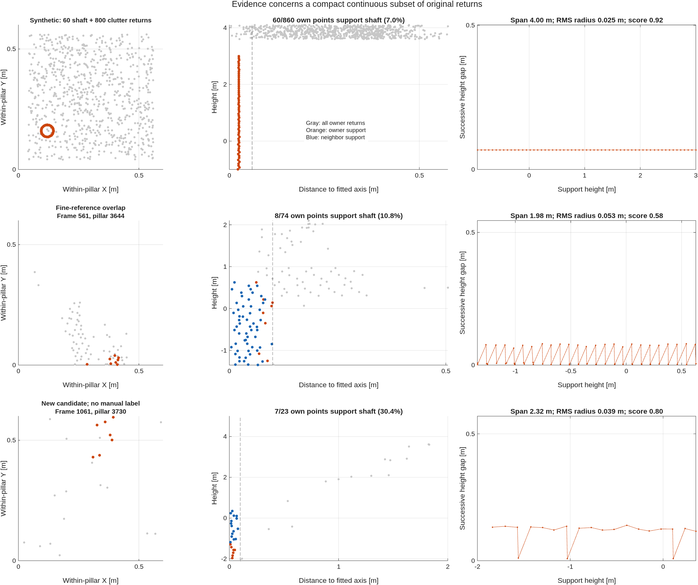

# Existential pole support inside mixed 0.6 m pillars

## Decision and scope

A wide pillar may contain a shaft and many unrelated returns. The relevant
criterion is the existence of a compact, vertically continuous point bundle,
even when that bundle is a minority. Whole-pillar covariance, the fraction of
all points near one peak, and isolation against all neighboring returns must
not veto that bundle in this experimental detector.

The implementation is available through `poleSubsetExperimentConfig`. It is
**experimental, not the default**: measured agreement with the frozen 0.3 m
coarse output is below the user's 80% target and worse than the current 0.6 m
default. This is partial progress toward the migration, not acceptance of the
new detector or a claim of physical detection accuracy. No frozen reference
or acceptance threshold was changed to accommodate the experiment.

The source/detection lattice remains 0.6 m. There is no auxiliary 0.3 m
detector, finer XY lattice, Z occupancy grid, learned classifier, or semantic
point mask in the online product. All original off-ground points still enter
their pillar's output moments. The existing probability-cloud aggregation
resolution remains 1.2 m (two source pillars); it is not a new 0.6 m output
component grid. Offline 0.3 m extraction is only an evaluation reference.

## Algorithm

`findPillarPoleSubsets.m` and the matching CPU implementation in
`perception/native/poleSubsetKernel.hpp` evaluate each occupied pillar:

1. Cover the pillar's observed XY locations using up to 12 farthest-point
   seeds, with 0.08 m separation. Seeds come from actual returns; a dense short
   blob cannot monopolize a histogram's maximum bin.
2. Fit near-vertical axes using returns within 0.15 m of each seed. Evaluate
   the whole height and four overlapping 2 m height intervals. Duplicate
   intervals are removed. These are fit hypotheses, not vertical cells.
3. Balance the regression by physical height: trapezoidal measures between
   unique observed heights are shared among returns at the same height.
   Dense returns in a crown therefore do not dominate merely by multiplicity.
   Refine twice with neighboring whole pillars; cap axis tilt at 20 degrees.
4. Test shaft radii 0.06, 0.10 and 0.15 m. At each support height, count
   returns in a continuous plus/minus 0.5 m window. The inner cylinder must
   have at least two returns and radial density contrast
   `3 * inner / max(outer - inner, 1) >= 4`, where outer radius is twice inner
   radius. The factor three accounts for the annulus-to-disk area ratio.
5. Split support at gaps greater than `0.5 + 0.005 * axisRange` metres. A run
   needs 12 returns, 1.5 m total height, 1.2 m 5th-to-95th-percentile height,
   and radial RMS at most 0.10 m. Its owner pillar must contribute at least
   six returns spanning 0.5 m. A neighboring shaft cannot label an owner
   pillar containing only unrelated short clutter.
6. Require a transverse density maximum. Compare the candidate cylinder
   with equal-radius probes displaced one radius in eight XY directions,
   within the same height interval. Center mass divided by the largest
   probe mass must reach 1.3. This rejects a strip arbitrarily cut from a
   broad vertical sheet. It does not compare against all pillar/neighborhood
   points or demand a majority of them.
7. Retain the strongest qualifying hypothesis. Its evidence combines robust
   height, point support, `1 - maximumGap / height`, radial RMS, local radial
   contrast and density-peak contrast. Output footprints retain the existing
   compact whole-pillar selection and boundary-shaft completion. Only owners
   with their own subset evidence can join the footprint.

The search is finite and does not guarantee finding every possible subset.
Local density contrast is still necessary: an arbitrary selection of a few
collinear returns from a surface should not automatically create a pole.
Branches, stems, narrow building details and other physical structures can
satisfy the same local geometry. This evidence is not semantic truth.

## Recorded sample findings

The raw-point cache comes from `data/raw/MissisipiPointClouds.mat`, frames
1:10:1170 (117 frames), at the shared 100 by 100 coarse lattice with origin
[-29.9, -29.9] m. The frozen 0.3 m coarse reference is revision
`796c737344e6c29c3e7aa8869aab2630dc0ebbb1`. The prior 0.6 m default is
`3ff90ea2a195aa91d766c7be94902cc4d0d6e2bd`. Fine masks are cached offline
algorithmic detections, not manually labeled ground truth; their own compactness
rules introduce selection bias. Labels are used only for evaluation.
Original XYZ values are re-read by original point index; the earlier
single-precision diagnostic cache supplies membership and evaluation labels.
All 117 sample masks match the full end-to-end capture exactly.

| 117-frame measurement | Previous default | Subset experiment |
|---|---:|---:|
| Accepted pole pillars | 869 | 2104 |
| Exact fine-reference overlap / 306 | 260 (85.0%) | 296 (96.7%) |
| Exact precision against old coarse reference | 65.5% | 28.1% |
| Exact recall against old coarse reference | 61.6% | 64.0% |
| One-cell tolerant precision against old coarse | 70.1% | 32.6% |
| One-cell tolerant recall against old coarse | 71.2% | 73.5% |

The new sample retains 680 previous cells, adds 1424 and removes 189.
Fine-reference recall improves, but the added set is large. Absence from the
fine reference does not prove a false positive, and its presence does not
prove physical correctness. The 96.7% overlap is **not** 96.7% overall
agreement. One-cell tolerance allows 0.6 m per axis, up to 0.849 m diagonally;
it is a diagnostic, not a user-approved acceptance definition.

Among accepted cells, the 296 fine-supported candidates have median support
38.5 points, radial RMS 0.056 m, maximum height gap 0.153 m and score 0.602.
The other 1808 have medians 20 points, 0.069 m, 0.282 m and 0.340. These
distributions overlap. `score_threshold_diagnostic.csv` shows that raising
the score threshold alone does not obtain simultaneous 80% precision and
recall against either reference. This is same-drive exploratory analysis,
without a reserved generalization dataset or manual semantic audit.

## Full-drive comparison and runtime

All 1170 frames were evaluated end to end. Relative to the prior 0.6 m
default, the subset experiment retains 6884 pole cells, adds 13922 and removes
2025. The old 0.3 m reference has 9129 projected pole cells; the experiment
has 20806. Its pole agreement is:

| Metric against frozen 0.3 m coarse | Previous 0.6 m default | Subset experiment |
|---|---:|---:|
| Exact precision | 62.3% | 27.3% |
| Exact recall | 60.8% | 62.2% |
| One-cell tolerant precision | 67.4% | 31.5% |
| One-cell tolerant recall | 70.0% | 70.9% |
| One-cell tolerant F1 | 68.7% | 43.6% |

Consequently, this experiment should not replace the default as a grid-migration
solution. Adding these candidates would also introduce many all-point Gaussian
components whose moments still include clutter. A stronger local semantic
discriminator or reviewed physical labels are needed before treating the new
candidate set as reliable pole measurements; simply recovering more fine
reference cells is insufficient.

Full-drive non-pole cell masks, curb evidence, sign probabilities and non-pole
Gaussian geometry/evidence are unchanged. Retained, ground and off-ground
point counts are unchanged. Global normalized mixture weights may change when
the pole population changes. All-point structural statistics and projected
moments are identical in 117 separate cached-frame comparisons. Current
default masks and every stored Gaussian component field exactly match the
previous capture on another 117-frame check.

The full capture has median perception time **125.6 ms**. Alternating paired
invocations on frames 1:10:1170 after three warmup pairs give default/experiment
medians **31.67 / 121.275 ms** and a median paired increase of **89.741 ms**.
On the 117-frame pole-only study, the C++ detector takes median 99.563 ms,
versus 519.338 ms for its MATLAB reference. These are observed workstation
timings, not hard real-time guarantees. No runtime speedup is claimed for the
experiment relative to the default detector.

## Validation and examples

**110/110 targeted MATLAB tests passed**, zero failed or incomplete, including
minority shafts, a denser short competing mode, wall/slab rejection,
disconnected blobs, tilted boundary shafts, no borrowing of an unsupported
owner label, all-point moments, native parity, offline recorded masks, feature
selection and mapping regression. `tests.csv` contains the actual results.
The full 117-frame MATLAB/native study has identical detections, support
counts and row keys; maximum score difference is approximately 1.0e-14.
`capture_validation.json` records both backend and end-to-end correspondence.



Gray points are all owner-pillar returns. Orange points support the owner's
shaft hypothesis; blue points are additional support from neighboring whole
pillars. The synthetic shaft remains detected with **60 of 860 points (7.0%)**.
The displayed fine-supported real pillar (frame 561, pillar 3644) contributes
**8 of 74 points (10.8%)**, with 65 total support points across the boundary.
The displayed new candidate (frame 1061, pillar 3730) has concentrated continuous
geometry but no manual label; it is deliberately not presented as a confirmed
pole. `example_measurements.csv` preserves these measurements.

Initial negative testing exposed arbitrary wall strips passing the first
prototype; the density-peak test fixed that counterexample. A sparse boundary
fixture required continuous 1 m height windows with two returns instead of
0.5 m windows with three. The first full-drive invariant-check script indexed
the 2-by-2-by-N covariance tensor as a matrix; the checker was corrected to
index its third dimension before the successful validation. The full capture
exceeded the tool's 300-second response timeout, but MATLAB continued; the
completed 1170-frame artifact was verified and was not regenerated blindly.

## Reproduction

```matlab
addpath(pwd); setupVehicleLocalization;
buildPerceptionKernels;
% Cache from the preceding point-distribution study is required.
capturePoleSubsetStudy('native', @(c)setfield(c,'useNativeKernels',true));
capturePoleSubsetStudy('matlab');
captureCoarseSequence('subsetFull',1:1170,pwd,@poleSubsetExperimentConfig);
compareCoarseSequences('subsetFull','baseline');
validatePoleSubsetCapture;
validatePoleSubsetIntegration;
plotPoleSubsetExamples;
runPoleSubsetChecks;
```

```sh
python research/pole_subset_20260925/summarizePoleSubsets.py
```

For an individual invocation:

```matlab
cfg = poleSubsetExperimentConfig(perceptionConfig());
result = perceiveFrame(frame,cfg);
```

The experimental switch is explicit. `perceptionConfig()` alone retains the
previous detector and confidence. The CPU kernel interface is version 4;
older binaries fall back to MATLAB in automatic mode until rebuilt. The
MATLAB reference requires no compiled binary. Platform binaries and full
raw captures remain under ignored local output; source and compact research
results are versioned. No localization replay or task-wide completion of the
80% grid-migration objective is claimed.
