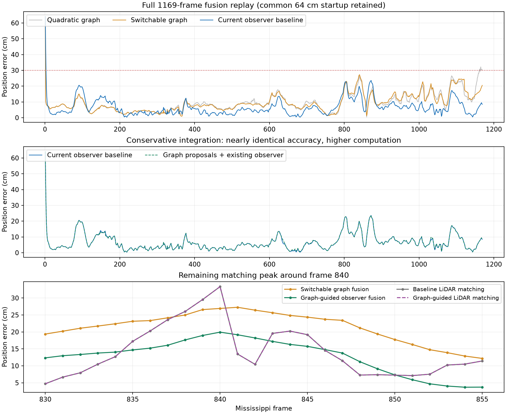

# Robust sliding-window pose graph experiment

Implemented and evaluated on September 23, 2026, starting from
`2f2cd50faa4471953e8a682389a74a16531ec416`.

**Decision: retain the existing GNSS-aided matcher and seven-state observer as
the default.** The new switchable graph improves some peaks relative to the
same graph with quadratic map factors, but does not improve the current
localization baseline. Using graph poses only as additional matching seeds
also produces no material improvement. These are completed negative findings,
not evidence that pose graphs cannot help under other models or conditions.

## Implementation

`updateRobustPoseGraph` implements a causal SE(2) sliding-window factor graph.
It retains ten acquisitions after marginalization and optimizes up to eleven
when the next acquisition arrives. Factors comprise independent wheel/gyro
odometry, output-point-corrected GNSS positions, and semantic Gaussian map
correspondences. Map correspondences are recomputed at each linearization.
This is continuous pose optimization with alternating hard association; it
does not jointly enumerate discrete object assignments.

`prepareSemanticRegistrationGeometry` is the shared current geometry kernel
for the ordinary matcher and graph. Curb/facade factors use their normal
residual; pole/sign factors use planar Gaussian residuals. Existing map
mixture weights remain association priors, so map repeatability is not
multiplied a second time. Semantic quality, class balancing and source temporal
stability retain their existing meanings.

For squared whitened geometric residual `q`, the switchable factor minimizes

`s^2 q + lambda (1 - s)^2`, with `s = lambda / (lambda + q)`.

Analytically eliminating the switch gives bounded loss
`rho(q) = lambda q / (lambda + q)` and iteration weight `s^2`. The switch prior
prevents discarding every measurement at zero cost. The configured
`lambda = 6.25` is an engineering scale, not a learned mismatch probability.
The construction follows the switch-and-prior principle in
[Sünderhauf and Protzel, *Switchable Constraints for Robust Pose Graph SLAM*,
IROS 2012](https://nikosuenderhauf.github.io/assets/papers/IROS12-switchableConstraints.pdf).
Our switches operate per Gaussian correspondence, not on loop-closure edges.

The five-scan temporal confirmation horizon is unchanged. A new fourth output
of `updateLocalizationSourceWindow`, `confirmedCurrent`, exposes only the
current acquisition's original distributions whose tracks have at least two
detections in that horizon. Its weight is the detection count divided by five.
The graph inserts each acquisition once, rather than repeatedly inserting
overlapping pooled distributions. This avoids exact observation duplication;
it does not remove all correlations from temporal confirmation or the map.
The stacked product remains available for matching initialization.

Marginalization folds only the departing node's unary factors, its incoming
prior and its outgoing motion edge into the next node's Schur prior. Retained
factors remain explicit and are not counted again in that prior. Output poses
are the latest causal estimates at acquisition time, not retrospectively
smoothed poses. The first output preserves the common declared initial pose.

Two integrations were exercised:

- `runRobustGraphLocalization` uses the graph as the pose-fusion backend. Its
  result includes GNSS and history. `registrationPoseMeasurement` explicitly
  refuses to export this fused result as an independent LiDAR measurement.
- `createRobustGraphMatcher` uses the graph only to propose an additional seed
  to the existing GNSS-aided LiDAR-only solve. The existing observer remains
  the fusion backend. Graph curvature is never added to LiDAR information.
  Distinct converged modes are deduplicated across all seeds before ambiguity
  weighting. GNSS/history still condition selection, so independence is not
  claimed.

No frame, point index, map-component blacklist, ring coordinate, fine
perception, or reference position is used by the new production decisions.
The graph and ablation use one implementation selected through configuration;
there is no retained duplicate legacy solver. The default production entry
point does not enable the experimental graph.

## Full-sequence results

All 1170 raw Mississippi scans were reprocessed with whole-pillar coarse
perception. As in the baseline, native motion/GNSS alignment supports 1169
localization outputs; the final unsupported fusion sample is not extrapolated.
All errors below are planar position errors against the existing aligned
reference at the same vehicle point.

| Backend | Full 1169-frame RMSE | RMSE after 2 s | Maximum after 2 s |
|---|---:|---:|---:|
| Existing GNSS-aided matcher + observer | 8.2156 cm | 7.8754 cm | 23.5787 cm |
| Graph with quadratic map loss | 11.2087 cm | 11.1126 cm | 32.1743 cm |
| Graph with switchable map loss | 10.9862 cm | 10.8835 cm | 27.2607 cm |
| Graph proposals + existing observer | 8.2177 cm | 7.8777 cm | 23.5800 cm |

All four trajectories retain the same **64.0312 cm frame-1 startup error**,
which is also their full-sequence maximum. The after-2-s population contains
1148 outputs and is reported separately. Switchable map factors reduce the
quadratic graph's after-startup errors above 30 cm from **7 to 0**. The existing
observer and graph-guided observer both have zero after-startup errors above
30 cm. Robustification helps that graph control, but does not beat the current
observer.

The direct mismatch-relevant comparison holds the observer and common accepted
matching population fixed:

| LiDAR matching on the common 1167 accepted frames | Existing matcher | Graph-guided matcher |
|---|---:|---:|
| Position RMSE | 11.5060 cm | 11.5021 cm |
| Maximum position error | 33.3491 cm | 33.3485 cm |
| Errors above 30 cm | 1 | 1 |
| Largest-error frame | 840 | 840 |

The RMSE change is only **0.039 mm**. Both methods reject frame 1 for temporal
startup and frame 169 for GNSS conflict. The remaining matching peak at frame
840 is essentially unchanged.

The standalone switchable graph's diagnostic LiDAR-only re-solve accepts 1168
frames, with 12.2598 cm RMSE and 39.0286 cm maximum. That diagnostic also accepts
frame 169 and has a different seed history; it is not the paired 1167-frame
comparison above and is not fed back as a second measurement.



## Association audit

The historical wrong-sign interval 950-959 already selects component 1298 in
the current baseline. All ten frames still select 1298 in each of the graph,
quadratic-control and graph-guided runs. The graph therefore demonstrates no
additional correction of that previously resolved case. At frame 959,
standalone switchable-graph fusion error is 15.49 cm versus the existing
observer's 7.71 cm.

The graph-guided run evaluates an additional candidate on 802 frames. Of
105733 correspondences with a common source index, 146 change target Gaussian:
101 curb, 36 sign and 9 pole. For the 45 point-feature changes, reference-aligned
source-to-target center distance decreases in 8 cases and increases in 37.
These distances are only a diagnostic proxy: map Gaussians can belong to the
same physical object, and a line component's center distance is not its normal
residual. Neither changed target count nor reduced pose error is a manually
labeled mismatch rate. The experiment does not establish a sequence-wide
association precision or recall.

There are 73835 uniquely inserted confirmed-current distributions in the 1169
graph acquisitions and 1159 marginalized acquisitions. In the switchable run,
5910 recorded current correspondences receive an influence below 0.25. Low
influence alone does not establish that those correspondences are false.

## Interpretation and limits

The observations support keeping the existing baseline. Several mechanisms
remain plausible explanations rather than individually isolated causes:

- The baseline already uses GNSS to choose between LiDAR modes, leaving less
  room for another seed to improve association.
- A persistent wrong correspondence can have a small residual at a displaced
  pose. A bounded residual loss need not reject such a self-consistent mode.
- Replacing the seven-state observer also replaces its velocity-bias handling
  with fixed-noise odometry factors. The standalone comparison changes more
  than the map loss. The quadratic-versus-switchable comparison isolates that
  loss, while graph proposals preserve the original observer.
- Gaussian spatial scatter is not calibrated pose-measurement covariance.
  Relative graph information scales remain engineering settings. The graph
  exports a local conditional information matrix, explicitly marked
  uncalibrated, containing GNSS/history. It is not independent LiDAR information.

Graph settings were fixed before the full comparisons: ten retained nodes,
twelve maximum iterations, per-edge motion standard deviations of 0.04 m,
0.04 m and 0.2 degrees at the replay's 10 Hz cadence, switch prior 6.25 and GNSS
Cauchy scale 9.21. These motion settings are not a general continuous-time
noise model. Additional graph seeds are currently used only when the existing
position-aiding path has valid, sufficiently precise GNSS. GNSS-outage benefits
were not established by this experiment. The switchable run has one frame
that does not meet the solver's convergence flag; the quadratic run has zero.

Measured batch times for 1169 outputs are 58.02 s for the switchable backend
(median 48.66 ms, P95 66.25 ms), 51.66 s for the quadratic control, and 50.31 s
for graph-guided matching (median 42.71 ms, P95 57.49 ms). Standalone timings
include its initializing match and diagnostic re-solve; guided timings include
graph update and candidate matching. Perception and disk reads are excluded.
The prior baseline recorded 9.79 s for matching. These are observed batch
timings with different work scopes, not a real-time deadline guarantee or a
controlled profiler comparison.

Inherited evaluation limits remain: mapping includes the query drive; BESTPOS
and the evaluation reference share a receiver; reference-offset initialization,
reference tilt, and offline clock/bracket alignment are retained. This is an
aligned offline comparison, not an independent-drive ground-truth evaluation.
Future improvements should distinguish association-model ambiguity and
uncertainty calibration from trajectory smoothing; no further benefit is
claimed without such a controlled experiment.

## Validation and reproduction

- **152/152 MATLAB tests pass** across ten suites, including repeated false
  pole constraints, overlapping-source rejection, duplicate timestamps,
  current-only observations, marginalization information preservation, curved
  motion, large map-coordinate origins, fused-information export rejection,
  and duplicate-mode handling.
- All **1170 pooled source clouds are exactly unchanged** against the prior
  cache. A fresh replay of the default observer through the refactored matcher
  gives **zero maximum pose difference** against its stored baseline.
- Factory MATLAB Code Analyzer reports **zero findings across 17 changed
  MATLAB files**. MATLAB version: R2026a Update 3.

Run from the repository root with the existing local dataset and earlier
experiment inputs available:

```matlab
setupVehicleLocalization;
addpath('research/robust_pose_graph_20260923');
out = 'output/robust_pose_graph_20260923';
if ~isfolder(out), mkdir(out); end
cache = prepareMississippiLocalizationClouds( ...
    'output/temporal_perception_20260922/five_frame_matching');
save(fullfile(out,'sources.mat'), '-struct', 'cache', '-v7.3');
run_graph_experiment("switchable");
run_graph_experiment("quadratic");
run_guided_experiment;
validate_graph_experiment;
```

`python research/robust_pose_graph_20260923/plot_graph_results.py` generates the
figure. Compact results, scripts, tests and the figure are versioned. Large
source/state MAT files remain under `output/`; `artifact_manifest.json` records
their hashes and input provenance. The manifest does not contain archive
weekly/monthly report hashes.

Intermediate output-serialization and correspondence-container audit errors
were corrected before the successful runs recorded here. The final guided run
also includes the duplicate-mode correction; earlier provisional metrics are
superseded by `guided_summary.json`.
