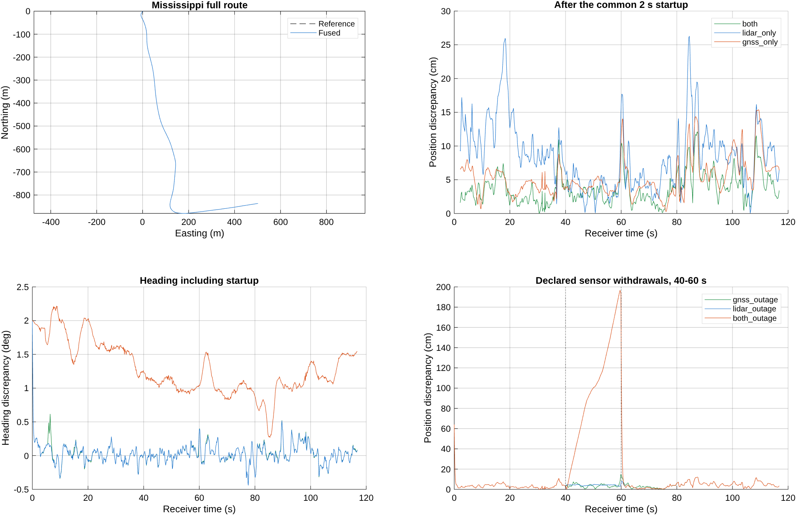

# Current support matching in the complete localization observer

The complete Mississippi experiment was executed from fresh raw scans using
the default `supportD2D` matcher and the current MnCAV configuration. The normal
GNSS + LiDAR + motion cascade has **4.9507 cm full-run position RMSE**. After
the pre-existing 2 s initialization interval, RMSE is **4.3363 cm**, P95 is
**8.3027 cm**, and maximum error is **12.1054 cm at frame 875**. Frame 895,
the standalone matcher maximum, has **5.9288 cm fused error**.

All discrepancies are relative to the recorded INSPVA trajectory. The map and
query recording overlap, BESTPOS is INS assisted, and input alignment is offline.
This experiment does not establish independent-drive or surveyed absolute accuracy.

## Executed pipeline and scope

1. Load canonical current vehicle, steering, wheel and sensor corrections.
   Re-synthesize lateral observer gains using the existing YALMIP/SeDuMi
   installation; run the actual lateral observer on recorded wheel/IMU/steering.
2. Run whole-pillar 0.6 m coarse perception and recursive support matching on
   all **1,170 raw scans**. The existing semantic map is fixed. A profiled
   independent call confirms the coarse path and no fine point refinement.
3. Reconstruct causal five-scan source clouds on the same independent motion.
   Synchronize motion and real BESTPOS brackets to native LiDAR frame times.
4. Run the seven-state synchronous observer with per-frame matching callbacks.
   Each scenario uses its own fused-state prediction and available GNSS aid to
   rematch; GNSS selects hypotheses but adds no curvature to LiDAR information.
   Only full-pose LiDAR results update the existing full observer; directional
   results remain diagnostic and are not turned into fabricated full poses.
5. Execute seven scenarios and the existing five output-point alignment controls.
   No observer gains, bias-learning settings or fusion weights were retuned.

There are **1,169 synchronized observer outputs**, frames 1--1169. The final
raw scan lies slightly beyond the high-rate motion grid and is excluded by the
existing no-extrapolation synchronization contract. It is included in the raw
matching replay. The two-second startup split is the established evaluation
convention, selected before inspecting this run's results.

The old raw-replay map crop copied a reduced Gaussian array but retained the
full landmark-view sidecar. `replayMississippiLocalization` now calls the shared
`selectLocalProbabilityCloud`, which crops distributions, view observations and
height metadata together. This small interface repair was required to use the
current view-conditioned map in the complete raw replay.

The working tree already contained lateral-observer synthesis/runtime and test
changes. They were used as the current configuration, hashed before/after the
run, and left outside this task's project commit. `source_inputs.json` records
310 actual source/config/test versions. An export of the relevant pre-existing
working-tree patch is retained with the ignored experiment outputs and archive
commit record. Historical stored gains were not substituted for current synthesis.

## Localization results

The first output retains the intentional common initialization offset
[+0.5 m, -0.4 m, +2 degrees], yielding **64.0312 cm** initial position error.
It is included in all full-run metrics. Therefore a maximum of 64 cm in the
normal full run is an initialization fact, not a failure later in the route.

| Observer inputs | Full-run position RMSE | After-2-s RMSE | After-2-s P95 | After-2-s maximum | Heading RMSE after 2 s |
| --- | ---: | ---: | ---: | ---: | ---: |
| GNSS + LiDAR + motion | 4.9507 cm | **4.3363 cm** | **8.3027 cm** | **12.1054 cm, frame 875** | 0.12863 deg |
| LiDAR + motion | 10.4171 cm | 9.8425 cm | 17.8486 cm | 26.3065 cm, frame 847 | 0.12017 deg |
| GNSS + motion | 6.4946 cm | 5.9665 cm | 11.4462 cm | 15.3791 cm, frame 1095 | 1.33367 deg |

The fused trajectory is within 10 cm at **97.91%** of post-startup frames.
At frame 895, the fused-state-seeded LiDAR measurement still has 15.8846 cm
error and 0.69287 degrees yaw error; the fused output has 5.9288 cm and
0.24752 degrees. It is the observer fusion that improves this output.

For a strictly paired comparison, use the **same 1,121 accepted LiDAR frames
after startup** within the fused run: raw matched-pose RMSE is 5.8062 cm and
observer RMSE is 4.3347 cm, a 25.34% reduction. Maximum error falls from 15.8846
to 12.1054 cm. The observer improves 72.52% of these individual frames, not all
of them. At its maximum frame 875, matching is 8.30 cm while fusion is 12.11 cm.

The LiDAR-only observer is a remaining weakness: its paired RMSE is 9.7796 cm
versus its own matched-pose 5.7677 cm. At its maximum frame 847, the match is
5.04 cm but the observer output is 26.31 cm. These are observer outputs, not
raw map-matching performance. This experiment establishes the discrepancy; it
does not isolate its motion-model, weighting or bias-learning causes.



## Channel withdrawals

The existing 40--60 s outage scenarios remove channels independently. Values
below score the **outage interval itself**, not dilute it across the route.

| Channel unavailable | Outage-interval RMSE | Outage-interval maximum |
| --- | ---: | ---: |
| GNSS | 4.1716 cm | 14.9072 cm |
| LiDAR | 4.2181 cm | 5.4524 cm |
| Both | **111.7654 cm** | **196.5976 cm**, frame 597 |

The both-outage case has no absolute pose correction during the declared
interval. Its maximum occurs at 59.6053 s. During 60--70 s recovery, its median
is 1.7967 cm but RMSE remains 19.6191 cm because of the initial recovery tail.
The separate one-second alternating-channel scenario has post-startup RMSE
15.2980 cm and maximum 33.2349 cm. Normal simultaneous-fusion accuracy must not
be used as an outage guarantee.

## Matching reproduction and timing

Fresh raw replay matches the preceding cached support replay's acceptance
decisions at every frame: 1,142 full poses, 11 directional results and 17
rejections (including the confirmation-startup frame). Maximum XY difference
is approximately 1.03e-8 m. Raw maximum after initialization remains frame 895,
15.8718 cm; all-frame raw RMSE is 6.0770 cm.

Measured raw online-path median is **180.182 ms per frame**, including
163.243 ms perception and 16.572 ms registration; every measured frame exceeds
100 ms. Disk loading and offline cache/gain preparation are excluded. Other
experiments were running on the machine, so this is not a controlled performance
benchmark. It nevertheless does not demonstrate 10 Hz real-time throughput.

The observer uses the existing **zero processing-delay** assumption. Offline
input synchronization waits up to **63.37 ms** for a GNSS bracket endpoint and
10.00 ms for motion. Neither measured computation time nor this wait was injected
as a delayed observer measurement. The accuracy above is an offline synchronized
framework result, not a measured-latency deployment result.

## Validation and remaining test failure

The 11-suite run contains **180 tests: 179 pass, one fails, none are skipped**.
The failure is the pre-existing working-tree test
`lateralObserverTest/currentDesignSatisfiesTheOriginalCertificate`, specifically
its relative bound on a nearly zero gain: recovered maximum gain norm is about
5.48e-10 while the optimized reported bound is about 9.46e-11, an excess of
4.53e-10. The original Lyapunov/ISS matrix and stable-mode checks in that same
test pass. This report retains the failed bound check; it is not labeled a
fully passing regression and the unrelated synthesis/test code was not changed.

`checkSupportFullLocalization` independently checks the actual run's original
lateral certificate, exact state reproduction with its selected measurements,
the implicit position equation, unchanged past outputs after future-measurement
mutation, common initialization, finite states in all scenarios, current vehicle
metadata and the coarse-only call path. It reports the unresolved gain-bound
failure explicitly in `validation.json`. Synchronous execution has no state
resets, virtual pose updates or integration substeps. The sampled nonlinear
system is not claimed certified merely because the continuous design passes.

An initial launch lacked YALMIP on the new MATLAB process path; the existing
sibling-repository installation was added and the experiment rerun successfully.
No dependency was installed or vendored. Research scripts and the repaired replay
entry are checked with the factory Code Analyzer. Independent Python aggregation
and technical input/output hashes are retained with the experiment findings.

## Reproduction

From the repository root, with the recorded data, synchronized receiver inputs,
fixed semantic map and recorded working-tree input versions available:

```matlab
setupVehicleLocalization;
addpath(genpath('../RobustVehicleLocalization/external/YALMIP'));
addpath(genpath('../RobustVehicleLocalization/external/sedumi'));
addpath('research/support_full_localization_20260930');
runSupportFullLocalization;
analyzeSupportFullLocalization;
% Run the 11 suites listed in tests.csv before the recorded-outcome checker.
checkSupportFullLocalization;
```

Large MAT products, raw datasets, runtime logs and the input working-tree patch
remain under `output/support_full_localization_20260930/`. This directory contains
compact metrics, frame errors, paired comparisons, maximum frames, static plots,
validation, source fingerprints and test results. No GUI was opened. The preceding
frame 895 causal diagnosis is in `research/frame895_diagnosis_20260930/`.
