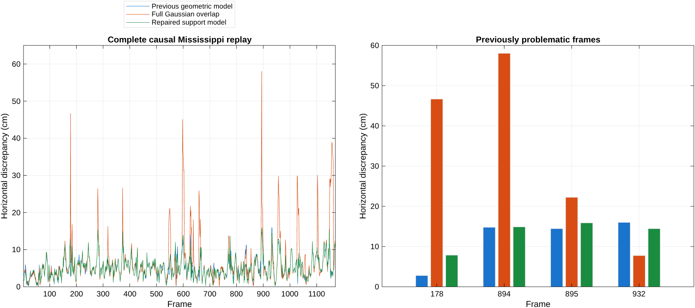

# Continuous support matching repair

The production default is now `supportD2D`. The repair restores the accuracy lost
by full Gaussian-overlap matching while retaining a continuous anisotropy model
for every semantic class. It does not establish a substantial improvement over
the previous geometric matcher. Perception remains the existing 0.6 m whole-pillar
pipeline; the map, source membership and independent motion inputs are unchanged.

## Implemented model

A local scan often observes only part of an accumulated landmark. Pulling its
center toward the complete landmark center introduces a positional bias even
when the landmark and its association are real. Merely lowering a positive
quadratic weight leaves that biased optimum in place.

`supportRegistrationGeometry` describes each planar support using major/minor
eigenvalues and a major axis. Its continuous axis confidence is

\[
c=\left(\frac{\lambda_1-\lambda_2}{\lambda_1+\lambda_2}\right)^2.
\]

For a map component, the native confidence `c0` uses the existing within-view
scatter when available, avoiding acquisition-center dispersion being treated as
the landmark's intrinsic shape. Map storage is unchanged. If the native support
is too short, both map and query estimate orientation from connected same-class
centers: radius 4 m, maximum neighbor gap 1.5 m, at least three distinct centers,
and span at least 2.4 m. These spatial selection thresholds remain discrete;
the force as a function of covariance anisotropy is continuous. The connected
component prevents separate repeated landmarks being joined across a gap.

For support eigenvalues `major`, `minor`, the added target tangent variance is

\[
V=c_0(\lambda_1-\lambda_2)
  \left[\left(\frac{\lambda_1}{\lambda_2}\right)^p-1\right],\quad p=1.
\]

The positional residual uses rotated query covariance plus target covariance,
`beta * V * t * t'`, and the existing noise floor. This is a Gaussian latent
support displacement along the extended direction. `beta` incorporates relative
source/target extent and continuous elongation; a strict-majority patch-consensus
check increases it to one for displaced partial observations. The consensus rule
uses the same 0.15 m tangent and 0.20 m normal tolerances for every class. No class
is explicitly converted to an infinite line. Finite elongated clouds retain
finite tangent precision. Round target clouds have zero added sliding variance.

The angular residual is `sin(thetaSource - thetaTarget)` weighted by continuous
axis confidence and support scatter. The defaults use a 1 degree floor,
scatter scale 0.1 and confidence power 4. Its information vanishes continuously
for isotropic geometry. These are engineering weights, not a calibrated sensor
likelihood. Candidate association uses the same relaxed geometry, angular
evidence and a finite tangent-distance penalty. Soft-association temperature
decreases continuously with elongation to avoid averaging distinct road patches.
Correspondences, support displacement and weights are frozen within each trial
line search; rotated query covariance and its derivative are recomputed.

`registrationObservableStep` projects out weak translation directions before
the joint pose eigensolve. This prevents finite tangent forces from tilting a
rejected spatial direction into yaw and leaking into the accepted directional
pose information. It retains the existing 1 percent observability threshold.
It is not a general solution to scale-dependent rank selection. Raw curvature
still contains weak finite information; the exported accepted directional
information removes the rejected subspace.

The Gaussian residual helper also separates angular and constant scale mismatch
into four rows. This preserves the full-overlap scalar cost and gradient but
repairs its zero Gauss--Newton angular curvature at aligned, unequal scales.
The synthetic curvature is 2.81073, matching finite differences. The explicit
`anisotropicD2D` comparator includes this fix and still exhibits the large route
regression, confirming that this derivative repair alone is insufficient.

## Fresh complete-route results

All three comparators were executed recursively over all 1,170 Mississippi
frames. The accepted output seeds the next frame through the same independent
wheel/gyro/lateral-motion increment. Reference poses score outputs only. Inputs
are the previously raw-verified five-scan source cache and existing map; this
task did not rerun perception on every raw route frame. The retained
`geometricD2D` comparator reproduces all 1,170 prior XY/yaw outputs exactly.

| Matcher | Maximum error | Maximum frame | XY RMSE | P95 | Full / directional accepted |
| --- | ---: | ---: | ---: | ---: | ---: |
| Previous `geometricD2D` | 15.9861 cm | 932 | 6.1123 cm | 10.4464 cm | 1148 / 11 |
| Full overlap `anisotropicD2D` | 58.0283 cm | 894 | 8.9732 cm | 18.8180 cm | 1140 / 27 |
| Repaired default `supportD2D` | 15.8718 cm | 895 | 6.0770 cm | 10.5769 cm | 1142 / 11 |

The repair reduces the regressed maximum by 72.65 percent. Against the previous
geometric model, maximum error improves only 1.14 mm and RMSE only 0.35 mm;
P95 worsens 1.31 mm and six fewer frames receive a full-pose acceptance. The
remaining maximum is frame 895. Frame 178 improves from 46.66 cm in the overlap
model to 7.85 cm, but the previous model achieved 2.78 cm there. Frame 932 is
14.43 cm versus the previous 15.99 cm. Frame-specific recursive errors include
changes in the incoming trajectory, so these are not isolated factor ablations.
The earlier diagnosis remains in `research/anisotropic_regression_20260930/`.



Observed median matcher times were 10.25 ms (previous), 8.12 ms (overlap) and
15.48 ms (repair). These runs overlapped other verification work; timing is not
a controlled benchmark and no speed improvement is claimed. The added support
geometry has a real computational cost. The map and queries share a recording,
and parameters were developed on this route. No independent-drive accuracy,
calibrated uncertainty or new perception precision/recall claim is made.

## Validation and reproduction

The final test export contains 356 passing tests across 25 suites, including the new all-class support
checks, analytic frozen-objective gradient, isotropic limit, identical-cloud
identity, disconnected supports, graph integration, spatial information,
height association, source windows, perception and recorded pipeline regression.
Legacy partial-sign and line-direction option tests explicitly select the legacy
method. Tests for the production method inspect accepted directional information
rather than demanding zero raw information from a finite covariance. Numerical
tolerances for ideal road null motion are nanometers, and the canonical alias
midpoint permits the expected submillimeter finite tangent force. These changes
reflect the new model contract rather than disabling the geometric checks.

Run from the repository root with the recorded data and cached products present:

```matlab
setupVehicleLocalization;
addpath('tests', 'research/support_matching_repair_20260930');
legacy = distributionRegistrationConfig(); legacy.method = "geometricD2D";
replaySupportMatching("legacy_verified", legacy);
replaySupportMatching("overlap_verified", anisotropicRegistrationConfig());
replaySupportMatching("final_default", distributionRegistrationConfig());
checkSupportImplementation;
verifySupportRepair;
```

`comparison.csv`, `focus_frames.csv`, `replay_validation.json`, `final_tests.csv`
and `code_analysis.csv` contain the final results. `findings.json` records actual
test counts and validation status. Independent input and artifact hash manifests
identify the inputs and exports; generated MAT files remain under ignored
`output/support_matching_repair_20260930/`. No GUI was opened.

The other replay CSV files and the original `screen.csv`/`coverage_screen.csv`
are development observations from intermediate implementations, not a factorial
parameter comparison of the committed algorithm. `screenSupportRepair` now
writes `current_screen.csv` so rerunning it cannot overwrite those historical
screens. The development work tested sliding/coverage/direction strength,
neighborhood consistency, connected support and spatial projection. Broader
tests exposed false joining of separate landmarks and numerical directional
information leakage; both were addressed before final validation.
`default_transition_failures.csv`, `continuity_tests.csv` and `focused_tests.csv`
retain intermediate check outcomes. Initial harness setup and result-concatenation
errors were corrected and are not counted as successful experiments.
