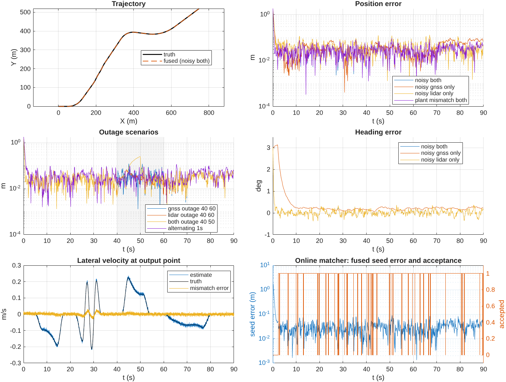

# Synthetic end-to-end validation of the localization observer cascade (2026-09-29)

## Question

Does the current localization observer architecture work as one chain when
every input is synthetic and the truth is known exactly? The chain under test
is the production path used by `runMncavFullObserverExperiment`:

1. 100 Hz wheel speed, road-wheel steering and IMU specific force/yaw rate
2. hybrid LPV lateral observer (`runLateralVelocityObserver`, MnCAV gains
   synthesized fresh by `designLateralObserverGains`) exporting lateral
   velocity and side-slip rate at the INSPVA output point (2.36 m transport)
3. frame-clock alignment (`synchronizeLocalizationInputs`): 20 Hz receiver
   positions on their own clock, bracket-interpolated onto jittered 10 Hz
   LiDAR frames
4. synchronous seven-state observer (`runFullLocalizationObserver`,
   `mncavFullObserverConfig`): receiver output-point correction, LiDAR pose
   with full information matrix, velocity-bias learning, GNSS course heading,
   and the optional online `lidarMatcher` callback

## Reproduction

```matlab
addpath('~/MATLAB/toolboxes/sedumi'); addpath(genpath('~/MATLAB/toolboxes/YALMIP'));
setupVehicleLocalization;
report = validateSyntheticLocalizationCascade;   % 11 scenarios, 21 checks
% GNSS-only ablation, e.g.:
validateSyntheticLocalizationCascade("output/synthetic_cascade_ablation", ...
    NoiseOverrides=struct('wheelScaleError',0), Scenarios=["noisy_gnss_only","noisy_both"]);
```

Runtime is about one minute. Outputs go to
`output/synthetic_localization_cascade_20260929/`; the tables and figure are
copied here.

## Synthetic truth and signals

* Plant: the 2-DOF MnCAV bicycle model (the lateral design model), RK4 at 1 kHz,
  90 s, 988 m. Speed `11 - 4cos(2πt/60) + sin(2πt/13)` m/s (about 6–16 m/s);
  raised-cosine road-wheel steering with a left turn, a slalom, a right turn
  and a long gentle curve (peak |r + βdot| = 0.141 rad/s). Position and heading
  are integrated at the output point, `vyOut = vy - 2.36 r`.
* `plant_mismatch_both`: the truth plant uses front/rear cornering stiffness
  ×0.85/×1.15, and the observers keep the nominal model.
* Motion sensors ("noisy"): wheel scale +0.5% and 0.02 m/s noise; steering
  0.5 mrad noise; ax noise 0.05 m/s²; ay bias 0.1 m/s² and 0.05 m/s² noise;
  gyro bias 0.001 rad/s and 0.002 rad/s noise. The ay and gyro sigmas come from
  `mncavSensorParameters.json`; the rest are declared stress values.
* Receiver: 20 Hz with a 13 ms clock offset, placed at the calibrated body
  offset `[1.725, 0.264]` m. Its error is 0.02 m white plus 0.03 m first-order
  Gauss–Markov (τ = 20 s) per axis. The information passed is the matching
  isotropic inverse covariance.
* LiDAR: 10 Hz with ±3 ms jitter. Pose error is anisotropic (0.10 m along
  track, 0.04 m cross track, 0.3° yaw), the information matrix equals the
  true inverse covariance, and 5% of frames are randomly rejected.
* The initial state is either truth or perturbed by (+1.5 m, −1.0 m, +3°). As in
  production, velocity and acceleration come from the measured motion rotated
  by the initial heading.
* The online matcher is a stand-in for `localizeLidarFrame`. It returns the
  synthetic LiDAR pose only when the fused seed lies within 1 m and 3° of the
  truth; otherwise it rejects the frame.

## Results

Settled means t ≥ 5 s for position and t ≥ 10 s for heading. Full table:
[metrics.csv](metrics.csv).

| Scenario | Settled pos. RMSE (m) | P95 (m) | Max (m) | Heading RMSE (°) | Lateral vy RMSE (m/s) |
|---|---:|---:|---:|---:|---:|
| clean, both, truth init | 0.0055 | 0.011 | 0.014 | 0.0005 | 0.0000 |
| clean, dead reckoning | 0.404 | 0.663 | 0.728 | 0.0015 | 0.0000 |
| noisy, both | **0.0329** | 0.058 | 0.092 | 0.123 | 0.0052 |
| noisy, GNSS only | 0.0432 | 0.080 | 0.096 | 0.201 | 0.0052 |
| noisy, LiDAR only | 0.0421 | 0.076 | 0.130 | 0.124 | 0.0052 |
| GNSS outage 40–60 s | 0.0353 | 0.062 | 0.124 | 0.123 | 0.0052 |
| LiDAR outage 40–60 s | 0.0328 | 0.057 | 0.083 | 0.190 | 0.0052 |
| both outage 40–50 s | 0.0555 | 0.124 | 0.253 | 0.184 | 0.0052 |
| alternating each 1 s | 0.0420 | 0.075 | 0.119 | 0.138 | 0.0052 |
| online matcher + GNSS | 0.0329 | 0.058 | 0.092 | 0.123 | 0.0052 |
| plant mismatch, both | 0.0328 | 0.058 | 0.093 | 0.123 | 0.0068 |

Raw inputs over the same settled frames: the output-point-corrected receiver
has 0.039 m RMSE and the LiDAR poses 0.106 m.



## Checks (20 of 21 passed)

The criteria were fixed before the first run and were not retuned afterwards.
Full list: [checks.csv](checks.csv).

* **Conventions.** With exact signals and truth initialization, the maximum
  error is 1.45 cm and 0.0023°. The residual matches the expected
  backward-Euler lag of about `dt·a/(2K)` at 10 Hz. A sign or frame error in
  the output-point transport, receiver lever arm, heading or information
  rotation would show up at metre scale.
* **Dead reckoning.** With no absolute source and exact motion, final drift is
  0.47 m over 988 m (0.048%).
* **Convergence.** From a 1.8 m / 3° initial error, both-source position error
  stays below 10 cm from 0.6 s on, and heading converges within about 2 s.
  GNSS-only heading converges from course alone (about 8 s to under 0.3°).
* **Fusion.** Both sources give 3.29 cm, better than GNSS only (4.32 cm) and
  LiDAR only (4.21 cm). LiDAR-only fusion also beats the raw LiDAR poses
  (10.6 cm).
* **Outages.** Maximum error is 12.4 cm during a 20 s GNSS outage, 6.9 cm
  during a 20 s LiDAR outage, and 25.3 cm after 10 s of pure dead reckoning.
  Error is back under 15 cm at the first frame after each outage ends.
* **Closed-loop matching.** The first match is accepted at 2.35 s, once GNSS
  has pulled the seed inside the 1 m capture basin. After that, acceptance is
  95.1%, which equals the injected 5% rejection, so capture is never lost. Seed
  RMSE is 3.3 cm, and accuracy is identical to recorded-LiDAR fusion.
* **Bias learning.** The learned longitudinal velocity bias is −0.067 m/s. The
  expected value is about −0.055 m/s (−0.5% of about 11 m/s), so the sign and
  magnitude are right.
* **Model mismatch.** ±15% cornering-stiffness error raises lateral velocity
  RMSE only from 5.2 to 6.8 mm/s, and fused position does not change.
* **FAILED — `gnss_only_filters_raw_receiver`.** GNSS-only fusion (4.32 cm) is
  slightly worse than the corrected raw receiver (3.89 cm). See below.

## Finding 1: GNSS-only fusion cannot beat the receiver when motion inputs are biased

Error decomposition for GNSS-only fusion: along-track mean +1.34 cm and
cross-track mean +2.02 cm. The raw receiver means are under 0.2 cm. The
ablation ([gnss_only_ablation.csv](gnss_only_ablation.csv)) isolates the
causes:

| Removed from the noisy case | GNSS-only fused (m) | Raw receiver (m) |
|---|---:|---:|
| nothing | 0.0432 | 0.0389 |
| wheel scale error | 0.0415 | 0.0389 |
| gyro bias | 0.0411 | 0.0396 |
| ay bias | 0.0405 | 0.0390 |
| all three motion biases | **0.0372** | 0.0396 |
| Gauss–Markov receiver error (white only) | **0.0283** | 0.0405 |

The filter does work on the receiver noise. With white receiver noise it
removes 30% of the error, and without motion biases it beats the receiver. The
failure comes from the architecture:

* The velocity-bias learner uses only past accepted LiDAR displacement. With
  GNSS alone, the +0.5% wheel scale error is never learned. The position gain
  of about 3.9/s then leaves a steady along-track lag of about
  0.055/3.9 ≈ 1.4 cm, which matches the observed 1.34 cm.
* GNSS course heading with `headingGain` 0.5/s turns the 0.001 rad/s gyro bias
  into a steady heading offset of about 0.1–0.2°. That offset produces a
  cross-track velocity error and also rotates the 1.75 m receiver lever-arm
  correction.
* Time-correlated receiver error (τ = 20 s) cannot be averaged out at a 4/s
  position bandwidth.

This does not affect production scenarios that use LiDAR, where the bias is
learned. GNSS-only operation (for example, during a long LiDAR outage) would
benefit from learning wheel-scale and gyro bias from GNSS displacement/course
too. That is left as a design option and not implemented here.

## Finding 2: the LPV lateral observer's synthesized correction gain is numerically zero

The fresh MnCAV synthesis returns vertex gains with norms of 2.4e-10 to
5.5e-10 and an ISS gain of 3.4e-9. The committed HEAD (`6b600c5`; lateral files unchanged since `8aa8e1b`) design gives
1e-7 to 2e-6 and identical cascade metrics. The open-loop bicycle error
dynamics already meet the certified decay rate (2/s) at every grid speed, so
minimizing the gain bound drives the gain to zero. The hidden LPV state is
therefore an open-loop model copy. Lateral-velocity accuracy comes from the
hybrid master state: kinematic ay integration with ay-bias estimation, pulled
toward that model copy by the dynamic correction channel. This works here,
including with ±15% stiffness mismatch, but the "certified LPV observer"
contributes no measurement injection of its own.

The uncommitted lateral-observer edits in the working tree at the time of this
run (Pdot/ISS certificate) also fail
`lateralObserverTest/currentDesignSatisfiesTheOriginalCertificate`: the
vertex-gain-norm check compares 5.48e-10 with a bound of 9.46e-11, which is
tolerance noise around a zero gain. The other 82 tests in the synchronous,
full, lateral, GNSS output-point and motion-aided suites pass.

## Scope and limitations

* The truth plant equals the lateral design model except in the mismatch case.
  It has no tire saturation, roll or pitch, and road grade and gravity leakage
  are absent.
* All errors are Gaussian or Gauss–Markov with correct information matrices.
  Real matching errors are map-dependent, biased and outlier-prone, and the
  information matrices are not calibrated covariances.
* The IMU runs on the 100 Hz simulation grid rather than the native 50 Hz, and
  sensor latency is not modelled.
* The online matcher is an idealized capture-basin stand-in, not
  `localizeLidarFrame`.
* These results support that the software architecture works and that its
  conventions are consistent. They are not recorded-data or hardware accuracy
  claims.
