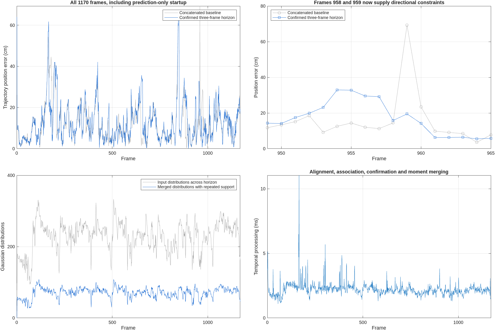

# Short-term stability in coarse perception

Implemented and evaluated September 22, 2026, against source revision
`24f6cd34c91278cad65bfd7b628fbebeb93ee82e`. The online classifier remains based
on whole-pillar point statistics; no ring, height subdivision, raw-point
refinement, or fine-perception call is introduced into online localization.
The active map, calibration, single-frame perception settings and registration
parameters are unchanged.

## Current behavior

The final perception product is a causal three-acquisition horizon: the current
scan and up to two previous scans, with a maximum age of 0.25 seconds.
`updateLocalizationSourceWindow` performs these operations:

1. Retain only recent **single-scan** Gaussian statistics. Feeding an already
   stacked product back as a new scan is rejected.
2. Transport means and full XY covariances into the current frame using relative
   independent wheel/gyro/lateral odometry. Registration corrections are never
   used to move the source history.
3. Associate same-class distributions across scans. Greedy matching in ascending
   standardized distance is one-to-one within each acquisition. Eligibility
   requires a center distance at most 0.75 m and standardized distance at most
   three, using both spatial covariances plus 0.10 m association noise.
4. Merge associated distributions using equal-acquisition mixture moments.
   The covariance retains within-scan scatter and between-scan disagreement;
   it is **not** divided by the number of scans as a mean-estimation covariance.
5. Emit only tracks detected in at least two distinct acquisitions. A large
   number of points or neighboring pillars in one scan never supplies a second
   temporal vote. Same-class association is required: a sign detection cannot
   confirm a pole detection.
6. Assign `temporalStability = detectionFrameCount / maximumFrames`.
   Two detections receive 2/3 and three receive one. The configured denominator
   is retained during startup. Singleton tracks have no matching component.

The Gaussian mixture mass contains semantic evidence, occupancy and temporal
stability. The geometric matcher retains its existing source-quality balance
within each class, then multiplies residual weights by `temporalStability`.
Applying stability **after** class normalization prevents a weakly supported
class from being renormalized to full influence. Map mixture priors continue to
use their existing temporal map stability without an additional multiplication.
Identically repeated scans yield one component and do not multiply pose
information by the number of frames. Information remains uncalibrated geometric
information, not a calibrated probability of pose accuracy.

A feature detected twice may survive one missing acquisition while its two
supporting scans remain inside the horizon. It disappears as that evidence
expires. Repeated timestamps, reversed time and mismatched calibration are
rejected. A fresh first scan produces no LiDAR measurement; it must not bypass
confirmation. Repeated calls to `localizeLidarFrame` require returned history
and a cumulative odometry pose. A call without motion is permitted only to
start an empty history.

`localizeLidarFrame` returns the final matching input as `probabilityCloud` and
its fresh single-frame input as `currentProbabilityCloud`. `sourceWindow`
reports retained and rejected counts; `sourceWindowSeconds` reports the new
stage's elapsed time. Source data and reference/map geometry never determine
confirmation thresholds on a frame-by-frame basis.

## Complete sequence results

Two complete 1170-frame recursive coarse-only replays were executed with the
same map, calibration, motion inputs and initial prediction as the stored
concatenation baseline. Subsequent predictions differ causally with matching
outputs. The five-frame comparison uses the same implementation with a 0.45 s
age bound and two required detections; it is not deployed. Three frames are
retained because five frames increase aggregate position error further.

| Metric | Prior concatenation | Current three-frame confirmation | Five-frame comparison |
|---|---:|---:|---:|
| All-frame trajectory RMSE (cm) | 15.1725 | 15.9610 | 17.2856 |
| Emitted full-pose RMSE (cm) | 15.1725 | 15.8542 | 17.1913 |
| RMSE on 1167 common full-pose frames (cm) | 15.0476 | 15.8542 | 17.1369 |
| Position P95 (cm) | 28.8244 | 30.5363 | 36.0825 |
| Maximum trajectory error (cm) | 69.2822 | 66.9504 | 68.2811 |
| Maximum-error frame | 959 | 849 | 847 |
| Frame 959 error (cm) | 69.2822 | 19.4904 | 35.7554 |
| Full pose / directional / no event | 1170 / 0 / 0 | 1167 / 2 / 1 | 1169 / 0 / 1 |

All-frame trajectory metrics include prediction-only startup and directional
updates, and must not be described as 1170 accepted full-pose measurements.
Frames 958 and 959 are directional in the current three-frame replay. Only
frame 1 supplies no event. Population-specific comparisons are retained in
`comparison.csv`; complete trajectories are in `error_curves.csv`.

The requested stability mechanism is implemented, but **it is not an overall
accuracy improvement yet**. Three-frame trajectory RMSE increases by about
5.2 percent and P95 also worsens. It removes single-scan flashes; persistent
false detections and wrong map correspondences can still pass temporal
confirmation. Gaussian association and averaging can also change the location
and scatter of coarse distributions. These are limitations, not evidence that
all repeated features are true landmarks.



## Frame 959 causal check

Using the exact saved pre-change prediction, the new horizon changes 143 input
distributions into 38 merged components supported by multiple scans. It rejects
46 singleton tracks, including the two distant pole source distributions
identified in the preceding diagnostic. Candidate error becomes 18.6715 cm,
with rank two and `acceptedDirectional`; this is not an accepted full pose.
The complete recursive run has a different inherited prediction and gives
19.4904 cm at frame 959. No feature ID or frame number is used by production
filtering. Matching the original unfiltered input, which has no temporal metadata,
reproduces the preceding matcher result within 1e-7 pose coordinates.

## Timing and integration

On this desktop, the new temporal stage has median 2.1755 ms, P95 2.79 ms and
maximum 11.049 ms. The complete three-frame replay pipeline has median 63.132 ms,
P95 72.087 ms and maximum 84.426 ms; none of its 1170 calls exceeded 100 ms.
These timings exclude disk reads and offline preparation and are empirical
measurements, not a hard real-time guarantee. The older baseline was recorded
in a separate run, so timing differences are not a controlled speedup estimate.

Both standalone timing entry points now prepare real preceding coarse scans
with independent odometry; they no longer time an empty startup horizon on
every repeated trial. A seven-scene smoke run with three-frame offline maps
and one repetition accepted all 21 timed cases. Its paced 100 ms input run
completed all 21 cases with maximum availability-to-output time 84.609 ms.
Offline benchmark map creation uses fine features; online calls remain coarse.

The observer experiment now handles a withheld first LiDAR event by using the
existing matching prediction as the common initial state, without manufacturing
a measurement or looking ahead. All seven observer scenarios ran successfully.
The smoke test reports 9.2030 cm GNSS-plus-LiDAR RMSE and 9.1932 cm GNSS-only RMSE.
Its initial state differs from the preceding experiment's first-LiDAR state;
these figures are not an isolated fusion improvement comparison. The initial
64.0312 cm prediction error is retained in its metrics. Directional poses remain
withheld from the full-pose-only observer channel.

## Verification and limitations

- 96 tests passed across temporal windows, geometric/distribution/height
  registration, calibration, clock handling and coarse/whole-pillar perception.
- Tests cover startup, expiry, one missed scan, odometry frame invariance, full
  covariance transport, distinct-frame counting, duplicate pillars, one-to-one
  association, semantic changes, prevention of recursive stacking, mixture
  scatter, source weight influence and preservation of unobservable directions.
- Exact replay input checks confirm unchanged perception and matcher parameters
  and identical independent odometry. Runtime profiling verifies coarse
  perception, temporal confirmation and registration, with no fine refinement.
- An initial replay attempt exposed a row-vector iteration error when one track
  faced multiple candidates. It was fixed and covered by a regression test
  before both complete runs. The partial attempt is not counted as a full run.
- MATLAB Code Analyzer with factory settings reports no findings. Benchmarks
  and observer execution additionally exercise integration paths.
- The map includes observations from the query drive. The existing calibration
  is fitted on this sequence, tilt comes from the recorded reference and sensor
  preparation uses offline synchronization. The existing biased initial pose
  remains an experiment assumption. No independent accuracy claim is made.
- No point masks, map components or perception thresholds were tuned to specific
  frames. Five-frame selection used this sequence, so it is development tuning.

## Reproduction

Run from the repository root with the existing input assets:

```matlab
setupVehicleLocalization();
addpath('research/temporal_perception_20260922');
run_experiment();
window = localizationSourceWindowConfig();
window.maximumFrames = 5;
window.maximumAgeSeconds = .45;
run_experiment('output/temporal_perception_20260922/five_frame_matching', window);
runMncavFullObserverExperiment('output/temporal_perception_20260922/observer', ...
    MatchingFolder='output/temporal_perception_20260922/matching');
validate_experiment();
plot_results();
```

`python research/temporal_perception_20260922/summarize_results.py` refreshes
compact comparisons from saved runs. The unit results are retained in
`tests.csv`; generated MAT results and benchmark inputs stay under `output`.
